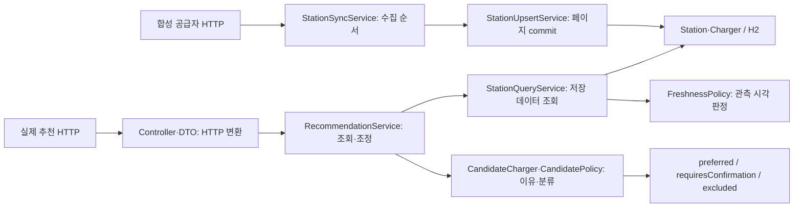

# agent-engineering의 PlugPass 적용

2026-10-05 요청 범위는 개선한 전역 agent-engineering을 **현재 프로젝트에 적용**하는 것이다. 기존 테스트·구조 검사·공용 verify·기능 지도·verify-plugpass를 재사용하고, 현재 소스 증거와 원격 완료 확인을 연결한다. T14 이후 기능·성능·실공급자 인증을 완료 처리하는 작업은 아니다.

## 적용 전 빈틈과 변경

업무 동작과 구조 경계는 이미 테스트로 검증하고 있었다. 적용 전 추천·실제 HTTP·구조 대상 52개가 통과했으므로 기존 절차가 실패했다고 주장하지 않는다. 빈틈은 다음과 같았다.

| 관찰한 빈틈 | 변경 | 확인할 결과 |
| --- | --- | --- |
| README가 수집·추천 기능을 아직 없다고 안내 | T02~T13의 실제 구현과 합성 검증/실인증 차이를 반영 | 첫 안내가 기능 지도와 일치 |
| 공용 verify의 로그와 현재 소스의 일치를 연결하는 프로젝트 계획 없음 | [.agents/verification.json](../.agents/verification.json)에 기존 명령을 등록 | 현재 commit·파일·plan에 맞는 로그만 유효 |
| 프로젝트 검증 스킬이 새 증거/PR 절차를 안내하지 않음 | 기존 [verify-plugpass](../.agents/skills/verify-plugpass/SKILL.md)에 실행·검사·실패 대응을 연결 | 실제 명령으로 검증하고 완료 상태를 구분 |
| CI 성공과 실제 PR 머지 확인의 구체적 도구 안내 없음 | [전달 절차](delivery-workflow.md)에 전역 읽기 전용 도구 연결 | 검증 commit과 PR head를 대조하고 요청된 최종 상태 확인 |

새 증거 기록기나 CI 검사기를 복제하지 않는다. CI는 계속 `bash scripts/verify.sh`를 직접 실행하므로 전역 스킬 설치에 의존하지 않는다. JaCoCo와 coverage 수치 gate는 도입하지 않는다.

## 대표 경로의 책임과 결과



`StationReadFlowTests`는 실제 loopback 공급자 HTTP를 수집해 H2에 저장하고 실제 네트워크의 검색·상세·추천 HTTP를 호출한다. 공급자 응답과 Clock만 외부 경계에서 제어한다. Spring·Repository·업무 도메인은 실제 구현이다.

- 정상/반복: 같은 충전소를 두 번 수집해도 Station·Charger 각 1건. 추천 HTTP 200이며 관측 시각이 없으면 `preferred=[]`, 확인 필요 그룹에 `UNVERIFIED_AVAILABLE` 이유를 반환한다.
- 외부 실패: 공급자 503 후 실행 실패를 기록하고 기존 저장 데이터·마지막 성공 시각과 확인 필요 추천을 유지한다.
- 도메인/경계: `RecommendationTests`는 최근·불명·오래된 상태, 호환·제한·제외와 정렬을 검증하고, Service/MVC 테스트가 실제 DB와 공개 HTTP 계약을 각각 확인한다.
- 구조: Controller는 Service 계약에 의존한다. 도메인 상태 규칙의 정확성은 동작 assertion이, 구조적 책임 경계는 ArchUnit이, 규칙 의미·이름·협력의 적절성은 리뷰가 맡는다.

대표 명령:

```bash
./gradlew test --tests '*Recommendation*Tests' \
  --tests '*StationReadFlowTests' --tests '*Architecture*Tests'
bash scripts/verify.sh
```

실제 HTTP 출력은 `build/verification/station-read-flow/`, JUnit은 `build/test-results/test/`, JAR 확인 결과는 `build/verification/runtime.json`에 남는다. 합성 응답 범위이며 실제 공공 API 인증·운영 DB·H2 재시작 보존·성능을 증명하지 않는다. 프런트엔드와 TypeScript는 없어 적용 대상이 아니다.

## 실제 경계 거부 확인

기존 테스트를 변경하지 않고 실제 `StationController`에 `StationRepository` 타입 필드 하나를 임시로 추가했다. 컴파일은 성공했고 다음 기존 구조 테스트는 종료 1, assertion 실패 1건을 반환했다.

```bash
./gradlew test --tests \
  'com.plugpass.architecture.ArchitectureTests.controllersUseServiceContracts'
```

실패는 `StationController.stationRepository`의 Repository 의존성을 정확히 지목했다. 실행 성공 여부와 관계없이 원본 바이트를 복원하도록 처리했다. 금지 예제는 최종 소스에 포함하지 않으며 복원 후 최종 공용 검증을 수행한다. 검사 이름만 문서에 추가한 것이 아니라 현재 실제 코드의 위반을 거부한 확인이다.

이번 변경은 문서와 기존 명령의 실행 계획이다. 업무 동작을 새로 구현하지 않았으므로 신규 기능의 TDD Red/Green이라고 주장하지 않는다. 위 실패는 기존 구조 검사의 부정 대조다. 실제 기능 변경은 기존 AGENTS의 테스트 선행 규칙을 계속 따른다.

## 현재 소스와 원격 완료의 증거

검증 계획의 한 항목은 `bash scripts/verify.sh`다. Python 검사기 → clean build → JUnit/필수 suite → JAR·실제 HTTP를 그대로 실행한다. plan은 exit-only 모드이며 전역 기록기가 JUnit을 직접 집계한 것으로 보고하지 않는다. 실제 건수와 실패/오류/skip은 기존 XML 검사와 runtime 결과로 판단한다.

전역 `evidence.py`의 `run`은 로그·종료 코드·입력 fingerprint를 저장하고 `check`는 현재 commit·파일·plan과 비교한다. 최종 commit에서 실행하고 같은 HEAD의 파일 변경도 이전 증거를 유효한 것으로 취급하지 않는다. 실제 사용 명령은 [검증 스킬](../.agents/skills/verify-plugpass/SKILL.md)에 있다. 도구는 runtime·의존성·외부 시스템을 자동 fingerprint하지 않으므로 해당 실행의 식별은 별도로 확인한다.

PR 전달은 다음 관찰을 구분한다.

```text
검증한 commit과 현재 소스 일치
    → 같은 PR head에서 필요한 CI 실행·성공
    → native 머지 조건과 적용되는 리뷰
    → 승인된 protected 전달
    → 실제 MERGED·merge commit 확인
```

main 보호는 이번 작업에서 API로 `PlugPass verify`의 GitHub Actions 앱 출처(ID 15368), 최신 base 요구(strict), 관리자 적용, PR 필수, force push/삭제 금지를 확인했다. native auto-merge와 squash도 활성화되어 있었다. 이 값은 신청 전에 다시 조회하며 문서의 과거 값으로 대신하지 않는다. 필수 승인 인원은 0명이므로 사람의 의미적 책임 리뷰가 필수 승인 gate로 강제된다고 보고하지 않는다.

전역 `pr_status.py`는 하나의 원격 스냅샷만 읽는다. 머지·push·CI 재실행을 하지 않고 추가 권한을 주지 않는다. CI 통과·ready·실제 merged를 구분하며 이름만으로 검사 출처·assertion 품질·로컬 dirty 변경을 증명하지 않는다. merge 동작은 기존 native 보호와 `--match-head-commit` 아래 수행한다.

## 실행 기록과 평가 범위

최초 대상 실행은 52개, 실패·오류·skip 0, 종료 0이었다. 임시 위반은 의도한 assertion 실패 1개, 종료 1이었다. 로그·XML은 작업 외부 기록 `/private/tmp/plugpass-agent-engineering-20261005/logs/`에 보존했다. 최종 소스 증거는 같은 작업 폴더의 `proof/`에 새로 생성한다. PR의 Checks·본문에서 해당 head의 최종 공용 verify와 원격 결과를 연결한다.

검증 계획을 직접 실행한 첫 공용 검증은 Java353개·Python8개, 실패·오류·skip0으로 통과했다. JAR의 health200·검색200·추천200·입력 오류400·없는 상세404·env/기본 metrics404·문서 HTML 일치를 확인했다. 임시 위반 복원 후 구조·검사기 회귀 23개도 통과했다. 실행 환경은 Java25.0.4.1, 실제 Spring core7.0.9이며 전역 기록 도구는 Python3.12.14로 실행했다. 버전 변경과 신규 애플리케이션 의존성은 없다.

같은 HEAD에서 파일만 바꾸는 부정 대조는 다음 실제 결과를 남겼다. 입력 원본은 항상 복원했고 테스트·기준을 완화하지 않았다.

| 실제 입력 상태 | evidence check 결과 |
| --- | --- |
| 검증한 현재 파일·plan | `current`, 종료0 |
| 같은 HEAD에서 README에 임시 변경 | `block` / `stale_or_different_inputs`, 종료1 |
| 원본 복원 | `current`, 종료0 |

문서 링크·계획 schema·스킬 형식과 실행 절차를 검토했고 계획을 실제 사용했다. 최종 commit은 해당 HEAD의 증거를 다시 확보한다. 기존 절차의 성공은 보존하며 설치된 전역 도구의 자체 테스트와 프로젝트 업무 결과를 혼합해 하나의 평가 점수로 바꾸지 않는다.

이 작업은 도구 통합·지침 검토·프로젝트 사용자 경로 실행이다. 독립 fresh-context 에이전트의 작업 성공률이나 시간 절감은 측정하지 않았고, 병렬 에이전트 권한을 확대하지 않는다. 기존 경계와 명령을 재사용하는 것이 유지보수 비용을 줄이는 설계 선택이며 그 효과를 임의의 숫자로 주장하지 않는다.
