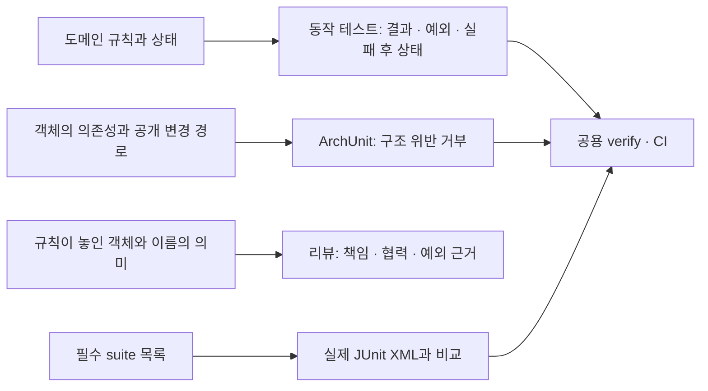

# 동작·구조·리뷰의 검증 책임



도메인 객체가 규칙을 올바르게 지키는지는 기존 동작 테스트가 검증한다. 구조 검사는 의존성과 공개 API의 형태를 검사하고, 규칙의 소유자가 적절한지는 구조 검사와 리뷰가 함께 확인한다. `update()`라는 이름만으로 입력 검증이나 실패 후 상태 보존을 보장하지 않는다.

## 실제로 강제하는 범위

| 대상 선택 | 거부하는 구조 | 함께 확인할 동작·리뷰 |
| --- | --- | --- |
| `@RestController` | Repository·EntityManager·`@Service` 구현 직접 의존 | HTTP 변환에 업무 판단이 섞였는지 리뷰. 현재 검색·추천 REST Controller 두 개를 검사한다. |
| `@Entity`, station/freshness 값·규칙 객체 (Repository·Configuration 제외), recommendation 루트의 값·정책 객체 (Service·Controller 제외) | Repository·EntityManager·Service 계약/구현·프로젝트 request/response DTO·Spring web 의존 | 실패 후 필드와 시각 보존은 기존 동작 테스트가 확인. 새 도메인 패키지는 selector와 위반 예제를 함께 추가한다. |
| `@Entity`의 public 메서드 | `set[A-Z].*` 이름의 setter | 변경 메서드의 검증 순서·불변식은 동작 테스트와 리뷰가 확인. JPA 애너테이션과 읽기 getter는 허용한다. |
| `@Service` | `Default<계약명>` 이름과 대응 Service 인터페이스 불일치 | 의미 있는 유스케이스 계약인지, 단순 위임·추측성 분리인지 리뷰. |
| `@SpringBootTest`이며 Service 타입을 의존하는 테스트 | 클래스·메서드 테스트 트랜잭션, Mockito 및 Spring Mockito bean 대체 의존 | 실제 Service 종료/commit 후 별도 재조회는 기존 통합 테스트 assertion이 확인. 타입 의존성으로 선택하므로 테스트 의도 자체는 판정하지 않는다. |
| `@WebMvcTest` | 실제 Repository·EntityManager 의존 | Service mock은 허용. 바인딩·validation·직렬화는 기존 MVC assertion이 확인. |

운영 객체용 검사는 test class를 제외한 bytecode를 가져온다. 테스트 경계 검사는 프로젝트 test bytecode도 가져온다. 이름·패키지·애너테이션 변경으로 검사 대상이 달라지면 함께 리뷰한다. 전체 AGENTS.md 준수를 보장하지 않는다. `var`, DisplayName, fixture 작성 방식 등의 소스 규약은 이번 자동 검사에 포함하지 않았다. 프런트엔드는 없어 적용 대상이 없다.

검사기 예제 `src/test/java/architecturefixture/RuleSamples.java`는 금지·허용 구조의 bytecode 입력이다. 업무 도메인을 fake로 대체하거나 여러 도메인 객체를 묶어 준비하는 fixture가 아니다. 잘못된 Spring/JPA 예제가 앱에 로딩되지 않도록 component/entity scan의 `com.plugpass` 밖에 두며 test source에만 둔다.

## 필수 테스트 누락

[required-test-suites.json](required-test-suites.json)은 T10/T11을 포함한 기존 기능 지도의 26개 suite와 구조 검사 2개 suite의 실행 요구 목록이다. 공용 검증은 실제 XML과 비교하고 누락 이름을 출력하며 실패한다. 총건수는 고정하지 않고 새로운 suite 추가는 허용한다. 새 기능 완료 시 핵심 suite를 목록에 등록한다. 테스트 0개·빈 suite·실패·오류·skip도 계속 거부한다.

목록 삭제·suite 이름 변경에는 대체 검증과 [기능 지도](feature-map.md)를 함께 검토한다. suite 내부의 일부 테스트 삭제·잘못된 assertion·목록 자체의 의도적인 변경은 자동으로 판정하지 못하므로 리뷰가 맡는다.

## 실행과 실패 확인

```bash
./gradlew test --tests '*Architecture*Tests'
python3 -m unittest discover -s scripts -p 'test_*.py' -v
bash scripts/verify.sh
```

공용 verify: Python 검사기 테스트 → clean build (기존 동작 + 구조 테스트) → 필수 XML 검사 → JAR·실제 HTTP. 빠른 대상 테스트는 필수 suite 목록 검사를 호출하지 않아 반복 개발을 허용한다. 로컬 런타임도 JDK 25의 JAVA_HOME을 사용한다. CI는 setup-java가 설정한다.

검사기를 변경하면 허용 예제 통과와 금지 예제의 assertion 실패를 확인한다. 실제 Controller 임시 위반, 필수 XML 임시 제거의 거부, 복원 후 통과는 [실행 기록](ci-boundaries-verification.md)에 남긴다.

## JaCoCo 제외와 리뷰

사용자가 2026-10-05에 JaCoCo 제외를 선택했다. coverage는 올바른 assertion·객체 책임·요구사항 완전성을 증명하지 않는다. 기존 도메인·저장·HTTP·외부 장애 동작 assertion을 유지하고 구조·suite 누락 검사를 추가한다. 비율을 위한 getter/DTO 테스트나 추측성 인터페이스를 추가하지 않는다.

리뷰는 변경 상태와 불변식의 소유 객체, Controller/Service/Domain의 실제 수행 내용, 협력 경계, 이름·선언부·호출부·공개 계약 영향을 확인한다. 구조 검사 통과만으로 판단을 대신하지 않는다. 동시성·성능·실공급자·운영 DB는 후속 사용자 경로의 별도 검증 범위다.
