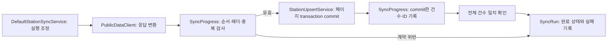

# 2주차 코드 리뷰와 수집 완료 판정 리팩터링

## 리뷰 결론

기준 main: `913e8228d1527bc272c07b414d9e69c4de77b316`. 별도 에이전트 없이 직접 소스·호출부·테스트를 검토했다.
검토 경로는 외부 HTTP/XML → 정규화 → 페이지 저장/수집 이력 → 최신성 → 검색/상세 DTO와 HTTP 오류 경계다.
재현한 결함 하나를 수정하고 그 판단을 소유하는 객체를 추출했다. 모든 가능한 결함이 없다는 보장은 아니다.

**P1: 중복 응답이 누락을 가리고 전체 수집 성공으로 기록된다.**
기존 `DefaultStationSyncService`는 목록 길이의 합과 totalCount만 비교했다.
예를 들어 첫 페이지의 서로 다른 충전기 10개 뒤에 두 번째 페이지가 신규 1개와 앞 페이지 충전기 1개를 반환하면,
totalCount=12를 충족하지만 DB에는 서로 다른 충전기 11개만 남는다. 중복된 충전기는 뒤의 응답으로 덮어써진다.
이 실행이 SUCCESS가 되면 조회의 dataReady/lastSuccessfulRunAt도 불완전한 실행을 성공 근거로 사용한다.
같은 페이지 내부의 중복도 같은 문제를 만든다.

수정 후에는 회차 내 `(provider, stationId, chargerId)`가 반복되는 페이지를 저장 전에 CONTRACT로 거부한다.
첫 페이지이면 FAILURE·처리0, 이후이면 PARTIAL_FAILURE·앞서 commit한 건수만 기록한다.
중복 페이지의 신규 항목도 저장하지 않는다. 정상적인 별도 회차의 재수집은 허용한다.
공급자 페이지가 고정된 스냅샷이라는 공식 보장은 없으므로, 이 거부는 완전성을 주장하지 않기 위한 프로젝트 판단이다.

## 책임과 데이터 흐름

`SyncProgress`는 실행 중인 한 회차의 페이지 번호, 고정 totalCount/pageSize, commit한 ID와 건수를 소유한다.
Spring bean이나 static 상태가 아니며 synchronize마다 새로 생성한다. 따라서 이전 회차의 ID가 다음 회차를 막지 않는다.
validatePage는 상태를 바꾸지 않고, DB 서비스가 성공적으로 반환한 뒤 recordCommittedPage가 상태를 변경한다.
페이지 내부 임시 Set과 이전 commit ID Set을 구분하므로 실패 페이지의 일부 ID를 완료로 기록하지 않는다.
네트워크와 DB transaction은 기존처럼 분리되고, API 응답 필드·라우트·DB 스키마는 바뀌지 않는다.

이름 → 실제 수행 내용 → 배치를 검토했다. `recordCommittedPage`는 저장 후 기록임을 드러내며,
`requireComplete`는 건수가 맞지 않으면 실패한다. 여러 지역 변수와 조건을 서비스 밖으로 옮긴 이유는 줄 수가 아니라
같은 수집 완전성 규칙과 상태를 한 객체에서 관리하기 위해서다. 내부 클래스는 package-private이며 추측성 인터페이스를 만들지 않았다.

## TDD와 실제 검증

- [x] Red: `./gradlew test --tests '*StationSyncTests'` 종료1, 12건 중 신규2건 실패.
  `rejectsDuplicateIdentityWithinPage`: expected FAILURE / actual SUCCESS.
  `rejectsDuplicateIdentityAcrossPages`: expected PARTIAL_FAILURE / actual SUCCESS.
  컴파일·환경 오류가 아닌 실제 assertion 실패다. 로그: `/tmp/plugpass-review-red.log`.
- [x] Green: 서비스 안에 회차별 ID Set과 저장 전 중복 검사를 최소 추가했다.
  대상12건과 `./gradlew test` 전체260건 통과. 로그: `/tmp/plugpass-review-green-target.log`, `/tmp/plugpass-review-green-all.log`.
- [x] Refactor: SyncProgress로 페이지 검증·진행 상태를 추출하고 서비스는 요청/검증/commit/기록/완료 순서를 조정한다.
- [x] 전체 검증: `bash scripts/verify.sh` 종료0, 260건·실패0·오류0·skip0.
  실행 JAR health200/UP, env404, 검색200, validation400, 없는 상세404,
  생성 문서와 패키징 문서 일치, 테스트 fixture 미포함을 확인했다.
  로그: `/tmp/plugpass-review-verify.log`, `build/verification/runtime.json`, `build/test-results/test/`.

신규 서비스 테스트는 실제 Spring 서비스와 H2를 사용하며 테스트 transaction·Service mock을 두지 않는다.
호출이 끝난 뒤 Repository로 실행 이력과 DB를 재조회한다. 첫 실패의 저장0, 중간 실패의 이전10개 보존,
실패 페이지의 신규 항목 미저장, 중복 항목의 원본 상태 미변경, 정확한 실패 페이지/건수를 확인한다.
기존 테스트가 정상 다중 페이지·동일 충전기 번호/다른 충전소·회차 간 재수집·빈 성공·저장 rollback·timeout·인증 실패·헤더 변화·건수 부족도 확인한다.
공용 검증의 실제 fixture HTTP→수집→H2→검색/상세 및 공급자503 중 조회 테스트2건도 통과했다.

## 유지한 설계와 한계

- sourceObservedAt이 없는 공급자의 null/UNVERIFIED와 원본 시각 문자열 보존은 의도된 계약이다. 수신 시각으로 관측 순서를 추측하지 않는다.
- 검색의 전체 로딩/거리 정렬 비용은 T15 측정 범위다. 이번에는 성능 결과나 개선을 주장하지 않는다.
- 검색/상세의 짧은 정렬 표현 중복은 있지만 외부 계약 변환은 기존 ChargerResponse를 공유한다. 수집 결함 PR에 조회 구조 변경을 섞지 않았다.
- 새로운 라이브러리·버전 변경 없음. Java25의 Set.add/equals 계약을 공식 API로 확인했다. Set은 회차 내 고유 충전기 수에 비례한 메모리를 사용한다.
- 이 검사는 중복 ID와 헤더/건수 모순을 잡는다. 서로 다른 ID로 바뀐 공급자 데이터나 공급자가 누락 자체를 totalCount에서 숨긴 경우까지 검출하지는 못한다.
- 시간 예산·재시도·스케줄·분산 동시성·예기치 못한 중단 뒤 RUNNING 복구는 이번 변경 범위가 아니다. T10 이후 기능을 선구현하지 않았다.
- CMUX_WORKSPACE_ID/SURFACE_ID가 없고 sandbox 밖 cmux identify도 No live cmux socket found였다. 실제 터미널 HTTP 검증이며 화면 E2E 성공으로 보고하지 않는다.
- 공공 API 키가 없어 실인증·실응답 시간대는 미확인이다. 프런트엔드/Vue/TypeScript는 현재 적용 대상 없음.
- Gradle10 호환성 deprecation 및 JRuby native-access 경고는 기존 도구 경고로 남아 있다. 현재 JDK25/Gradle9.7.1 실행은 성공했다.

전달은 이 변경 PR의 필수 CI와 실제 merge 상태를 별도로 확인한다. 로컬 성공은 원격 CI 성공을 대신하지 않는다.
