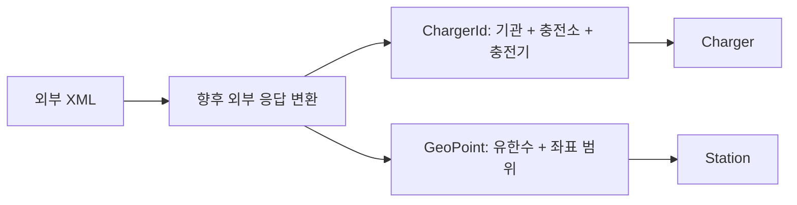

# T01 — 공공데이터 계약

확인일: 2026-10-01. 공급자: 한국환경공단 EvCharger API 한 곳.
[공식 등록 페이지](https://www.data.go.kr/data/15076352/openapi.do),
[공식 활용 가이드 v1.25](https://www.data.go.kr/cmm/cmm/fileDownload.do?atchFileId=FILE_000000003680003&fileSn=1).
가이드 파일의 해시·검토 범위는 [확인 기록](evidence/publicdata-guide-2026-10-01.json)에 있다.

## 확인 범위와 접근 제한

사용자가 API 키 없음·문서/fixture 진행을 선택했다. 인증된 실응답은 확보하지 않았다.
아래 계약은 공식 가이드와 포털 대조 결과이며 실응답 확인 완료가 아니다.
검증 지역은 가이드 예제와 맞는 인천(`zcode=28`) 하나다. 실제 지역 표본 확인은 키 발급 후 수행한다.
T02는 plan.md의 승인 지연 예외에 따라 이 문서 계약으로 진행한다. T01 실연동 체크는 열린 상태로 유지한다.

## 요청·페이지·이용 조건

- 기본 URL: `https://apis.data.go.kr/B552584/EvCharger`.
- 위치·운영·상태를 함께 받는 `getChargerInfo`를 기본 수집 작업으로 선택한다. `getChargerStatus`는 최근 변경 상태 조회이며 전체 스냅샷으로 대체하지 않는다.
- 활용신청 후 발급 인증키를 요청한다. 가이드 Info 예제는 `serviceKey`, 포털 Status 표는 `ServiceKey`이므로 각 operation의 공식 표를 따른다. 키는 외부 주입하고 URL/로그/fixture에 남기지 않는다.
- XML을 선택한다(`dataType=XML`). JSON도 가이드에 있지만 현재 fixture 계약은 XML이다.
- `pageNo=1`부터 시작, `numOfRows`는 10~9999, 지역 필터 `zcode=28`.
- XML은 `response/header`의 `resultCode`, `resultMsg`, `totalCount`, `pageNo`, `numOfRows`와 `response/body/items/item` 목록이다. HTTP 200만으로 성공 판정하지 않고 결과 코드 `00`을 확인한다.
- 페이지 수는 `ceil(totalCount / numOfRows)`. 응답이 비거나 진행하지 않으면 별도로 처리한다. 여러 페이지에 걸친 일관된 스냅샷·정렬은 보장 확인 안 됨.
- 포털은 개발 트래픽 1,000, 일일 초과 오류 22를 안내한다. 계정별 실제 한도·초당 제한은 승인 화면에서 재확인한다. 운영 트래픽 증가는 활용사례 등록 후 신청 가능.
- 무료, 공공저작물 제1유형(출처표시). 제공 출처를 표시한다.
- 포털은 실시간 갱신이라고 설명하지만 최대 지연·SLA·스냅샷 관측 시각은 제공하지 않는다.

## 필드 의미와 업무 모델

| 원본 | 의미 | 프로젝트 판단 |
| --- | --- | --- |
| busiId | 운영 기관 식별 코드 | ChargerId의 provider. API 공급자 KEC와 운영 기관 코드를 혼동하지 않는다 |
| statId / chgerId | 충전소 / 충전기 식별자 | 문자열 유지, 선행 0 보존. 기관·충전소·충전기 3요소로 식별 |
| lat / lng | 위도 / 경도 | GeoPoint는 유한수와 [-90,90] / [-180,180] 보장. 좌표계는 가이드에 명시되지 않아 지리 좌표로 사용하는 판단은 실표본 대조 필요 |
| chgerType | 커넥터 조합 코드 | 아래 코드표 유지, 단일 커넥터로 단정하지 않음 |
| useTime / limitYn / limitDetail / note | 이용시간 / 제한 여부 / 제한 설명 / 참고 | 상태와 별도 조건. 누락은 이용 가능 근거가 아님 |
| delYn / delDetail | 삭제 여부 / 사유 | 부분 실패 때 미수신을 삭제와 동일시하지 않음 |
| stat | 상태 코드 | 아래 코드표. 미지원 값은 UNKNOWN으로 처리할 T03 입력 |
| statUpdDt | 상태 변경·통신이상·복구 시각 | 관측 시각이 아님 |
| lastTsdt / lastTedt / nowTsdt | 마지막 충전 시작 / 종료 / 현재 충전 시작 | 관측·수집 시각 대신 쓰지 않음 |

시각 문자열은 14자리 `yyyyMMddHHmmss`이며 offset이 없다. 가이드에서 시간대 명시를 찾지 못했다.
KST를 공식 보장으로 단정하지 않는다. `sourceObservedAt`은 제공 확인 안 됨 → null → UNVERIFIED.
`collectedAt`은 애플리케이션 수신 시각이며 원본 최신성의 증거가 아니다.

상태: 0 알 수 없음, 1 통신이상, 2 사용가능, 3 충전중, 4 운영중지, 5 점검중.
커넥터: 01 DC차데모, 02 AC완속, 03 DC차데모+AC3상, 04 DC콤보,
05 DC차데모+DC콤보, 06 DC차데모+AC3상+DC콤보, 07 AC3상,
08 DC콤보(완속), 09 NACS, 10 DC콤보+NACS.

## 최신성·실행 예산: 공식 보장과 구분한 잠정 정책

관측 시각이 없으므로 maxAge로 RECENT를 주장하지 않는다. 향후 신뢰 가능한 관측 시각이 생길 때의
초기 maxAge 후보는 10분이며 Status 조회 window 최대 10분을 참고한 제품 판단일 뿐 지연 보장이 아니다.
T07은 PT10M을 외부 설정 가능한 잠정값으로 적용했다. 신뢰할 관측 시각이 없는 현 공급자는 이 값과 관계없이 UNVERIFIED다.

T05/T11/T12 초기 예산 후보: 페이지 크기 9999, 회차 최대 10페이지·총 20요청,
일시 오류만 요청당 최대 1회 재시도, connect 3초·response 10초·회차 총 120초.
인증·계약 오류는 재시도하지 않는다. 30분 간격이면 일 48회 × 최대 20요청 = 960으로
개발 한도 1,000에서 40요청을 남긴다. 실제 페이지 수·계정 한도 확인 전 스케줄은 비활성화한다.
10페이지를 넘으면 미완료로 종료하고 전체 성공으로 기록하지 않는다. T11/T12에서 고정 지연·실행 소유권·페이지/전체요청/시간 상한·제한 재시도로 구현했다. 기본 비활성화는 유지한다.

## Fixture와 재확인 목록

`src/test/resources/publicdata/normal.xml`은 가이드 XML 예제의 한 항목을 옮기고 totalCount를 1로 조정했다.
연락처는 제외했다. `empty.xml`은 목록·건수 0, `unknown-status.xml`은 stat=9로 만든 합성 실패 입력이다.
셋 모두 인증된 실제 API 응답이 아니다. 공식 예제의 서로 다른 시각·이용 조건을 일관된 실제 상태로 추정하지 않는다.

검사: XML 구문, header/목록 구조, 필수 식별자·좌표·상태, 빈 목록 건수,
정상/미지원 코드 차이, 키·연락처 미포함. 키 발급 후 인증 성공·지역 표본·필드 누락·시간대·한도·페이지 종료를 재확인한다.

## T05 구현된 클라이언트 계약

`PublicDataClient.fetchPage(1)`부터 시작한다. `StationPage.hasNext()`는 `pageNumber × pageSize < totalCount`로 판단한다.
응답 페이지/크기가 요청과 다르거나, 총 건수가 음수이거나, 남은 데이터가 있는데 목록이 비면 CONTRACT 실패다.
`busiId/statId/chgerId/statNm/lat/lng`는 필수, 상태·운영 정보 누락은 원본 null/미확인으로 보존한다.
외부 응답 DTO를 JPA 엔티티나 HTTP 응답으로 직접 사용하지 않고 StationSnapshot으로 변환한다.

현재 Snapshot은 식별자·이름·위치·원본/정규화 상태, 커넥터·이용시간·제한·note,
원본 상태/충전 시각 문자열·삭제 플래그/사유를 보존한다. 주소·출력·층수 등 나머지 가이드 필드는
현재 유스케이스의 저장 입력에 포함하지 않는다. 후속 조회 요구에 필요하면 정규화/저장/검증을 함께 확장한다.
삭제 플래그를 보존하지만 DB 삭제 동작은 추가하지 않았다.

인증 값은 `PLUGPASS_PUBLIC_DATA_SERVICE_KEY`로 외부 주입한다. `.env.example`은 변수 목록이며 자동 로딩 파일이 아니다.
키가 없어도 앱은 기동하지만 fetchPage는 호출 전 AUTHENTICATION으로 실패한다. 스케줄은 T11에서 기본 비활성화로 추가했고 공개 수집 API는 없다.
기본 connect timeout은 3초, 전체 HTTP 응답(헤더+본문) timeout은 10초다. T12 수집 회차는 일시 오류만 요청당 한 번 재시도하며 개별 클라이언트 호출 자체는 재시도하지 않는다.
HTTP URI/응답 원문/원본 I/O cause를 공개 예외·로그에 포함하지 않고 오류 범주만 반환한다. redirect는 따라가지 않는다.

| 실패 | 분류 |
| --- | --- |
| HTTP 401/403, 공급자 20/30/31, 키 누락 | AUTHENTICATION |
| HTTP 429, 공급자 22/23 | RATE_LIMIT |
| HTTP 5xx, 공급자 01 | SERVER |
| timeout, 공급자 05 | TIMEOUT |
| 연결/I/O/interrupt | TRANSPORT (interrupt flag 유지) |
| 기타 HTTP/코드, XML·필드·좌표·페이지 위반 | CONTRACT |

공급자 04는 잘못된 HTTP 요청과 응답 처리 실패를 함께 설명해 일시 장애로 단정할 수 없으므로 CONTRACT로 보수적으로 분류한다.
이 분류는 프로젝트 판단이다. 실제 인증 오류의 전체 XML envelope는 키가 없어 미확인이다. 공식 예제 response/header와
HTTP 오류를 fixture 서버로 검증한 범위이며 다른 envelope는 CONTRACT로 거부한다.

HTTP XML 본문은 원본 bytes로 전달하여 XML 선언/BOM의 인코딩을 유지한다. UTF-8 BOM·UTF-16 fixture도 정상 변환한다.
DOCTYPE/외부 entity는 정상 문서 구조 안에서도 거부하고 외부 resource를 요청하지 않는 것을 테스트한다.
