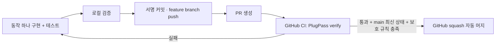

# 작은 기능 → PR → 검증 → 자동 머지

2026-10-01 사용자가 PlugPass에 이 흐름의 적용을 요청했다. 전역 스킬의 기본 권한을 바꾸지 않으며 배포·유료 요금제 변경·저장소 공개 전환·병렬 에이전트 실행은 이 요청에 포함되지 않는다.



## PR의 크기

PR 하나는 목적 하나, 독립적인 검증, 독립적인 되돌리기를 가진다. 정해진 줄 수나 파일 수 제한은 두지 않는다. 기능에 필요한 구현·테스트·계약 문서는 함께 넣는다.

- 충전기 상태 코드를 도메인 상태로 변환한다 → 변환 규칙과 테스트를 한 PR에 넣는다.
- 정보 갱신 시각으로 오래된 데이터를 판정한다 → 경계 시각의 테스트와 함께 별도 PR로 만든다.
- 위 두 결과를 사용하는 조회 API를 제공한다 → 앞선 변경이 main에 들어온 뒤 다음 PR로 진행한다.

이 예시는 향후 작업 단위를 설명하며 현재 충전소 기능이 구현됐다는 뜻은 아니다. 빈 저장소의 초기 커밋은 PR 대상인 main을 만드는 부트스트랩으로 한 번 직접 push한다.

## 에이전트의 작업 순서

1. 최신 main에서 `feat/...`, `fix/...`, `chore/...` 브랜치를 만든다. 사용자 변경을 덮거나 강제 push하지 않는다.
2. 변경 목적과 실패 조건을 설명하고 해당 동작·테스트를 구현한다. 변경 diff를 리뷰한다.
3. [verify-plugpass](../.agents/skills/verify-plugpass/SKILL.md)에 따라 현재 cmux 가시성부터 확인하고 `bash scripts/verify.sh`를 실행한다. cmux가 없으면 실제 터미널 검증 범위를 명시한다.
4. 기존 Git 서명 설정을 유지하여 커밋하고 해당 브랜치를 push한다. 인증 실패는 우회하지 않고 원인을 알린다.
5. 같은 head 브랜치의 열린 PR이 있으면 갱신하고, 없으면 `gh pr create --base main --head <branch> --title <title> --body-file <file>`로 생성한다. 본문에는 목적·실제 검증·한계를 쓴다. Codex 작업에 PR을 첨부한다.
6. 아래 보호 설정이 **실제로 적용된 것을 조회한 경우에만** 해당 PR에 `gh pr merge <number> --auto --squash --match-head-commit <verified-head-sha>`를 실행한다. 승인된 기능 범위 안에서 다시 일반적인 머지 허락을 묻지 않는다.
7. GitHub에서 실제 머지 상태와 main의 SHA를 확인한다. CI 실패는 수정 후 재검증하며, 충돌·base 변경은 최신 main을 반영해 다시 검사한다. 대기 중인 자동 머지를 완료라고 보고하지 않는다.

에이전트가 작업하는 동안 PR을 만들고 자동 머지를 신청하는 흐름이다. 별도 예약 작업이나 임의의 새 기능을 계속 개발하는 무인 봇을 만드는 것은 아니다.

## GitHub가 강제할 조건

- main은 PR을 통해서만 변경한다.
- 필수 check: `PlugPass verify` (GitHub Actions에서 발생한 check).
- 최신 main을 반영한 상태에서 check가 성공해야 한다.
- 관리자에게도 같은 규칙을 적용하고 강제 push·브랜치 삭제를 허용하지 않는다.
- 저장소의 native auto-merge와 squash merge가 활성화되어야 한다.
- 혼자 개발하는 저장소이므로 본인 승인으로 충족할 수 없는 필수 승인 인원은 두지 않는다. 변경 리뷰와 실행 검증은 별개로 수행한다.

보호 규칙이나 요금제 지원을 확인하지 못하면 PR까지만 만들고 멈춘다. `--admin`이나 보호 없는 직접 merge로 성공한 것처럼 처리하지 않는다.

## 공용 검증 명령

```bash
bash scripts/verify.sh
```

JDK 25와 Python 3이 필요하다. clean build → JUnit XML 검사 → JAR 내용 검사 → 실제 HTTP 검사를 순서대로 실행한다. 실패·오류·skip·테스트 0개는 모두 실패다. 직접 띄운 서버만 종료한다. `build/verification/`에 서버 로그·HTTP 결과, `build/test-results/test/`에 테스트 결과를 남긴다.

CI는 PR마다 실행하고 main push도 검사한다. 경로 필터나 성공으로 바꾸는 오류 무시 옵션을 두지 않는다. read-only token으로 검사하며 소스 코드의 실행 권한과 merge 권한을 같은 CI job에 넣지 않는다. GitHub Actions 실패 로그와 보고서는 7일 보관한다.

## 도입 당시 제약

현재 비공개 저장소의 Rulesets API가 요금제 제한으로 HTTP 403을 반환했다. GitHub는 Free 비공개 저장소에서 native auto-merge·브랜치 보호 기능을 제공하지 않는다. 이 상태에서는 CI 파일을 추가해도 필수 검사나 자동 머지가 활성화되는 것은 아니다. 공개 전환 또는 사용자가 직접 요금제를 변경한 후 보호 설정을 별도로 적용·확인해야 한다.

공식 근거: [auto-merge 지원 범위](https://docs.github.com/en/repositories/configuring-branches-and-merges-in-your-repository/configuring-pull-request-merges/managing-auto-merge-for-pull-requests-in-your-repository), [보호 브랜치](https://docs.github.com/en/repositories/configuring-branches-and-merges-in-your-repository/managing-protected-branches/about-protected-branches), [Java CI](https://docs.github.com/en/actions/tutorials/build-and-test-code/java-with-gradle).
