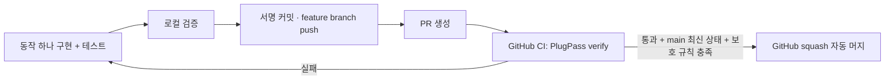

# 작은 기능 → PR → 검증 → 자동 머지

2026-10-01 사용자가 PlugPass에 이 흐름의 적용을 요청했다. 전역 스킬의 기본 권한을 바꾸지 않으며 배포·유료 요금제 변경·저장소 공개 전환·병렬 에이전트 실행은 이 요청에 포함되지 않는다.



## PR의 크기

PR 하나는 목적 하나, 독립적인 검증, 독립적인 되돌리기를 가진다. 정해진 줄 수나 파일 수 제한은 두지 않는다. 기능에 필요한 구현·테스트·계약 문서는 함께 넣는다.

- 충전기 상태 코드를 도메인 상태로 변환한다 → 변환 규칙과 테스트를 한 PR에 넣는다.
- 정보 갱신 시각으로 오래된 데이터를 판정한다 → 경계 시각의 테스트와 함께 별도 PR로 만든다.
- 위 두 결과를 사용하는 조회 API를 제공한다 → 앞선 변경이 main에 들어온 뒤 다음 PR로 진행한다.

이 예시는 향후 작업 단위를 설명하며 현재 충전소 기능이 구현됐다는 뜻은 아니다. 빈 저장소의 초기 커밋은 PR 대상인 main을 만드는 부트스트랩으로 한 번 직접 push한다.

## 에이전트의 작업 순서

1. 최신 main에서 작업 브랜치를 만든다. Codex의 기본 prefix는 `codex/`이며 사용자 지정이 있으면 따른다. 사용자 변경을 덮거나 강제 push하지 않는다.
2. 변경 목적과 실패 조건을 설명하고 해당 동작·테스트를 구현한다. 변경 diff를 리뷰한다.
3. [verify-plugpass](../.agents/skills/verify-plugpass/SKILL.md)에 따라 `bash scripts/verify.sh`를 실행한다. 현재 소스 증거가 필요하면 [.agents/verification.json](../.agents/verification.json)으로 같은 명령을 기록한다. 최종 commit으로 HEAD가 바뀌면 그 HEAD에 대한 증거를 다시 확보한다.
4. 기존 Git 서명 설정을 유지하여 커밋하고 해당 브랜치를 push한다. 인증 실패는 우회하지 않고 원인을 알린다.
5. 같은 head 브랜치의 열린 PR이 있으면 갱신하고, 없으면 `gh pr create --base main --head <branch> --title <title> --body-file <file>`로 생성한다. 본문에는 목적·실제 검증·한계를 쓴다. Codex 작업에 PR을 첨부한다.
6. 아래 보호 설정이 **실제로 적용된 것을 조회한 경우에만** 해당 PR에 `gh pr merge <number> --auto --squash --match-head-commit <verified-head-sha>`를 실행한다. 승인된 기능 범위 안에서 다시 일반적인 머지 허락을 묻지 않는다.
7. 검증한 commit과 현재 PR head를 대조하고 GitHub에서 실제 머지 상태·merge commit과 main의 SHA를 확인한다. 아래 읽기 전용 도구를 사용할 수 있다. CI 실패는 원인을 분류해 수정 후 재검증하며, 충돌·base 변경은 최신 main을 반영해 다시 검사한다. 누락·skip은 실제 실행 증거가 아니며 대기 중인 자동 머지를 완료라고 보고하지 않는다.

에이전트가 작업하는 동안 PR을 만들고 자동 머지를 신청하는 흐름이다. 별도 예약 작업이나 임의의 새 기능을 계속 개발하는 무인 봇을 만드는 것은 아니다.

### 읽기 전용 PR 상태 확인

전역 agent-engineering 도구가 설치된 환경에서 실행한다. `PR_NUMBER`는 해당 작업의 실제 PR 번호로 바꾼다. `plugpass_verified_head`는 현재 소스 증거가 유효한 commit이어야 하며, dirty 변경을 원격 CI로 검증했다고 취급하지 않는다.

```bash
plugpass_verified_head="$(git rev-parse HEAD)"
python3 ~/.agents/skills/agent-engineering/scripts/pr_status.py \
  --repo seungmin-park/PlugPass --pr PR_NUMBER \
  --head "$plugpass_verified_head" --check 'PlugPass verify' --goal merged
```

`--goal ready`는 선택한 검사와 native 머지 준비 상태를, `--goal merged`는 실제 머지까지 관찰한다. 종료 0은 선택한 목표를 관찰한 경우, 1은 미완료, 2는 입력·접근·조회 문제로 확인 불가인 경우다. `head_changed`, `failed`, `pending`, `unverified`, `blocked`에 맞춰 소스·검사 실행 경로·실패 로그·native 차단 원인을 조사한다.

이 도구는 하나의 원격 스냅샷을 읽으며 보호 규칙·검사 출처 앱·assertion 건수·책임 리뷰·merge queue 후보를 직접 검증하지 않는다. 아래 실제 보호 설정과 원본 보고서를 별도로 확인한다. `ready`는 머지 권한이나 이후 변경에 대한 보장이 아니며 승인된 머지는 기존 `--match-head-commit`과 native 보호 아래 수행한다. CI는 전역 스킬 설치에 의존하지 않고 저장소의 공용 verify를 실행한다.

## GitHub가 강제할 조건

- main은 PR을 통해서만 변경한다.
- 필수 check: `PlugPass verify` (GitHub Actions에서 발생한 check).
- 최신 main을 반영한 상태에서 check가 성공해야 한다.
- 관리자에게도 같은 규칙을 적용하고 강제 push·브랜치 삭제를 허용하지 않는다.
- 저장소의 native auto-merge와 squash merge가 활성화되어야 한다.
- 혼자 개발하는 저장소이므로 본인 승인으로 충족할 수 없는 필수 승인 인원은 두지 않는다. 변경 리뷰와 실행 검증은 별개로 수행한다.

보호 규칙이나 요금제 지원을 확인하지 못하면 PR까지만 만들고 멈춘다. `--admin`이나 보호 없는 직접 merge로 성공한 것처럼 처리하지 않는다.

## 공용 검증 명령

```bash
bash scripts/verify.sh
```

JDK 25와 Python 3이 필요하다. clean build → JUnit XML 검사 → JAR 내용 검사 → 실제 HTTP 검사를 순서대로 실행한다. 실패·오류·skip·테스트 0개는 모두 실패다. 직접 띄운 서버만 종료한다. `build/verification/`에 서버 로그·HTTP 결과, `build/test-results/test/`에 테스트 결과를 남긴다.

CI는 PR마다 실행하고 main push도 검사한다. 경로 필터나 성공으로 바꾸는 오류 무시 옵션을 두지 않는다. read-only token으로 검사하며 소스 코드의 실행 권한과 merge 권한을 같은 CI job에 넣지 않는다. GitHub Actions 실패 로그와 보고서는 7일 보관한다.

## 실제 저장소 설정

사용자가 저장소를 공개로 전환한 뒤 GitHub API에서 다음 설정을 확인했다.

- 공개 저장소, native auto-merge 활성화, squash merge 사용 가능.
- main의 필수 검사: `PlugPass verify`, 출처는 GitHub Actions 앱(ID 15368).
- `strict: true`: 최신 main을 반영해야 머지할 수 있다.
- PR 필수, 관리자에게도 규칙 적용, 강제 push·브랜치 삭제 금지.
- 필수 승인 인원은 0명. 혼자 개발하는 프로젝트에서 본인 승인 불가로 멈추지 않도록 하며 CI 조건은 그대로 강제한다.

저장소 설정과 개별 PR의 자동 머지 신청은 별개다. 에이전트는 승인된 작업 범위의 PR마다 위 순서대로 auto-merge를 신청한다. 설정이 나중에 변경될 수 있으므로 신청 전 실제 보호 상태를 조회한다.

도입 당시에는 비공개 저장소의 요금제 제한으로 Rulesets API가 403을 반환했다. 공개 전환으로 해당 제약이 해소됐으며, 보호 없이 merge하는 우회는 사용하지 않았다.

공식 근거: [auto-merge 지원 범위](https://docs.github.com/en/repositories/configuring-branches-and-merges-in-your-repository/configuring-pull-request-merges/managing-auto-merge-for-pull-requests-in-your-repository), [보호 브랜치](https://docs.github.com/en/repositories/configuring-branches-and-merges-in-your-repository/managing-protected-branches/about-protected-branches), [Java CI](https://docs.github.com/en/actions/tutorials/build-and-test-code/java-with-gradle), [CLI 머지 옵션](https://cli.github.com/manual/gh_pr_merge). CLI의 auto와 match-head-commit 동작은 2026-10-05 공식 설명을 확인했다.
