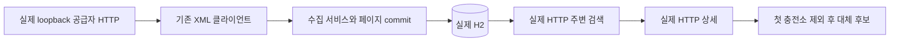

# 핵심 충전소 탐색 흐름 재현

실행 경로: 저장소 루트에서 `./gradlew test --tests '*ChargingJourneyTests' --console=plain`. 전체 검증은 `bash scripts/verify.sh`. JDK25·Python3 필요. 외부 키·유료 실행 없이 로컬 fixture로 재현한다.

`ChargingJourneyTests`는 랜덤 포트의 실제 서버에 HTTP 요청을 보내고 응답 값을 assertion한다. MockMvc·Service mock·테스트 트랜잭션을 사용하지 않는다. 각 테스트가 실제 생성한 데이터는 자식→부모 순서로 정리한다.

| 시나리오 | 정확한 판정 |
| --- | --- |
| 두 충전소 동일 응답 재수집 | 충전소2·충전기2 유지, 거리순·0m·호환/이용 가능 보고 수 확인 |
| 검색 → 상세 → 첫 ID 제외 | 상세 식별자·상태·수집/관측 시각 확인, 대체 ID만 반환 |
| 관측 시각 없는 공급자 계약 | AVAILABLE 보고도 UNVERIFIED, 우선 후보 없음, 확인 필요 이유 반환 |
| 합성 관측 시각 +601초 | RECENT 우선 후보가 MAX_AGE_EXCEEDED 제외 후보로 이동 |
| 공급자503 | 제한 재시도 후 SERVER, 기존 상세/추천 유지, 마지막 성공 시각 유지 |
| 다음 성공 회차 | 동일 ID·건수 유지, 수집 시각 갱신, RECENT 후보 회복 |
| 반경 밖 | 검색·추천 모두200과 빈 목록 |

실제 공급자 XML에는 신뢰할 관측 시각이 없다. 시간 경과 시나리오만 외부 경계의 테스트 adapter가 합성 관측 시각을 넣는다. 실제 XML→파싱→수집→DB→HTTP는 연결되지만, 이 합성 시각은 공급자가 제공한 사실이나 실시간 데이터 계약의 증거가 아니다. 인증된 실공공 API 표본은 키 없어 별도 미확인이다.

응답 파일: `build/verification/charging-journey/*.json`. 테스트 assertion이 정확성을 판정하며 공용 검사기는 필수 suite 실행·필수 HTTP 산출물의 형식/건수를 추가 확인한다. 산출물만으로 assertion 실행을 대신하지 않는다. JUnit 결과: `build/test-results/test/TEST-com.plugpass.ChargingJourneyTests.xml`.

2026-10-05 현재 세션은 CMUX_WORKSPACE_ID·CMUX_SURFACE_ID가 없고 `cmux identify/ping/capabilities` 모두 live socket 없음이다. 권한 경계 밖 identify도 동일했다. 실제 HTTP를 터미널에서 검증했으며 현재 cmux 화면 E2E는 확인하지 못했다. 연결 가능한 세션에서는 AGENTS.md에 따라 전용 보조 pane에 위 명령·로그를 표시해야 한다. 현재 프런트엔드는 없다.

H2는 메모리 모드다. 서버 재시작 후 데이터 보존·현장 충전 성공·주행거리·운영 배포는 이 검증 범위에 포함되지 않는다.
