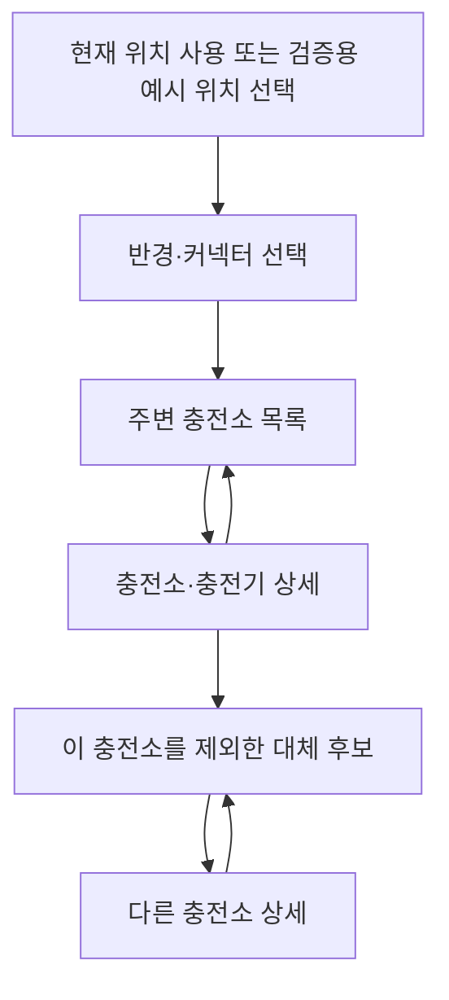
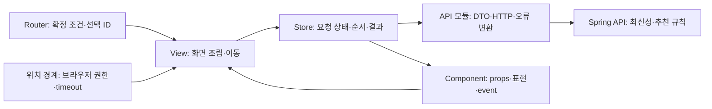
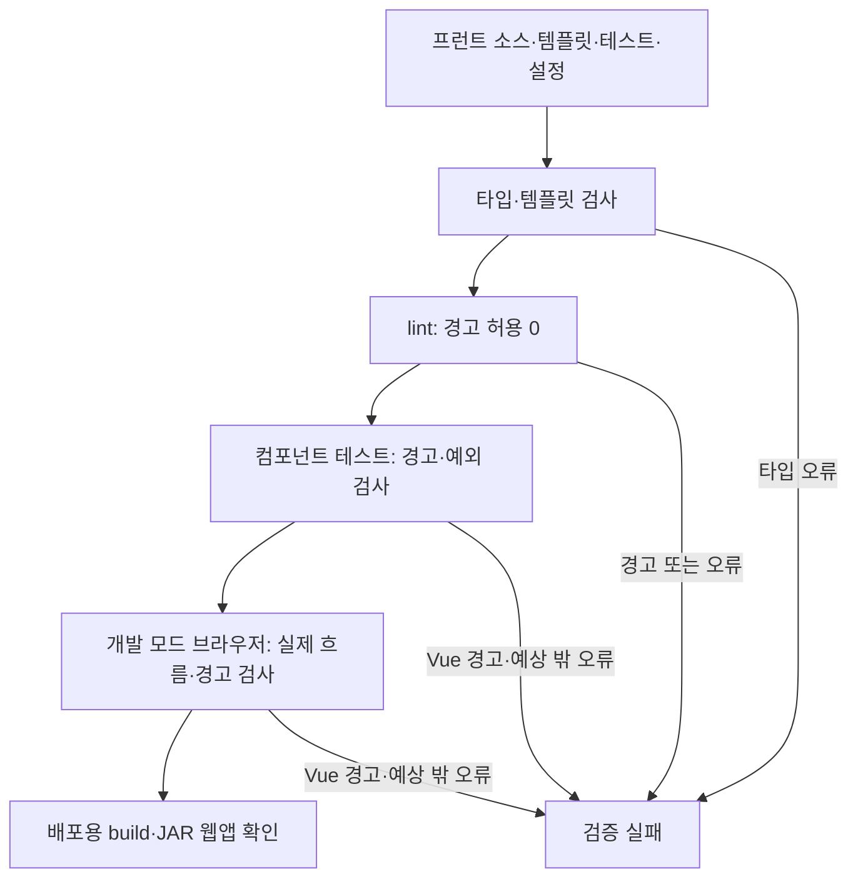

# PlugPass 목록 중심 웹앱 계획

작성일: 2026-10-05. 사용자 요청은 프런트 계획 수립이다. T18 실행·검증 기반은 구현했으며 실제 근거는 [프런트 기록](frontend-verification.md)을 따른다. 후속 화면·전체E2E는 계획이다.

기존 [프로젝트 계획](../plan.md)·[작업 체크리스트](../tasks.md)·[기능 지도](feature-map.md)·[검증 스킬](../.agents/skills/verify-plugpass/SKILL.md)을 확장한다. 새로운 계획 관리 체계는 만들지 않는다. 실행은 기존 `superpowers:executing-plans`로 작업 하나씩 진행하며 병렬 에이전트를 사용하지 않는다.

## 1. 목표와 기준안

운전자가 브라우저에서 **위치·차량 커넥터 선택 → 주변 충전소 검색 → 상태와 정보 시각 확인 → 다른 충전소 선택**을 수행하는 반응형 웹앱을 만든다. 모바일·데스크톱을 지원하는 Vue SPA이며 백엔드의 수집·최신성·추천 판단을 실제 사용자 화면으로 연결한다.

사용자는 **웹앱**, **목록 중심: 검색·상세·대체 후보를 먼저 완성하고 지도는 후속 단계로 추가**를 선택했다. Vue 3·TypeScript와 아래 일정은 이 범위를 구현하기 위한 제안값이다. 범위가 바뀌면 이 문서·plan.md·tasks.md를 함께 갱신한다.

| 접근 | 장점 | 추가 비용·제약 | 판단 |
| --- | --- | --- | --- |
| 목록 중심 Vue 앱 | 기존 API 세 개로 핵심 사용자 흐름 완성, 최신성·추천 이유에 집중 | 지도에서 위치를 비교하는 경험은 후속 | 첫 버전 기준안 |
| 지도와 목록을 동시에 구축 | 주변 위치를 한눈에 비교 | 지도 SDK·키/허용 도메인·표시 조건·SDK 장애·마커 선택 상태 추가 | 지도 포함 선호가 확인되면 범위·기간 조정 |
| 단일 정적 데모 페이지 | 초기 작업량이 작음 | 직접 링크·뒤로 가기·독립 상태 검증을 추가하면 다시 구조를 확장해야 함 | 설명용 일회성 데모에만 적합 |

완료 모습은 그림만 뜨는 화면이 아니라 실제 API로 검색·상세·대체 후보를 연결하고, 실패·빈 결과·미확인을 서로 다르게 표시하는 앱이다. 로그인·회원·결제·예약·즐겨찾기 동기화·알림·주소 검색/지오코딩·경로/주행시간·운영 배포는 첫 버전에 넣지 않는다.

## 2. 화면과 이동



| 화면 | 화면 경로 | 입력·표현·동작 |
| --- | --- | --- |
| 주변 검색 | `/stations` | 위치 획득/예시 위치, 반경·커넥터, 검색/새로고침, 거리순 결과와 데이터 준비 상태 |
| 충전소 상세 | `/stations/:stationId` | 충전기별 상태·최신성·관측/수집 시각·이용 조건, 목록 돌아가기·다른 충전소 찾기 |
| 대체 후보 | `/alternatives` | 같은 검색 조건과 `excludeStationId`, 우선 후보·확인 필요·제외 이유, 후보 상세 이동 |

`/`는 `/stations`로 이동한다. 잘못된 화면 경로는 화면을 찾을 수 없다는 안내와 검색으로 돌아가는 링크를 제공한다. Vue Router의 hash history를 사용하고 웹앱 진입점은 `/app/index.html`로 고정한다. 예: `/app/index.html#/stations?latitude=37.5&longitude=127&radiusMeters=1000&connector=DC_COMBO&limit=20`. 직접 링크 새로고침에 별도 서버 fallback을 요구하지 않으며 API 경로 `/api/v1/...`와 섞지 않는다. 개발에서도 `/app/index.html`을 사용하고 Router가 현재 진입 경로를 보존하도록 구성한다.

제출된 검색 조건은 URL query가 소유하고, 폼의 미제출 입력은 폼이 소유한다. 성공 응답·로딩·오류·요청 순번은 각 기능 Store가 소유한다. 검색 조건을 입력할 때마다 URL/API를 바꾸지 않고 검색 버튼을 누를 때 확정한다. 뒤로 가기·새로고침·직접 링크에서 조건을 복원하고 해당 조건의 데이터를 다시 조회한다. 사용자 위치를 localStorage에 저장하지 않는다.

상세에서 대체 후보로 이동할 때 검색 조건을 그대로 전달하고 상세의 ID를 제외한다. 검색 조건 없는 상세 직접 링크도 조회할 수 있다. 이 경우 ‘다른 충전소 찾기’는 먼저 검색 조건을 선택하게 한다. 대체 후보 직접 링크의 조건/제외 ID가 잘못되면 API 호출 전에 안내한다.

## 3. 위치와 검색 조건

- 첫 화면에서 위치 권한을 자동 요청하지 않는다. ‘현재 위치 사용’ 버튼을 누르면 브라우저 위치 경계를 호출한다.
- 권한 거부·위치 획득 실패·10초 제한을 각각 안내하고 재시도 또는 ‘검증용 예시 위치’ 선택을 제공한다. 예시 위치는 합성 데모 지역임을 표시하며 현재 위치처럼 표현하지 않는다.
- 검증용 예시 위치는 위도 `37.5`, 경도 `127`, 기본 반경 `1000m`, 커넥터 `DC_COMBO`, limit `20`이다. 기존 ChargingJourneyTests의 합성 지역과 맞춘다. 일반 서버에 해당 지역 데이터가 없으면 정상적인 빈 결과이며 자동 seed를 넣지 않는다.
- 반경 선택은 `500/1000/3000/5000/10000m`를 제공한다. 직접 링크는 백엔드 허용 범위 `100~10000m`의 정수를 받는다. limit 기본값 `20`, 허용 `1~50`이다.
- 커넥터는 `DC_CHADEMO`, `AC_SLOW`, `AC_THREE_PHASE`, `DC_COMBO`, `NACS`를 각각 CHAdeMO·AC 완속·AC 3상·DC 콤보·NACS로 표시한다. 공급자 원본 코드와 차량 선택 enum을 혼동하지 않는다.
- 위도 `-90~90`, 경도 `-180~180`의 유한 숫자만 허용한다. 누락·빈 문자열·중복 query 값·NaN·Infinity·비정수 반경/limit·미지원 enum은 거부한다. URL에 조건이 하나도 없을 때만 미검색 초기 화면으로 처리한다.
- 상세·제외 ID는 양수 안전 정수로 받는다. Java Long을 JavaScript number로 읽을 때 정밀도가 손실될 범위의 ID는 다른 대상을 조회하지 않도록 입력/응답 오류로 처리한다.
- 제한 시간·화면 이탈 후 늦게 도착한 위치 결과가 사용자가 나중에 고른 예시 위치를 덮어쓰지 않게 한다. 위치 획득 오류는 HTTP 오류와 별도로 관리한다.

## 4. 현재 API와 화면 계약

실제 기준은 현재 Java request/response DTO와 REST Docs다. 계획 단계에서 새 API를 도입하거나 엔티티를 화면에 직접 노출하지 않는다.

| API | 현재 계약 | 프런트 책임 |
| --- | --- | --- |
| `GET /api/v1/stations` | `latitude, longitude, radiusMeters, connector, limit`; `dataReady, lastSuccessfulRunAt, stations` | 조건 전달, 목록·상태 배너·빈 결과 표현 |
| `GET /api/v1/stations/{stationId}` | 내부 ID; 충전소 위치·충전기 목록 | 상세와 404 표현, 검색 조건 보존 |
| `GET /api/v1/recommendations` | 같은 조건과 선택적 양수 `excludeStationId`; `preferred, requiresConfirmation, excluded` | 반환 그룹/순서 유지, 사유 번역, 제외 대상 전달 |
| HTTP 오류 | `code, message, fields` | 400은 필드 오류, 404는 없는 대상, 그 밖의 실패는 재시도 가능한 화면 오류로 변환 |

검색 항목은 `id, name, latitude, longitude, distanceMeters, compatibleChargerCount, reportedAvailableCount, chargers`를 제공한다. `distanceMeters`는 **직선거리**로 표시한다. API는 page/total/hasNext를 제공하지 않으므로 전체 건수·페이지 수·무한 스크롤을 만들어내지 않는다. `limit`만큼 반환됐으면 ‘최대 20개 표시’처럼 조회 상한을 밝힌다.

`dataReady=false`는 전체 성공 수집 이력이 없다는 뜻이다. 일부 저장된 충전소가 있을 수 있으므로 결과가 있으면 함께 표시하고 ‘전체 수집 완료 전 정보’ 배너를 붙인다. `dataReady=true`이며 빈 목록이면 ‘조건에 맞는 충전소 없음’이다. `lastSuccessfulRunAt`은 전체 수집 성공 시각이며 충전기 관측 시각이 아니다.

추천 응답에는 좌표·충전기 상세·dataReady가 없다. 첫 버전 추천 카드는 이름·직선거리·이유만 보여 주고 클릭 시 상세를 조회한다. 추천 페이지는 같은 조건의 검색 응답을 함께 조회하여 수집 준비 배너를 표시한다. 두 API의 조회가 원자적 snapshot이라는 보장은 없으므로 검색의 성공 수집 시각을 추천 데이터의 관측 시각처럼 표시하지 않는다. 검색 메타 조회만 실패한 경우 후보가 성공했다면 후보와 ‘수집 상태 확인 실패’를 함께 표시하고 독립 재시도를 제공한다.

## 5. 상태·최신성·이유 표현

```text
사용 중?              → status: 충전기 상태
정보를 믿을 수 있는가? → freshness + reasonCode: 서버 판단
언제 관측했는가?      → sourceObservedAt
언제 받아왔는가?      → collectedAt
```

| 서버 값 | 화면 문구 | 지켜야 할 의미 |
| --- | --- | --- |
| AVAILABLE / OCCUPIED / UNAVAILABLE / UNKNOWN | 이용 가능 보고 / 사용 중 / 이용 불가 / 상태 확인 불가 | AVAILABLE만으로 현장 빈자리·충전 성공 보장 금지 |
| RECENT / STALE / UNVERIFIED | 최근 관측 / 오래된 정보 / 최신성 확인 불가 | 서버가 준 판정 유지, 프런트에서 시간 기준 재계산·승격 금지 |
| `sourceObservedAt=null` | 관측 시각 확인 불가 | 수집 시각이나 상태 변경 원본 시각으로 대체 금지 |
| `preferred` | 우선 후보 | 서버 추천 결과와 근거 표현 |
| `requiresConfirmation` | 이용 전 확인 필요 | 우선 후보와 시각적으로 구분 |
| `excluded` | 추천에서 제외된 이유 | 접어 보기 가능, 삭제하여 이유를 숨기지 않음 |

시각은 사용자 로컬 시간대·시간대 표시로 표현하고 API 원본 UTC 값을 변경하지 않는다. 누락/파싱 불가 시각은 ‘확인 불가’로 표시하며 응답 문자열을 HTML로 삽입하지 않는다. 화면에는 조회 시점도 표시하여 오랫동안 열린 화면이 현재 현장 상태를 보장하는 인상을 주지 않는다. 새로고침은 API를 다시 조회하며 첫 버전에 자동 polling은 넣지 않는다.

reasonCode의 한국어 설명은 표시 모듈이 소유한다. 현재 코드의 `RECENT_AVAILABLE`, `UNVERIFIED_AVAILABLE`, `SOURCE_OBSERVED_AT_MISSING`, `SOURCE_OBSERVED_AT_IN_FUTURE`, `WITHIN_MAX_AGE`, `MAX_AGE_EXCEEDED`, `INCOMPATIBLE_CONNECTOR`, `DELETED_BY_PROVIDER`, `ACCESS_RESTRICTED`, `STATUS_UNKNOWN`, `NOT_AVAILABLE`, `NO_COMPATIBLE_CHARGER`, `ACCESS_CONDITIONS_UNVERIFIED`, `OPERATING_HOURS_UNVERIFIED`, `OPERATING_HOURS_REQUIRE_CHECK`를 실제 소스와 대조한다. 알 수 없는 새 상태/사유는 ‘상태 확인 불가’/‘상세 확인이 필요한 사유’로 보수적으로 표시하고 정상 후보로 추측하지 않는다.

원본 이용 조건·비고가 없으면 ‘이용 조건 확인 필요’로 표시한다. 이용 시간 문자열을 프런트에서 영업 여부로 다시 판정하지 않는다. 상태와 최신성은 별도 배지로 표시하고 색만으로 의미를 전달하지 않는다.

## 6. 객체 책임과 파일 배치



Store가 비동기 흐름을 소유하기 때문에 응답 역전 방지는 View마다 복제하지 않는다. Component는 전달받은 값을 표시하고 사용자 의도를 event로 돌려준다. API 모듈은 HTTP 경계만 소유하므로 추천 정책을 계산하지 않는다. 단순 데이터 변환에는 함수·타입을 사용하며 모든 파일을 클래스/인터페이스로 감싸지 않는다.

```text
frontend/
  index.html · package.json · package-lock.json · vite.config.ts · vitest.config.ts
  playwright.config.ts · tsconfig*.json · eslint.config.js
  src/
    main.ts · App.vue · router/index.ts · styles/base.css
    shared/api/httpClient.ts · shared/api/apiError.ts
    shared/location/useCurrentLocation.ts
    shared/ui/RequestState.vue
    features/search/
      types.ts · criteria.ts · api/stationApi.ts · stores/stationSearchStore.ts
      views/StationSearchView.vue · components/SearchForm.vue · components/StationCard.vue
    features/station-detail/
      types.ts · api/stationDetailApi.ts · stores/stationDetailStore.ts
      views/StationDetailView.vue · components/ChargerList.vue
    features/charging-info/
      types.ts · presentation.ts · components/StatusBadge.vue · components/FreshnessBadge.vue
    features/recommendation/
      types.ts · api/recommendationApi.ts · stores/recommendationStore.ts
      views/AlternativeStationsView.vue · components/CandidateGroup.vue
  tests/setup.ts · tests/vueWarnings.ts · tests/vueWarnings.spec.ts
  e2e/fixtures.ts · e2e/charging-journey.spec.ts · e2e/ui-failures.spec.ts
src/test/java/e2e/ChargingDemoApplication.java · DemoProvider.java
src/test/resources/publicdata/browser-demo.xml
scripts/frontend-e2e.sh
```

단일 기능 테스트는 대상 파일과 같은 디렉터리에 `.spec.ts`로 둔다. 공용 충전기 DTO·표시 규칙은 `charging-info`가 소유하고 search/detail에서 중복 정의하지 않는다. API는 같은 origin의 `/api`를 쓰고 개발·E2E에서는 Vite proxy로 Spring에 연결한다. 공공데이터 키는 Spring만 사용하며 `VITE_*`에 넣지 않는다.

웹앱 산출물은 `frontend/dist/`이며 Vite base를 `/app/`로 맞춘다. T24에서 Gradle의 프런트 build와 `bootJar`를 연결해 산출물을 `BOOT-INF/classes/static/app/`에 넣는다. 최종 로컬 실행은 Spring JAR 하나로 `/app/index.html` 웹앱·`/api/v1/...` API·기존 `/docs/index.html` API 문서를 같은 origin에서 제공한다. 프런트 소스와 Node 의존성은 JAR에 넣지 않는다. 외부 공개 배포는 별도 범위다.

의존 방향은 View→Store→API, Component→props/event다. Vue 자체에 SOLID 점수를 매기지 않고 상태·통신·표시 경계를 평가한다. T24에서 ESLint import 제한으로 Vue 파일의 Axios 직접 의존과 API→Store/View 역의존을 거부한다. 문서의 그림은 강제 검사가 아니므로, 실제 임시 위반이 검사에서 거부되는지 확인한다.

## 7. 비동기와 실패 규칙

- 각 Store는 `idle / loading / success / error`를 구분한다. 성공 응답의 빈 배열과 통신 실패를 혼동하지 않는다.
- 새 검색 조건·상세 ID·제외 ID로 바꿀 때 이전 결과를 새 조건의 결과로 표시하지 않는다. 같은 조건의 재조회 실패는 직전 성공 결과를 유지할 수 있지만 ‘이전에 조회한 정보·새로고침 실패’를 명시하고 재시도를 제공한다.
- Axios timeout은 `10000ms`, 자동 재시도는 `0`회다. 수동 재시도는 같은 확정 조건으로 한 번의 새 요청을 보낸다. 조건 변경·화면 이탈에서는 AbortController로 이전 요청을 취소한다.
- 취소에만 의존하지 않고 요청 순번도 확인한다. A→B로 보낸 후 B→A 순으로 돌아와도 B가 최종 결과이며, A의 실패가 B의 성공을 지우지 않는다.
- 400의 `fields`는 해당 입력에 표시하고 연결된 라벨과 포커스를 제공한다. 404는 대상 없음 화면이다. timeout·network·429·5xx를 분류하고 무한 재시도 없이 다시 시도 버튼을 제공한다. 취소는 오류로 알리지 않는다.
- 잘못된 JSON·응답 구조/배열 누락은 ‘응답을 확인할 수 없습니다’로 처리한다. 타입 단언만으로 안전하다고 보지 않고 API 경계에서 최소 구조·필수값을 확인한다. 새 enum/사유는 앞 절의 보수적 표시로 처리한다.

## 8. 기술 후보와 공식 확인

| 영역 | 제안 | 용도·확인 사항 |
| --- | --- | --- |
| UI | Vue 3 · TypeScript | `<script setup lang="ts">`, strict 타입 검사, props/event |
| 개발 | Vite · npm | 프런트 독립 개발·정적 build, lockfile 재현 |
| 이동·상태·통신 | Vue Router · Pinia · Axios | URL·비동기 상태·HTTP 책임 분리 |
| 단위·컴포넌트 | Vitest · Vue Test Utils · jsdom | 입력·렌더링·event·상태 전이, 외부 경계만 제어 |
| 브라우저 | Playwright | 실제 클릭·입력·이동과 assertion, 로컬 headed/UI·CI headless |

2026-10-05 공식 문서의 관련 절을 확인했다. Vue 공식 생성 도구는 Vite/TypeScript 구성을 제공한다. Vite build는 타입 검사를 대신하지 않으므로 `vue-tsc`를 별도 실행한다. 당일 Vite guide는 Node `20.19+ / 22.12+`를 요구하지만 생성 template·Vitest의 실제 버전 조건까지 만족하는 Node를 T18에서26.7.0으로 확정했다. 채택한 lockfile 조합의 실제검증은 프런트기록을 따르며 다른최신버전의 호환성을 보장하지 않는다.

도입할 때 package-lock.json과 프로젝트 Node 설정에 채택 버전을 고정하고, `npm ls --depth=0`·실제 type-check/test/build 결과를 [기술 기록](official-stack-guide.md)·[출처 목록](official-sources.json)에 반영한다. 공식 동작과 이 계획의 구성 판단을 구분한다.

- [Vue TypeScript](https://vuejs.org/guide/typescript/overview.html): 프로젝트 생성·타입 검사.
- [Vite guide](https://vite.dev/guide/) · [proxy](https://vite.dev/config/server-options.html#server-proxy): 실행 환경·개발 연결.
- [Vite build의 base 경로](https://vite.dev/guide/build.html#public-base-path) · [Spring 정적 파일 제공](https://docs.spring.io/spring-boot/4.1/reference/web/servlet.html#web.servlet.spring-mvc.static-content): `/app/` 산출물과 실제 JAR HTTP 확인.
- [Vue Router](https://router.vuejs.org/guide/): route/history.
- [Pinia actions](https://pinia.vuejs.org/core-concepts/actions.html): 비동기 action.
- [Axios cancellation](https://axios-http.com/docs/cancellation): AbortController.
- [Vitest](https://vitest.dev/guide/) · [Vue Test Utils](https://test-utils.vuejs.org/guide/): runner·mount.
- [Playwright UI mode](https://playwright.dev/docs/test-ui-mode): 화면에 보이는 러너.
- [브라우저 위치 API](https://developer.mozilla.org/en-US/docs/Web/API/Geolocation/getCurrentPosition): secure context·권한·timeout.

## 9. 구현 순서와 예상 기간

기존 T16 성능 개선·T17 장애 검증을 마친 뒤 T18→T24을 순서대로 진행한다. 각 기능의 사용법·검증 근거는 해당 기능 작업에서 갱신한다. API가 바뀌면 착수 전 계약을 재확인한다. 기존 백엔드 4~6주에 프런트 8~12작업일을 추가하는 개략 추정으로 전체 6~8주를 예상한다. 구현·리뷰·CI 대기·환경 준비에 따라 달라지며 날짜를 확약하는 일정은 아니다.

| 작업 | 독립적으로 확인할 결과 | 예상 | 선행 |
| --- | --- | --- | --- |
| T18 | Vue·테스트 기반과 실제 렌더링되는 검색 진입점 | 1일 | T16·T17·계약 확인 |
| T19 | API 타입·입력/query·오류 변환 계약 | 1일 | T18 |
| T20 | 위치 선택부터 실제 API 주변 검색까지 | 2일 | T19 |
| T21 | 상세·상태/최신성/시각/이용 조건 표시 | 1~2일 | T20 |
| T22 | 제외 조건을 유지한 대체 후보와 이유 | 1~2일 | T21 |
| T23 | 실제 백엔드 연결과 화면에 보이는 브라우저 E2E | 1~2일 | T22 |
| T24 | 모바일·키보드·웹앱 JAR 패키징·의존성 검사·필수 CI | 1~2일 | T23 |

각 작업의 checkbox·파일·Red/Green/Refactor·명령은 [tasks.md](../tasks.md)의 T18~T24이 소유한다. 이 표는 검증 완료 목록이 아니다.

## 10. 검증과 근거

| 범위 | 실제 확인할 내용 | 제어 경계·한계 |
| --- | --- | --- |
| 순수 함수 | query 값 경계·표시 규칙·알 수 없는 값 처리 | 도메인의 추천/최신성 규칙 재구현 없음 |
| Store | loading→success/error·취소·응답 역전·동조건 재시도 | HTTP만 제어, 상태 전이는 실제 Store |
| Component/View | 라벨·폼·event·표시·route 복원 | API/위치 경계 제어, private 변수 직접 검증 없음 |
| UI 브라우저 테스트 | 권한 거부·400/404/429/5xx·빈 결과·응답 역전 | Playwright mock 범위, 실제 DB 연결로 보고하지 않음 |
| 전체 E2E | 공급자 fixture HTTP→수집→H2→실제 API→검색·상세·제외 추천 클릭 | 공급자·시간만 제어하고 실제 Service/Repository/Controller 사용. 인증된 공공 API 검증은 아님 |

### 10.1 엄격한 정적 검사와 Vue 경고

2026-10-05 사용자가 타입·템플릿 검사를 강하게 적용하고 `[Vue warn]`도 실패 처리하도록 요청했다. T18에서 정적 검사·단위 테스트 경고 수집과 실제 거부를 구현·검증했다. [실행 기록](frontend-verification.md)을 따른다. T18에서 로컬 검사와 필수 CI의 타입·lint·단위 테스트를 마련하고, T23에서 브라우저 경고 검사를 확인한 뒤 T24에서 전체 E2E·배포 산출물 검증까지 기존 필수 CI에 연결한다.



| 검사·소유 위치 | 강제할 계약 | 실제 거부 확인 |
| --- | --- | --- |
| `tsconfig*.json`·`type-check` | TypeScript `strict: true`, `noUncheckedIndexedAccess: true`, `exactOptionalPropertyTypes: true`; Vue `vueCompilerOptions.strictTemplates: true` | props 타입 오류·없는 템플릿 변수·미확인 null/배열 원소 접근·undefined를 허용하지 않은 optional 속성 대입이 타입 진단과 비정상 종료를 발생시킴 |
| `package.json`·`build` | `type-check` 성공 후 `vite build`; 운영 `.vue`/TS·단위 테스트·설정·E2E TS를 해당 tsconfig로 모두 검사 | 운영 소스와 테스트/설정의 임시 타입 오류를 각각 검사하고, 오류가 있으면 build도 실패 |
| `eslint.config.js`·`lint` | `eslint ... --max-warnings 0`; T24의 기존 의존성 규칙 유지 | 임시 lint 경고 1건으로 비정상 종료; 금지 import도 별도 거부 |
| `tests/setup.ts`·`tests/vueWarnings.ts` | 테스트별 Vue 경고·예상 밖 console 경고/오류 수집, 정리까지 감시 후 assertion; Vitest의 처리되지 않은 예외 실패 유지 | 경고 0은 통과; 실제 Vue 경고·console 진단·비동기 예외의 임시 probe는 각각 실패; 다음 정상 테스트에 수집 상태 누출 없음 |
| `e2e/fixtures.ts` | 최초 이동 전 `console`·`pageerror` 감시, 테스트 완료/정리까지 유지, 모든 UI/E2E spec이 공용 fixture 사용 | 초기 mount 경고·클릭 후 비동기 경고·처리되지 않은 예외의 임시 probe가 Playwright를 실패시킴 |
| `scripts/verify.sh`·기존 필수 `PlugPass verify` | 실제 검사 종료 코드 전파, 테스트 0개·skip·누락·실패 거부 | T18 검사와 T24 전체 E2E 연결 시 실제 실패·누락을 공용 경로가 거부; 실패 유도는 복원 후 전체 통과 |

Vite는 TypeScript를 변환하지만 타입 검사를 수행하지 않는다. 따라서 `type-check`는 `.vue`를 지원하는 `vue-tsc`와 필요한 설정용 TypeScript 검사를 실제로 실행해야 한다. tsconfig를 여러 개 두면 파일이 어느 검사에 포함되는지 확인하며, 루트 설정만 실행하고 하위 소스가 빠진 결과를 통과로 보지 않는다. `strictTemplates`는 Vue Language Tools 옵션이며 런타임 `app.config.compilerOptions`와 구분한다. 채택 버전의 실제 옵션·템플릿 진단은 T18에서 확인한다.

`tests/setup.ts`는 수집기의 등록·해제와 테스트별 정리를, `tests/vueWarnings.ts`는 진단 수집·실패 판정을 맡는다. `tests/vueWarnings.spec.ts`는 정상/실패 판정과 격리를 검증한다. `e2e/fixtures.ts`는 브라우저 이벤트 수집·수명·마지막 assertion을 소유한다. 제품 View/Store가 검증 정책을 소유하지 않으며, 별도 검증 프레임워크나 제품용 경고 수집 API를 만들지 않는다.

`app.config.warnHandler`와 console 경로를 함께 살펴 Vue 경고가 수집기를 우회하거나 조용히 소비되지 않게 한다. handler에서 throw한 오류는 Vue의 오류 처리 경로를 거칠 수 있으므로 수집 결과를 테스트 assertion으로 판정한다. 처리되지 않은 예외를 무시하는 runner 옵션·전역 빈 handler·console 출력만 없애는 mock은 금지한다. 경고 수집·spy·handler는 테스트별로 복원하고 mount 해제·대기 중 작업까지 감시한다. 일반 애플리케이션 테스트는 Vue 경고 0건이어야 하며, 실제 경고 발생 probe는 별도로 실행해 비정상 종료를 확인하고 제거한다.

HTTP 400/404/429/5xx·timeout은 화면이 처리해야 하는 정상적인 실패 시나리오다. 이 과정에서 브라우저가 내는 예상 진단을 허용해야 하면 그 테스트에만 종류·메시지/URL·횟수를 명시하고 실제로 발생했는지 확인한다. 전체 console.error 무시·부분 문자열 하나로 광범위한 허용·Vue 경고의 전역 허용은 하지 않는다. 화면의 오류 안내·재시도·상태 유지 assertion도 함께 확인한다.

Vue 경고는 개발 모드에서 발생하고 `warnHandler`도 production에서는 적용되지 않는다. 개발 모드의 UI/실제 DB 연결 E2E와 T24의 배포용 JAR 웹앱 검사를 모두 유지한다. production의 경고 0건은 개발 모드 검사를 대신하지 않으며, 개발 모드 통과도 JAR 경로·직접 링크·실제 산출물 동작을 대신하지 않는다. 로컬 두 범위의 실행은 기존 cmux 표시 규칙을 따른다.

타입은 런타임에 외부 JSON을 검증하지 않고, 경고 감시는 실행한 경로에서 발생한 문제만 관찰한다. API 응답은 T19의 구조·필수값 검증을 유지하고, 검색/상세/추천·응답 역전·실패 복구의 실제 assertion을 생략하지 않는다. 수집기가 정상이어도 테스트 경로가 빠질 수 있으므로 T24의 필수 suite/0개/skip 검사와 기능 지도를 함께 확인한다.

공식 근거는 [Vue 타입 검사](https://vuejs.org/guide/typescript/overview.html#overview), [TypeScript 옵션](https://www.typescriptlang.org/tsconfig/), [Vue Language Tools 옵션](https://github.com/vuejs/language-tools/blob/master/packages/language-core/lib/types.ts), [Vue warnHandler](https://vuejs.org/api/application.html#app-config-warnhandler), [ESLint 경고 한도](https://eslint.org/docs/latest/use/command-line-interface#--max-warnings), [Playwright console](https://playwright.dev/docs/api/class-page#page-event-console)·[pageerror](https://playwright.dev/docs/api/class-page#page-event-page-error)다. 공식 동작을 검증 정책으로 연결하는 것은 프로젝트 설계 판단이며 도입 버전·실제 거부 결과는 해당 작업에서 기록한다.

### 10.2 사용자 흐름과 화면 표시

T23의 test-classpath 데모 서버는 `ChargingJourneyTests`의 외부 HTTP/시간 경계를 재사용한다. `browser-demo.xml`은 37.5/127 근처 합성 충전소 2곳을 명시하고 ApplicationRunner가 실제 `StationSyncService.synchronize()`를 호출한다. DB seed SQL·Service mock·운영 seed/admin route를 추가하지 않는다. 관측 시각 없는 일반 데모는 UNVERIFIED 상태로 확인 필요 후보에 나온다. RECENT/STALE 표시 테스트에서 합성 시각을 쓰면 별도의 제어 데이터임을 명시한다.

test-classpath 도우미는 운영 JAR에 포함하지 않고 공용 verify의 JAR 내용 검사로 부재를 확인한다. 브라우저 테스트는 읽기 중심의 고정 데이터를 사용하고 다른 데이터 시나리오가 필요하면 별도 프로세스/DB로 실행한다. 공유 DB를 전부 삭제하는 병렬 테스트를 쓰지 않는다. 기존 `ChargingJourneyTests` assertion과 `bash scripts/verify.sh`를 유지한다.

예정 명령은 `npm --prefix frontend run test:unit`, `type-check`, `lint`, `build`, `test:e2e -- --headed`, 선택적 `test:e2e:ui`다. CI 공용 진입점은 기존 `bash scripts/verify.sh`를 확장한다. T18의 test:unit/type-check/lint/build와 기존CI연결은 구현·실행했다. 브라우저E2E명령·데모도우미는 T23의 미구현범위다.

로컬 E2E는 [AGENTS.md](../AGENTS.md)를 따른다.

1. `CMUX_WORKSPACE_ID`·`CMUX_SURFACE_ID`·`cmux identify --json`으로 호출 workspace/surface를 확인한다.
2. 같은 workspace의 E2E 보조 pane을 재사용하고 없으면 호출 terminal 오른쪽에 focus false로 하나 만든다. 명시한 workspace/surface에서 서버·러너 명령과 로그를 표시한다.
3. 같은 workspace의 cmux browser에서 위치/조건 입력→검색→상세→대체 후보를 실제 클릭한다.
4. Playwright assertion도 별도 headed/UI 러너에서 실행한다. mock UI 테스트와 cmux browser의 실제 DB E2E를 같은 검증으로 표현하지 않는다.
5. 연결 불가이면 원인·가능했던 범위·미확인을 기록한다. 보이지 않는 실행을 화면 E2E로 보고하지 않는다. 종료 코드·assertion·JUnit/HTML/trace·서버 로그를 보존하고 pane을 남긴다.

예정 산출물은 `frontend/test-results/`, `frontend/playwright-report/`, `build/verification/frontend-e2e/`, `docs/frontend-verification.md`다. 테스트 0개·전체 skip·실패 숨기기를 거부하고 실제 assertion과 실행 소스를 대응시킨다. 기존 검증 스킬/기능 지도에는 구현 후 실제 명령·결과를 추가한다.

## 11. 완료 기준과 후속 지도

- 실제 API로 검색→상세→같은 조건에서 첫 충전소 제외→다른 후보 상세까지 이동한다.
- dataReady=false와 빈 결과, 상태와 최신성, 관측 시각과 수집 시각, 확인 필요와 우선 후보를 구분한다.
- 위치 거부·조건 경계·알 수 없는 값·400/404·timeout/429/5xx·잘못된 응답·순서 역전 assertion이 있다.
- 모바일 `375×812`·데스크톱 `1440×900`, 키보드 주요 조작·라벨·포커스·상태 알림을 검증한다. 가로 스크롤과 색만으로 상태를 표시하는 문제를 남기지 않는다.
- 타입·템플릿 오류·lint 경고·Vue 경고·실행 예외의 실제 거부와 복원 후 전체 통과를 기록한다. 개발 모드 경고 검사와 배포용 JAR 검사를 구분한다.
- 프런트 전체 테스트·type-check·lint·build, 기존 백엔드 공용 verify·필수 CI가 실제 통과한다. 화면 E2E 가능 여부와 실공공 API 미확인을 별도로 기록한다.
- 실제 JAR의 `/app/index.html`과 연결된 JS/CSS가 정상 제공되고 직접 링크 새로고침·같은 origin의 API·기존 REST Docs 경로가 동작한다. 개발 서버에서만 확인한 결과를 JAR 웹앱 검증으로 바꾸어 말하지 않는다.
- 이름→실제 처리→소유 위치·호출부를 리뷰하고 공개 API/JSON 변경 여부를 기록한다.

T25 지도는 첫 버전 이후의 후속 단계다. SDK 공식 조건·키/허용 도메인·출처 표시·브라우저 지원을 확인한 뒤 채택한다. 첫 지도는 검색 응답의 위경도로 마커·카드 선택을 연결하고 SDK 실패 시에도 목록을 제공한다. 추천 응답에 위치가 없으므로 추천 지도까지 포함하면 좌표 DTO 확장과 HTTP/REST Docs 회귀 검증 또는 선택 시 상세 조회를 별도 설계한다. 주소 검색·경로 안내는 자동으로 포함하지 않는다. 지도 SDK는 아직 선택하지 않았으며 비용 발생·공개 배포 권한을 이 계획으로 확대하지 않는다.

## 12. 이번 계획 문서의 확인 범위

계획 작성 당시 DTO·Controller·프런트 미구현·CI/verify 구성과 대조했다. T18의 실제도입/검증은 별도실행기록을 따른다. 이는 계획 문서의 정합성 확인이며 프런트 기능·TDD Red/Green·브라우저 E2E 실행 근거가 아니다. 계획 PR의 필수 CI 통과도 미래 프런트 기능의 검증으로 해석하지 않는다.

문서를 수정할 때는 현재 내용의 링크·작업 참조·선행 조건·문서 배치를 확인한다. 문서만 변경한 작업의 검사를 애플리케이션/프런트/E2E 실행으로 표현하지 않는다. 원격 필수 CI와 실제 main 반영은 전달 PR에서 별도로 확인한다.
