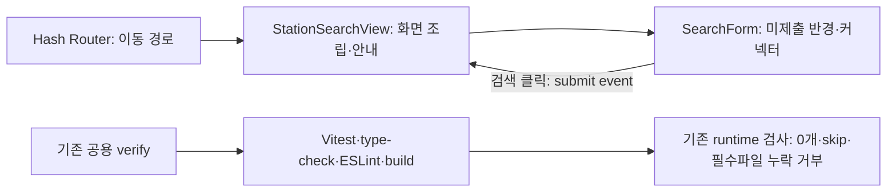

# 프런트 실행 기록

## T18 — 검색 진입점과 검사 기반

공식 create-vue3.24.0의 TypeScript·Router·Pinia·Vitest bare 구성에서 시작했다. 샘플 counter/테스트·favicon·devtools 의존성은 제거하고 검색 진입점과 필요한 검사만 유지했다. Node26.7.0·npm11.19.0, Vue3.5.43·TypeScript6.0.3·Vite8.3.2·Router4.6.4·Pinia4.0.3·Axios1.20.0·Vitest5.0.3·VueTestUtils2.5.1·jsdom30.1.2를 직접 의존성의 정확한 버전과 lockfile에 고정했다. [실제 해석 목록](evidence/t18/dependencies.txt).

최신 TypeScript7은 typescript-eslint8.71의 `<6.1` peer 지원 범위 밖이어서 공식 Vue template도 사용하는6.0계열을 선택했다. Router는 계획의 명시적 hash route API를 사용하는4.6.4를 선택했으며 rolling문서의v4/v5를 구분했다. 실제 실행이 조합의 확인 근거다.

Red: `npm --prefix frontend run test:unit -- src/features/search/components/SearchForm.spec.ts`, 빈form의 라벨/기본선택 assertion 실패(4건 중3실패, 자동위치요청 없음은 기존 상태 확인). 없는select 조작 실패를 유일한 Red 근거로 사용하지 않았다. Router의 검색 redirect/404안내도2건의 실제 assertion 실패를 확인했다. 검사기5건은 0개/누락/실패/skip을 거부하지 않는 assertion 실패를 확인했다.

Green: 기본1000m·DC_COMBO, 라벨/5반경·5커넥터·검색submit event를 구현했다. Vue Router hash history에서 `/`→`/stations`, 없는화면 안내/복귀링크를 제공한다. API나 위치 권한 요청은 없다. `/app/index.html`을 Vite base `/app/`로 제공한다.

Refactor: 폼은 입력과event, View는조립, Router는이동, 공용CSS는기본표현을 소유한다. 인터페이스/클래스 래퍼나 빈기능패키지는 만들지 않았다. TS함수/모듈에는 입력·표현 책임을 적용하고 Vue컴포넌트에는 props/event/렌더링 경계로 검토했다. 기존 Java HTTP/JSON 계약은 유지한다.

대상/전체 프런트6건 통과, type-check·lint(경고0)·build 종료0. npm 설치는 실제254패키지/감사255였다. 검사는 기존 `scripts/verify.sh`와 `PlugPass verify` CI에 통합하고 setup-node v6의 확인한SHA/Node고정값을 사용한다. 단위report의 실제assertion과 [필수파일](required-frontend-tests.json)을 기존 runtime검사기가 확인하며 testsuite0/skip/누락은 통과시키지 않는다. JAR프런트포함은 T24범위다.

## 현재 Codex 세션의 실제 브라우저

사용자가 cmux 대신 현재 Codex 세션을 허용했다. `http://localhost:5173/app/index.html`을 보이는 Codex in-app browser로 열었고 다음 실제조작/화면을 확인했다.

1. URL이 `#/stations`로 이동하고 검색반경1km·DC콤보·검색버튼을 표시한다.
2. 반경3km·NACS를 실제선택하고 검색버튼을 클릭하면 위치를먼저선택하라는 상태안내가 바뀐다.
3. 직접링크 새로고침 뒤 같은`/app/index.html#/stations` 진입점과 기본폼이 정상 표시된다.
4. `#/missing-screen`에서 없는화면 안내와 복귀링크를 확인하고 링크를실제클릭하여 검색으로돌아온다.

이는 T18의 실제 렌더링/조작 검증이다. 위치→실제API검색→상세→추천 흐름이나 Playwright러너의 전체E2E로 표현하지 않는다. T20~T24는 남아 있다. 초기T16의127.0.0.1 임의포트 JSON주소는 브라우저차단이 있었지만, T18의localhost 개발웹앱은 실제열림/조작을 확인했다. 서버로그는 `/tmp/plugpass-t19-work/frontend-dev.log`다.

T18 최종 공용검증 `bash scripts/verify.sh` 종료0: Java360건·Python21건·프런트6건·타입/lint/build·JAR실제HTTP·별도JVM재시작 assertion 모두통과, 실패/오류/skip0.
