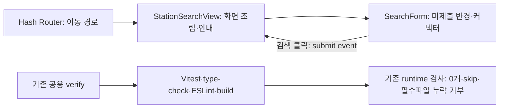
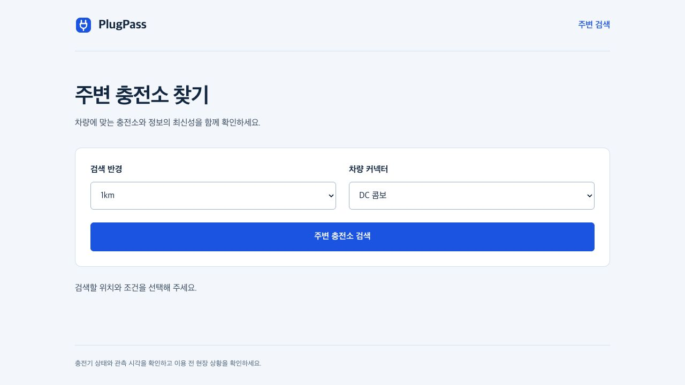
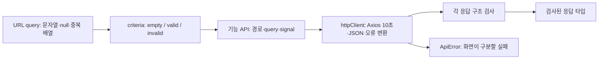
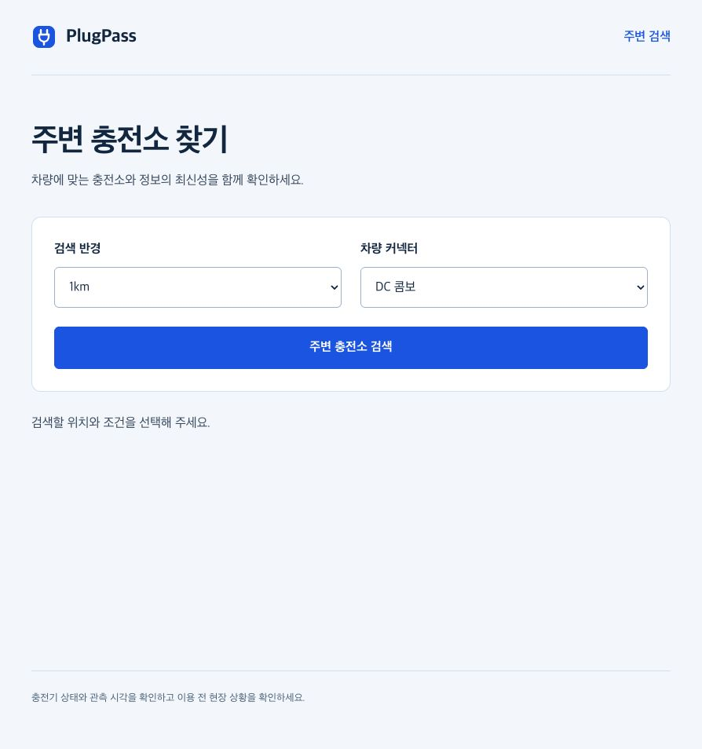

# 프런트 실행 기록

## T18 — 검색 진입점과 검사 기반

공식 create-vue3.24.0의 TypeScript·Router·Pinia·Vitest bare 구성에서 시작했다. 샘플 counter/테스트·favicon·devtools 의존성은 제거하고 검색 진입점과 필요한 검사만 유지했다. Node26.7.0·npm11.19.0, Vue3.5.43·TypeScript6.0.3·Vite8.3.2·Router4.6.4·Pinia4.0.3·Axios1.20.0·Vitest5.0.3·VueTestUtils2.5.1·jsdom30.1.2를 직접 의존성의 정확한 버전과 lockfile에 고정했다. [실제 해석 목록](evidence/t18/dependencies.txt).

최신 TypeScript7은 typescript-eslint8.71의 `<6.1` peer 지원 범위 밖이어서 공식 Vue template도 사용하는6.0계열을 선택했다. Router는 계획의 명시적 hash route API를 사용하는4.6.4를 선택했으며 rolling문서의v4/v5를 구분했다. 실제 실행이 조합의 확인 근거다.

Red: `npm --prefix frontend run test:unit -- src/features/search/components/SearchForm.spec.ts`, 빈form의 라벨/기본선택 assertion 실패(4건 중3실패, 자동위치요청 없음은 기존 상태 확인). 없는select 조작 실패를 유일한 Red 근거로 사용하지 않았다. Router의 검색 redirect/404안내도2건의 실제 assertion 실패를 확인했다. 검사기5건은 0개/누락/실패/skip을 거부하지 않는 assertion 실패를 확인했다.

Green: 기본1000m·DC_COMBO, 라벨/5반경·5커넥터·검색submit event를 구현했다. Vue Router hash history에서 `/`→`/stations`, 없는화면 안내/복귀링크를 제공한다. API나 위치 권한 요청은 없다. `/app/index.html`을 Vite base `/app/`로 제공한다.

Refactor: 폼은 입력과event, View는조립, Router는이동, 공용CSS는기본표현을 소유한다. 인터페이스/클래스 래퍼나 빈기능패키지는 만들지 않았다. TS함수/모듈에는 입력·표현 책임을 적용하고 Vue컴포넌트에는 props/event/렌더링 경계로 검토했다. 기존 Java HTTP/JSON 계약은 유지한다.

대상/전체 프런트9건 통과, type-check·lint(경고0)·build 종료0. npm 설치는 실제254패키지/감사255였다. 검사는 기존 `scripts/verify.sh`와 `PlugPass verify` CI에 통합하고 setup-node v6의 확인한SHA/Node고정값을 사용한다. 단위report의 실제assertion과 [필수파일](required-frontend-tests.json)을 기존 runtime검사기가 확인하며 testsuite0/skip/누락은 통과시키지 않는다. JAR프런트포함은 T24범위다.

## 현재 Codex 세션의 실제 브라우저

사용자가 cmux 대신 현재 Codex 세션을 허용했다. `http://localhost:5173/app/index.html`을 보이는 Codex in-app browser로 열었고 다음 실제조작/화면을 확인했다.

1. URL이 `#/stations`로 이동하고 검색반경1km·DC콤보·검색버튼을 표시한다.
2. 반경3km·NACS를 실제선택하고 검색버튼을 클릭하면 위치를먼저선택하라는 상태안내가 바뀐다.
3. 직접링크 새로고침 뒤 같은`/app/index.html#/stations` 진입점과 기본폼이 정상 표시된다.
4. `#/missing-screen`에서 없는화면 안내와 복귀링크를 확인하고 링크를실제클릭하여 검색으로돌아온다.

이는 T18의 실제 렌더링/조작 검증이다. 위치→실제API검색→상세→추천 흐름이나 Playwright러너의 전체E2E로 표현하지 않는다. T20~T24는 남아 있다. 초기T16의127.0.0.1 임의포트 JSON주소는 브라우저차단이 있었지만, T18의localhost 개발웹앱은 실제열림/조작을 확인했다. 서버로그는 `/tmp/plugpass-t19-work/frontend-dev.log`다.

T18 최종 공용검증 `bash scripts/verify.sh` 종료0: Java360건·Python21건·프런트9건·타입/lint/build·JAR실제HTTP·별도JVM재시작 assertion 모두통과, 실패/오류/skip0.

## T18 — 강화한 정적 검사와 실행 진단

main의 PR35 지침을 병합하여 TypeScript strict/noUncheckedIndexedAccess/exactOptionalPropertyTypes와 Vue strictTemplates를 적용했다. app은 운영 Vue/TS, node는 도구 설정, vitest는 단위 테스트·공용 setup·미래 e2e TS를 포함한다. 아직 Playwright/E2E 구현은 없다. build는 type-check 성공 후 Vite를 실행한다.

수집기 Red는 진단이 있는데 실패하지 않는 실제 assertion2건이었다(0건 정상1건 통과). Green은 테스트별 메시지 컬렉션과 마지막 assertion이다. 공용 setup은 mount 전에 Vue plugin과 console 감시를 등록하고, auto-unmount와 flushPromises 이후 판정하며 finally에서 spy/global/plugin을 복원한다. Vue handler는 진단을 먼저 기록한 뒤 기존 handler나 실제 console로 전달한다. 이후 handler 변경도 수집을 유지하며 console 교체는 실패시킨다. 제품 코드에는 검증 상태를 넣지 않았다. Vitest의 unhandled exception 실패 동작을 유지한다.

[17개 임시 probe 결과](evidence/t18/strict-probes/result.json)와 해당 폴더 로그: null·배열·optional·템플릿·동적 props·테스트/설정/E2E TS 오류·build 선행검사 종료2, lint 경고 종료1; 실제 Vue warning·빈 handler·console warn/error·console mock·unmount 경고·비동기 예외 종료1. 진단 probe의 다음 정상 테스트는 통과하여 수집 상태 격리를 확인했다. 첫 한 줄 정적 props probe는 통과했으므로 거부 근거로 세지 않았고, 여러 줄 동적 문자열→숫자 바인딩의 TS2322 실패로 확인했다. 모든 임시 파일·설정을 복원했다. 지연 작업 전체나 미실행 경로의 오류를 증명하는 검사는 아니며 T23 브라우저 진단 검증은 별도다.

## T19 — URL 조건과 HTTP/JSON 계약

T18 PR36/main `1e4e544`·필수 CI 성공 후 별도 브랜치에서 진행했다. 현재 Java StationSearchRequest/RecommendationRequest와 StationSearchResponse/StationDetailResponse/ChargerResponse/RecommendationResponse·REST Docs를 확인했다. 서버는 limit 생략 시20, 위도±90·경도±180, 정수 반경100~10000·limit1~50, 다섯 Connector를 사용한다. JavaLong을 JS 안전 정수 밖에서 반올림하여 다른 ID로 보내지 않는다.

Red: 여섯 대상 파일127건 중107건이 누락된 동작의 assertion으로 실패하고20건은 기존 빈 상태/거부 확인이었다. 테스트 adapter 복원에 strict optional 타입 오류가 있어 먼저 수정했고, type-check 종료0 후 동일107 assertion 실패를 다시 실행했다. [원본 Red](evidence/t19/t19-red.log.gz)·[타입 확인](evidence/t19/t19-red-typecheck.log.gz).

Green: parseSearchCriteria는 알려진 query가 없으면 empty, 부분 조건·null/빈값·배열 중복·범위·유한수·정수/커넥터를 검사하고 invalid.fields 또는 valid.criteria를 반환한다. 반경/limit의 소수·지수 표현은 정수 입력으로 거부한다. 좌표는 유한한10진/지수 표현을 허용하고 hex는 거부한다. URL ID는 공백 없는10진 문자열의 양의 안전 정수다. 직접 API 입력도 요청 전에 범위/ID를 검사한다.

API는 `/api/v1/stations`, `/stations/{id}`, `/recommendations`의 정확한 직렬화 URL·query·signal을 확인했다. Axios timeout10000·responseType json·silentJSONParsing false로 설정하고 `getValidatedJson`이 unknown 응답의 구조를 확인한 후 반환한다. 400 fields,404,429,500/503,network,timeout,이미/진행 중 취소, 잘못된 JSON/중첩 응답 구조를 구분한다. 재시도는 하지 않으며 실패 요청1회·취소/잘못된 입력0회를 확인했다. adapter만 테스트 경계로 대체했고 실제 Axios 직렬화·JSON 변환·취소 경로는 유지했다.10초 실네트워크 대기나 전체 UI 검색을 실행한 근거로 바꾸어 표현하지 않는다.

응답은 서버의 nullable 시각·세 추천 그룹·reasonCodes를 그대로 보존한다. 추천에 없는 좌표/dataReady를 생성하지 않는다. 미래 상태/최신성/이유 코드는 문자열 그대로 보존하여 T21 표시 fallback에 전달한다. 시각을 프런트에서 다시 최신성으로 계산하지 않으며 시각 문자열의 표시/해석은 T21 책임이다. 응답 fixture는 [실제 Java HTTP 산출물](evidence/t19/fixture-origin.md)이다.

Refactor: `parseNumericQueryField`는 query 숫자 검사, `getValidatedJson`은 통신·구조 검사·오류 변환을 이름에 드러냈다. 공통 숫자/문자열 검사는 shared/api, 충전기 필드는 charging-info, 검색/상세/추천 스키마는 해당 API가 소유한다. 검색폼은 공통 Connector 타입을 사용하며 label/event·라우트·HTTP 공개 계약은 유지했다. 별도 유스케이스 인터페이스나 단순 위임 클래스는 만들지 않았다. 기존 TS lib의 Object.hasOwn 타입 오류는 hasOwnProperty.call로 같은 동작을 유지하며 해결했다. 타입 검사를 build 성공과 혼동하지 않는다.

초기 대상127·전체 프런트136건(9파일), type-check·lint 경고0 통과. [Green](evidence/t19/t19-green.log.gz)·[Refactor](evidence/t19/t19-refactor.log.gz). JSON 구조/숫자 경계·불완전 입력·취소·통신 실패를 검증했고 DB 저장/트랜잭션·페이지 응답 역전·위치 권한은 이 읽기 API 계약 작업의 대상이 아니다(T20 이후). 실제 UI→API→DB 전체 브라우저 E2E와 운영JAR 웹앱은 T23/T24에 남아 있다.

필수값 보강 전 `bash scripts/verify.sh` 종료0: Java360·Python21·프런트136, strict 타입/lint/build와 실제 JAR HTTP·별도JVM3회 assertion 모두 성공. 실패/오류/skip0. [초기 runtime](evidence/t19/initial-runtime.json)·[초기 전체 로그](evidence/t19/initial-verify.log.gz).

최종 계약 리뷰에서 Java Station/ChargerId의 필수 문자열과 비교했다. 빈 이름·provider·chargerId·추천 이유 코드6건은 기존 구조 검사에서 통과하여 실제 rejection assertion이 실패했다. [추가 Red](evidence/t19/t19-required-values-red.log.gz) 후 `isNonblankString`/`hasNonblankStrings`로 필수값만 보강했다. optional 원문/null 시각·미래 코드의 보존은 유지한다. [Green](evidence/t19/t19-required-values-green.log.gz)은 최종 대상133·전체142건, 타입/lint0이다. 성공한 초기 로그의136건을 최종 건수로 바꾸지 않는다.

필수값 보강 후 최종 공용 verify 종료0: Java360·Python21·프런트142, 타입/lint/build·실제 HTTP·재시작3회 모두 성공, 실패/오류/skip0. [최종 runtime](evidence/t19/runtime.json)·[최종 전체 로그](evidence/t19/verify.log.gz)·[재시작](evidence/t19/memory-restart.json).

## T19 전달과 최종 화면

PR [#37](https://github.com/seungmin-park/PlugPass/pull/37)의 서명 head `b7f10dc`는 GitHub에서 valid, 필수 CI [37232622126](https://github.com/seungmin-park/PlugPass/actions/runs/37232622126)는 SUCCESS였다. native 보호/auto-squash 아래 실제 main `3191b89` 머지를 확인했다. 원격 로그도 Java360·Python21·프런트142·실제HTTP·재시작3회, 실패/오류/skip0이다. [원격 요약](evidence/t19/ci-summary.json)·[원본 CI 로그](evidence/t19/ci.log.gz). T16~T19 체크를 닫고 실공공 API 인증이 필요한 T01 두 항목은 유지한다.

최종 브라우저 새로고침에서 이전 dev 프로세스의 Vue 변환 오류 화면을 발견했다. [이전 로그](evidence/t19/frontend-dev.log.gz)는 프런트가 없는 이전 main을 잠깐 checkout한05:24:55에 설정 재시작과 base가 `/app/`→`/`로 바뀐 것을 보여준다. 설정 파일/의존성 교체 중 살아 있던 프로세스의 임시 상태로 판단했다. 현재 설정에는 Vue plugin이 있고 현재 code의 clean build는 성공했다. 종료 코드130으로 자신이 시작한 서버만 종료하고 동일5173에서 새 프로세스를 시작하자 실제 화면이 복구됐다. 제품 코드를 바꾸거나 오류 overlay를 숨기지 않았다.

[새 서버 로그](evidence/t19/frontend-dev-final.log.gz)의05:36:00 이후 실제 조건3km/NACS 선택·검색 클릭·없는경로·복귀 링크를 다시 확인했다. [브라우저 진단](evidence/t19/browser-diagnostics.json)은 이전 오류5건을 보존하고 재시작 후0건을 구분한다. 이전 오류를 전체기간0건으로 보고하지 않는다. 최종 화면은 아래와 같으며 서버와 Codex 브라우저를 유지했다. 이 흐름은 T18 진입점 검증이고 T20 위치/API 연결·T23 Playwright 전체 흐름은 미구현이다.

