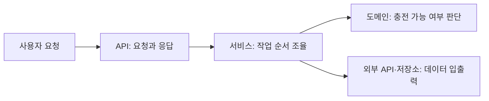

# PlugPass 기술 스택과 개발 기준

## 기술 스택

| 기술 | 버전 | 역할 |
| --- | --- | --- |
| Java | 25 LTS | 서비스 구현 |
| Spring Boot | 4.1.1 | API 서버 구성과 실행 |
| JPA · H2 | Spring Boot 관리 버전 | 객체 저장·조회, 개발용 메모리 DB |
| Spring REST Docs | 4.0.1 | 테스트 기반 API 문서 |

현재는 기반 HTTP·문서·JPA 검증, T02 식별/위치 모델, T03 상태 정규화, T04 업무 저장, T05 외부 클라이언트를 구현했다. 페이지 전체 수집·조회·추천은 후속 작업이다.

## 서비스의 큰 흐름

아래는 충전소 기능을 구현할 때의 설계 방향이다.

API는 HTTP 계약을, 서비스는 작업의 순서를, 도메인 객체는 데이터의 의미와 판단 규칙을 맡는다.
외부 통신과 저장 방식은 별도 경계에서 다룬다. 이 구조는 아직 구현된 클래스 목록이 아니라 책임을 나누는 기준이다.

## 구현할 때 지킬 기준

- **공식 문서부터 확인한다.** 현재 버전에 맞는 문서를 읽고, 예제의 버전 차이를 확인한다.
- **데이터와 행동을 함께 둔다.** 상태를 꺼내 여러 곳에서 판단하기보다, 그 상태를 소유한 객체에 적절한 판단과 변경을 맡긴다.
- **요청별 상태를 공유하지 않는다.** 여러 요청이 사용하는 서비스 객체에 사용자 위치나 요청 결과를 저장하지 않는다.
- **서버 정상과 데이터 최신성을 구분한다.** 서버가 실행 중이어도 충전소 데이터는 오래됐을 수 있다.
- **실제 결과로 검증한다.** 빌드 성공, API 응답, 업무 판단의 정확성을 각각 확인한다.

구체적인 객체 설계에는 [객체지향 생활 체조 적용 기준](object-calisthenics.md)을 사용한다.

## 학습 근거와 검증

- 2026-10-01 기준으로 사용 기술의 공식 문서 관련 절을 확인했다. 전체 매뉴얼을 완독했다는 의미는 아니다.
- 대표 출처: [Java 25](https://openjdk.org/projects/jdk/25/), [Spring Boot](https://docs.spring.io/spring-boot/4.1/reference/using/structuring-your-code.html), [JPA](https://docs.spring.io/spring-data/jpa/reference/jpa/transactions.html), [Spring REST Docs](https://docs.spring.io/spring-restdocs/tutorial/getting-started/index.html).
- 상세 출처는 [공식 문서 목록](official-sources.json)에 보관한다. 새 기술 도입·버전 변경 시 다시 확인한다.
- 구현 범위는 [기능 지도](feature-map.md), 실행 절차는 [프로젝트 검증 안내](../.agents/skills/verify-plugpass/SKILL.md)를 따른다.

H2는 메모리 방식이므로 서버 종료 시 데이터가 사라진다. 기반 테스트 전용 엔티티와 T04의 업무 엔티티를 각각 검증한다.

## T02 — 생성 시 검증하는 값 모델

Java 25의 [record 생성자와 값 동등성](https://docs.oracle.com/en/java/javase/25/language/records.html),
[Double.isFinite](https://docs.oracle.com/en/java/javase/25/docs/api/java.base/java/lang/Double.html#isFinite(double)) 관련 절을 확인했다.
record compact constructor의 검증이 끝나야 final 필드에 값이 배정된다. equals/hashCode는 모든 구성값을 사용한다.
이를 ChargerId의 세 요소 식별과 GeoPoint의 유효 범위에 적용하는 것은 프로젝트 설계 판단이다.
NaN은 일반 비교만으로 거부되지 않아 isFinite를 함께 사용한다.

Station/Charger는 T02의 불변 도메인 모델이며 아직 JPA 엔티티가 아니다. JPA 매핑은 T04에서 수행하므로
이번에는 엔티티용 Lombok·보호 기본 생성자·시각 필드를 선구현하지 않는다. 신규 의존성·버전 변경은 없다.
현재 프런트엔드·TypeScript는 적용 대상 없음.

## T04 — 저장 경계와 엔티티 생성

실제 해석 결과: Hibernate ORM 7.4.5.Final, Spring Boot 4.1.1 관리 Lombok 1.18.46.
[Lombok 변경 기록](https://projectlombok.org/changelog)의 JDK25 지원,
[Gradle 구성](https://projectlombok.org/setup/gradle),
[생성자 Builder](https://projectlombok.org/features/Builder),
[보호 기본 생성자](https://projectlombok.org/features/constructor)를 확인했다.
compileOnly/annotationProcessor와 테스트 구성을 함께 사용하고 runtime 의존성으로 추가하지 않았다.
[Hibernate 7.4 엔티티·embeddable](https://docs.hibernate.org/orm/7.4/userguide/html_single/) 관련 절과
[서비스 트랜잭션](https://docs.spring.io/spring-data/jpa/reference/jpa/transactions.html)을 확인했다.
rolling Spring Data 문서는 현재 Spring Boot 관리 구성에서 실제 compile/test로 계약을 검증했다.

Station/Charger는 non-final JPA 엔티티, ChargerId/GeoPoint/ChargerDetails는 record embeddable이다.
원본 운영 정보·offset 없는 시각을 ChargerDetails에 보존하는 것은 프로젝트 판단이며 DB 매핑 복원 테스트로 확인한다.
생성/수정 시각은 입력 경계에서 전달하고 JPA callback에 위임하지 않는다.
공공 API 시각은 관측 시각으로 승격하지 않으며, DB unique 제약과 production 트랜잭션이 중복·부분 저장을 방어한다.

## T05 — HTTP timeout·XML·외부 설정

Java 25 [HttpClient connectTimeout](https://docs.oracle.com/en/java/javase/25/docs/api/java.net.http/java/net/http/HttpClient.Builder.html),
[HttpRequest timeout](https://docs.oracle.com/en/java/javase/25/docs/api/java.net.http/java/net/http/HttpRequest.Builder.html),
[DocumentBuilderFactory](https://docs.oracle.com/en/java/javase/25/docs/api/java.xml/javax/xml/parsers/DocumentBuilderFactory.html),
[Spring Boot 외부 설정](https://docs.spring.io/spring-boot/reference/features/external-config.html)의 관련 API를 확인했다.
HTTP 클라이언트·XML은 JDK 기본 API여서 신규 라이브러리 의존성은 없다. Boot 4.1.1 바인딩과 실제 응답 동작을 테스트로 확인했다.
HTTP connect/request timeout과 별개로 body 완료 future 전체에도 응답 deadline을 적용한 것은 프로젝트 판단이며
헤더·본문 지연을 실제 HTTP fixture로 각각 검증한다. sourceObservedAt과 원본 offset 없는 시각은 혼용하지 않는다.

[BodyHandlers.ofByteArray](https://docs.oracle.com/en/java/javase/25/docs/api/java.net.http/java/net/http/HttpResponse.BodyHandlers.html)와
[DocumentBuilder.parse(InputStream)](https://docs.oracle.com/en/java/javase/25/docs/api/java.xml/javax/xml/parsers/DocumentBuilder.html)를 사용해
XML의 BOM/선언 인코딩을 유지한다. UTF-8 BOM·UTF-16 응답을 실제 HTTP fixture로 검증했다.
