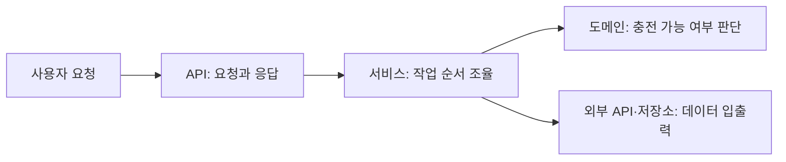

# PlugPass 기술 스택과 개발 기준

## CI 구조 검사 (2026-10-05)

기존 Java 25·Boot 4.1.1을 유지하며 test scope에 ArchUnit core 1.5.1을 도입했다. 실제 `testRuntimeClasspath`는 ArchUnit 1.5.1·JUnit Jupiter 6.0.3·Spring transaction 7.0.9로 해석됐다. 별도 ArchUnit JUnit 엔진을 추가하지 않고 기존 JUnit의 일반 `@Test` 안에서 bytecode 규칙을 실행한다.

[공식 가이드](https://www.archunit.org/userguide/html/000_Index.html)의 core import, dependency/member/annotation rules, custom condition, empty-rule failure를 확인했다. bytecode 의존성을 검사하는 것은 공식 동작이고, Controller·도메인·Service·테스트의 선택 기준은 [프로젝트 설계 판단](architecture-guardrails.md)이다. Java 25의 실제 컴파일·허용/금지 예제·전체 테스트로 호환성을 확인한다. [릴리스 기록](https://github.com/TNG/ArchUnit/releases)도 확인했다.

JaCoCo는 사용자 선택으로 도입하지 않았다. 운영 의존성과 HTTP/DB 계약은 바꾸지 않았다. 새 기술 검증과 한계는 [실행 기록](ci-boundaries-verification.md)에 남긴다.

## 기술 스택

### 프런트 기반 도입 (2026-10-05, T18)

사용자는 목록 중심 반응형 웹앱을 선택했다. [프런트 계획](frontend-plan.md)의 Vue3·TypeScript·Vite·VueRouter·Pinia·Axios의 실행 기반을 T18에서 도입했다. Vitest·Vue Test Utils·Playwright로 순수 규칙·표현·실제 브라우저를 나누어 검증할 예정이다. 실제 버전·Red/Green·검증 결과는 [프런트 기록](frontend-verification.md)과 lockfile을 따른다. Playwright 전체 흐름은 T23에서 도입한다.

[Vue TypeScript 공식 안내](https://vuejs.org/guide/typescript/overview.html)의 Vite 기반 생성과 vue-tsc 별도 타입 검사, [Vite 실행 조건](https://vite.dev/guide/)·[base 경로](https://vite.dev/guide/build.html#public-base-path), [Pinia action](https://pinia.vuejs.org/core-concepts/actions.html), [Axios 취소](https://axios-http.com/docs/cancellation), [Playwright UI mode](https://playwright.dev/docs/test-ui-mode)의 관련 절을 확인했다. 이 구성 선택·hash route·Spring JAR에 웹앱 포함은 프로젝트의 설계 판단이다. T18에서 lockfile·Node·실제 실행 결과를 추가하고 T24에서 실제 JAR의 웹앱·API 연결을 확인한다. 공식 문서를 읽었다는 이유로 프런트 도입·검증 완료를 주장하지 않는다.

### 현재 백엔드

| 기술 | 버전 | 역할 |
| --- | --- | --- |
| Java | 25 LTS | 서비스 구현 |
| Spring Boot | 4.1.1 | API 서버 구성과 실행 |
| JPA · H2 | Spring Boot 관리 버전 | 객체 저장·조회, 개발용 메모리 DB |
| Spring REST Docs | 4.0.1 | 테스트 기반 API 문서 |

현재는 T02~T15의 모델·저장·외부 클라이언트·페이지 수집·최신성·검색/상세·추천·반복 수집·장애 제한·운영 관측·종합 HTTP 데모·성능 기준선을 구현했다. 조회 p95 목표 미달은 성능 기록에서 확인한다. 실공공 API 인증은 키가 없어 미확인이다.

## 서비스의 큰 흐름

아래는 충전소 기능을 구현할 때의 설계 방향이다.

API는 HTTP 계약을, 서비스는 작업의 순서를, 도메인 객체는 데이터의 의미와 판단 규칙을 맡는다.
외부 통신과 저장 방식은 별도 경계에서 다룬다. 이 구조는 아직 구현된 클래스 목록이 아니라 책임을 나누는 기준이다.

## 구현할 때 지킬 기준

- **공식 문서부터 확인한다.** 현재 버전에 맞는 문서를 읽고, 예제의 버전 차이를 확인한다.
- **데이터와 행동을 함께 둔다.** 상태를 꺼내 여러 곳에서 판단하기보다, 그 상태를 소유한 객체에 적절한 판단과 변경을 맡긴다.
- **요청별 상태를 공유하지 않는다.** 여러 요청이 사용하는 서비스 객체에 사용자 위치나 요청 결과를 저장하지 않는다.
- **서버 정상과 데이터 최신성을 구분한다.** 서버가 실행 중이어도 충전소 데이터는 오래됐을 수 있다.
- **실제 결과로 검증한다.** 빌드 성공, API 응답, 업무 판단의 정확성을 각각 확인한다.

구체적인 객체 설계에는 [객체지향 생활 체조 적용 기준](object-calisthenics.md)을 사용한다.

## 학습 근거와 검증

- 2026-10-01 기준으로 사용 기술의 공식 문서 관련 절을 확인했다. 전체 매뉴얼을 완독했다는 의미는 아니다.
- 대표 출처: [Java 25](https://openjdk.org/projects/jdk/25/), [Spring Boot](https://docs.spring.io/spring-boot/4.1/reference/using/structuring-your-code.html), [JPA](https://docs.spring.io/spring-data/jpa/reference/jpa/transactions.html), [Spring REST Docs](https://docs.spring.io/spring-restdocs/tutorial/getting-started/index.html).
- 상세 출처는 [공식 문서 목록](official-sources.json)에 보관한다. 새 기술 도입·버전 변경 시 다시 확인한다.
- 구현 범위는 [기능 지도](feature-map.md), 실행 절차는 [프로젝트 검증 안내](../.agents/skills/verify-plugpass/SKILL.md)를 따른다.

H2는 메모리 방식이므로 서버 종료 시 데이터가 사라진다. 기반 테스트 전용 엔티티와 T04의 업무 엔티티를 각각 검증한다.

## T02 — 생성 시 검증하는 값 모델

Java 25의 [record 생성자와 값 동등성](https://docs.oracle.com/en/java/javase/25/language/records.html),
[Double.isFinite](https://docs.oracle.com/en/java/javase/25/docs/api/java.base/java/lang/Double.html#isFinite(double)) 관련 절을 확인했다.
record compact constructor의 검증이 끝나야 final 필드에 값이 배정된다. equals/hashCode는 모든 구성값을 사용한다.
이를 ChargerId의 세 요소 식별과 GeoPoint의 유효 범위에 적용하는 것은 프로젝트 설계 판단이다.
NaN은 일반 비교만으로 거부되지 않아 isFinite를 함께 사용한다.

Station/Charger는 T02의 불변 도메인 모델이며 아직 JPA 엔티티가 아니다. JPA 매핑은 T04에서 수행하므로
이번에는 엔티티용 Lombok·보호 기본 생성자·시각 필드를 선구현하지 않는다. 신규 의존성·버전 변경은 없다.
현재 프런트엔드·TypeScript는 적용 대상 없음.

## T04 — 저장 경계와 엔티티 생성

실제 해석 결과: Hibernate ORM 7.4.5.Final, Spring Boot 4.1.1 관리 Lombok 1.18.46.
[Lombok 변경 기록](https://projectlombok.org/changelog)의 JDK25 지원,
[Gradle 구성](https://projectlombok.org/setup/gradle),
[생성자 Builder](https://projectlombok.org/features/Builder),
[보호 기본 생성자](https://projectlombok.org/features/constructor)를 확인했다.
compileOnly/annotationProcessor와 테스트 구성을 함께 사용하고 runtime 의존성으로 추가하지 않았다.
[Hibernate 7.4 엔티티·embeddable](https://docs.hibernate.org/orm/7.4/userguide/html_single/) 관련 절과
[서비스 트랜잭션](https://docs.spring.io/spring-data/jpa/reference/jpa/transactions.html)을 확인했다.
rolling Spring Data 문서는 현재 Spring Boot 관리 구성에서 실제 compile/test로 계약을 검증했다.

Station/Charger는 non-final JPA 엔티티, ChargerId/GeoPoint/ChargerDetails는 record embeddable이다.
원본 운영 정보·offset 없는 시각을 ChargerDetails에 보존하는 것은 프로젝트 판단이며 DB 매핑 복원 테스트로 확인한다.
생성/수정 시각은 입력 경계에서 전달하고 JPA callback에 위임하지 않는다.
공공 API 시각은 관측 시각으로 승격하지 않으며, DB unique 제약과 production 트랜잭션이 중복·부분 저장을 방어한다.

## T05 — HTTP timeout·XML·외부 설정

Java 25 [HttpClient connectTimeout](https://docs.oracle.com/en/java/javase/25/docs/api/java.net.http/java/net/http/HttpClient.Builder.html),
[HttpRequest timeout](https://docs.oracle.com/en/java/javase/25/docs/api/java.net.http/java/net/http/HttpRequest.Builder.html),
[DocumentBuilderFactory](https://docs.oracle.com/en/java/javase/25/docs/api/java.xml/javax/xml/parsers/DocumentBuilderFactory.html),
[Spring Boot 외부 설정](https://docs.spring.io/spring-boot/reference/features/external-config.html)의 관련 API를 확인했다.
HTTP 클라이언트·XML은 JDK 기본 API여서 신규 라이브러리 의존성은 없다. Boot 4.1.1 바인딩과 실제 응답 동작을 테스트로 확인했다.
HTTP connect/request timeout과 별개로 body 완료 future 전체에도 응답 deadline을 적용한 것은 프로젝트 판단이며
헤더·본문 지연을 실제 HTTP fixture로 각각 검증한다. sourceObservedAt과 원본 offset 없는 시각은 혼용하지 않는다.

[BodyHandlers.ofByteArray](https://docs.oracle.com/en/java/javase/25/docs/api/java.net.http/java/net/http/HttpResponse.BodyHandlers.html)와
[DocumentBuilder.parse(InputStream)](https://docs.oracle.com/en/java/javase/25/docs/api/java.xml/javax/xml/parsers/DocumentBuilder.html)를 사용해
XML의 BOM/선언 인코딩을 유지한다. UTF-8 BOM·UTF-16 응답을 실제 HTTP fixture로 검증했다.

## T06 — 짧은 저장 단위와 transaction proxy

[Spring Data JPA 4.1.1 트랜잭션](https://docs.spring.io/spring-data/jpa/reference/jpa/transactions.html),
[Spring Framework 7 transaction proxy/self invocation](https://docs.spring.io/spring-framework/reference/data-access/transaction/declarative/annotations.html)을 재확인했다.
외부 proxy 호출이 transaction 경계이며 self-call 자체는 새 transaction을 만들지 않는다.
T06은 upsertPage 전체에 transaction을 열고 내부 upsert가 참여한다. synchronize는 NEVER로
네트워크 대기를 DB transaction 안에 넣는 호출을 거부한다. 실행 이력 save는 Repository의 별도 transaction이다.
페이지 원자성·SUCCESS 이력에서 마지막 성공을 계산하는 방식은 프로젝트 판단이다.

## T07 — Instant와 Duration 비교

실제 Spring transaction 버전은 dependencyInsight로 7.0.9를 확인했다. T06에서 확인한 rolling reference의 표시 버전과 같다.
[Java 25 Duration API](https://docs.oracle.com/en/java/javase/25/docs/api/java.base/java/time/Duration.html)의
between/compareTo는 초+나노초 정밀도로 경과를 비교한다. 밀리초 절삭 대신 이 비교를 사용한 것은
프로젝트의 maxAge 포함 경계 판단이다. 정책에 시스템 시각을 숨기지 않고 now를 명시적으로 전달한다.

## T08 — MVC constructor binding·validation·REST Docs

[Spring Framework 7 ModelAttribute](https://docs.spring.io/spring-framework/reference/web/webmvc/mvc-controller/ann-methods/modelattrib-method-args.html)의
record constructor binding과 Valid 검증, 기존 [REST Docs 4 가이드](https://docs.spring.io/spring-restdocs/tutorial/getting-started/index.html)를 확인했다.
현재 Boot4.1.1 MVC slice·MockitoBean·REST Docs 구성에서 실제 컴파일/실행으로 계약을 확인했다.
NaN/Infinity는 request DTO의 FiniteDouble로 거부하고 여러 violation은 유한수 오류를 우선 반환한다.
Haversine 평균 지구 반지름6371008.8m, 코드 조합 호환, 준비 상태·보고 수 구분은 프로젝트 설계 판단이다.
직선거리 모델은 도로/주행거리나 측지 타원체 정확도를 보장하지 않는다.

## T09 — path variable과 공개 오류 경계

[Spring Framework7.0.9 request mapping](https://docs.spring.io/spring-framework/reference/web/webmvc/mvc-controller/ann-requestmapping.html),
[ExceptionHandler](https://docs.spring.io/spring-framework/reference/web/webmvc/mvc-controller/ann-exceptionhandler.html) 관련 절을 확인했다.
@PathVariable Long 변환 오류와 애플리케이션 StationNotFoundException은 공통 advice에서 각각400/404로 변환한다.
공개 code·한국어 메시지·빈 fields는 프로젝트 계약이며 내부 예외 cause/DB 정보는 반환하지 않는다.
readOnly transaction에서 DTO로 옮기고 open-in-view=false 상태에서도 실제 HTTP 직렬화가 성공하는 것을 연결 테스트로 확인했다.

## 2주차 리뷰 — 회차별 식별자 중복 검사

JDK25.0.4.1과 기존 해석 의존성을 유지했다. [Java25 Set API](https://docs.oracle.com/en/java/javase/25/docs/api/java.base/java/util/Set.html)는
equals로 원소 동등성을 판단하고 add는 기존 원소이면 false를 반환한다. 불변 ChargerId record의 세 값 전체를 사용한다.
회차 내 중복을 CONTRACT로 거부하는 것은 프로젝트 설계 판단이며, DB unique 제약만으로 수집의 완전성을 보장할 수 없어 추가했다.
실제 서비스·DB 테스트에서 페이지 내부/페이지 간 중복과 회차 간 정상 재수집을 확인했다. 신규 의존성·버전 변경은 없다.

## T11/T12 — 실행 소유권·고정 지연·유한 요청 예산

실제 spring-core7.0.9, micrometer-core1.17.1을 dependencyInsight로 확인했다. Boot4.1.1과 JDK25.0.4.1을 유지하며 신규 의존성은 없다.
[Spring7 scheduling](https://docs.spring.io/spring-framework/reference/integration/scheduling.html)의 fixed delay는 이전 실행 완료 이후의 간격이다.
[@Scheduled](https://docs.spring.io/spring-framework/docs/7.0.9/javadoc-api/org/springframework/scheduling/annotation/Scheduled.html) 문자열 Duration은 현재 컨텍스트의 실제 등록으로 확인했다.
Service의 AtomicBoolean 실행 소유권은 단일 프로세스에서 예정/직접 호출을 함께 방어하는 프로젝트 판단이다.

[RFC9110 Retry-After](https://www.rfc-editor.org/rfc/rfc9110.html#section-10.2.3)는 초 또는 HTTP-date이며 음의 초는 허용하지 않는다.
계약의960요청 계산을 지키는10페이지/20요청/1재시도/120초는 프로젝트 정책이며 공급자의 SLA가 아니다.
남은 회차 시간을 JDK HTTP 전체 응답 future의 timeout에 전달하고 timeout/interrupt 시 취소한다.
monotonic 시간으로 예산을 계산하고 벽시계는 데이터 시각·이력에만 사용한다. 실제 HTTP 본문 지연, Retry-After, 실제 DB의 부분 실패/복구로 검증했다.

## 패키지 구조 정리 — 2026-10-05

설정은 Java 25·Spring Boot 4.1.1이며 실제 runtimeClasspath의 spring-core는 7.0.9다. [Boot 코드 구조](https://docs.spring.io/spring-boot/4.1/reference/using/structuring-your-code.html)의 root package·component/entity 탐색 설명을 확인했다. 버전 경로는 rolling 문서로 redirect되지만 표시 버전은 현재 프로젝트와 같은 4.1.1이다.

루트 PlugPassApplication을 유지하면 이동한 하위 패키지도 기본 탐색 범위에 속한다는 것은 공식 동작이다. 기능별 하위 역할 패키지와 DTO 묶음, 공유 Connector·validation의 소유 위치는 프로젝트 설계 판단이다. 신규 의존성·버전 변경은 없으며 기존 테스트와 실행 JAR HTTP로 실제 구성 유지 여부를 검증한다. 현재 프런트엔드·TypeScript는 적용 대상 없음.

## T13 — 누적 횟수와 현재 품질

기존 Actuator가 제공하는 실제 micrometer-core1.17.1을 사용한다. [Counter](https://docs.micrometer.io/micrometer/reference/concepts/counters.html)는 누적 횟수,
[Gauge](https://docs.micrometer.io/micrometer/reference/concepts/gauges.html)는 관측 시점의 값이다.
[Boot metrics endpoint](https://docs.spring.io/spring-boot/reference/actuator/metrics.html)는 이름과 tag로 조회하며 별도 노출 설정이 필요하다.
rolling 문서의 기능을 현재 Boot4.1.1 컨텍스트·실제 HTTP로 확인했다. 신규 의존성·외부 전송 설정은 없다.

commit된 실행 결과를 카운터/로그에 연결하고, 마지막 SUCCESS 이력과 관측 시각 건수는 조회 때 계산하는 것이 프로젝트 판단이다.
FreshnessPolicy가 최근 경계 시각을 소유하고 DB count 조건은 그 경계를 그대로 사용한다. 경계·null·미래 관측·실패 중 시각 경과와 로그 비밀값 비노출을 실제 DB/HTTP로 검증했다.

## T14 — 실제 HTTP 종합 검증

[Boot 공식 테스트 가이드](https://docs.spring.io/spring-boot/reference/testing/spring-boot-applications.html)의 표시 버전4.1.1·RANDOM_PORT 실제 서버·TestConfiguration 명시 import·서버 요청의 독립 transaction을 확인했다. JDK25 HTTP Client와 기존 실제 XML 클라이언트를 재사용한다. Service/Domain을 대체하지 않고 fixture 공급자와 시계만 제어한다. 합성 관측 시각 adapter는 테스트 판단이며 공급자 계약을 확장하지 않는다. 3건의 HTTP assertion과 실행 산출물을 공용 검증에 연결했다.

## T15 — 생성 데이터와 HTTP 성능 기준선

실제 의존성 `hibernate-core`는7.4.5.Final이다. [해당 major/minor Statistics API](https://docs.hibernate.org/orm/7.4/javadocs/org/hibernate/stat/Statistics.html)의 generate_statistics·getPrepareStatementCount·getEntityLoadCount를 확인했다. 이 통계는 SessionFactory 전역이므로 경쟁 부하가 없는 개별 HTTP 전후 차이로 조회당 수를 측정한다. Metadata 조회의 JDBC count는 Hibernate 통계에 포함되지 않는다. 공식 수집 기능과 grid-v1·seed0·고정 시계·로컬2GB heap의 실험 판단을 구분한다.

부하 도구는 Python3.9.6 표준 라이브러리 ThreadPoolExecutor/http.client 하나다. [Python 공식 executor 문서](https://docs.python.org/3.9/library/concurrent.futures.html)를 확인했다. 20개 worker가 barrier에서 함께 시작하고 응답 후 다음 요청을 보내는 closed-loop다. warmup 샘플은 측정 분포에서 제외한다. p95는 nearest-rank로 계산하며 빈 측정·HTTP/전체 응답 불일치를 거부한다. 생성 준비는 실제 도메인 Builder·Repository saveAll을 사용하고 측정 시간에서 제외한다. 신규 운영 의존성은 없다.

## T16 — DB 후보 축소와 실제 거리 유지

현재 Hibernate7.4.5.Final에서 named parameter·join fetch·between/in 쿼리를 실행했다. [HQL7.4](https://docs.hibernate.org/orm/7.4/querylanguage/html_single/)의 rolling 문서는7.4.12이므로 문서만으로 동일성을 추정하지 않고 SQL/로딩수 회귀 테스트와 전체 HTTP 계약으로 확인했다. 커넥터 코드표는 Connector가 소유하고 불변 Set을 파라미터로 전달한다. 검색 범위는 구면 원을 감싸는 사각형이며 날짜 변경선/극점·반경 경계는 [T16 실행 기록](t16-verification.md)에 있다. 정확한 거리와 추천 순서 정책은 기존 Java 코드가 유지한다.

## T18 프런트 실제 도입

[공식 Vue TypeScript](https://vuejs.org/guide/typescript/overview.html), [Vite base](https://vite.dev/config/shared-options.html#base), [Vue Router hash](https://router.vuejs.org/guide/essentials/history-mode.html), [Vitest](https://vitest.dev/guide/), [폼 검증](https://test-utils.vuejs.org/guide/essentials/forms) 관련절을 재확인했다. create-vue3.24.0 template의 실제 구성과 npm peer metadata를 대조하고 TypeScript6.0.3·Node26.7.0 및 [채택 버전](evidence/t18/dependencies.txt)을 실행 검증했다. 별도 타입 검사가 필요하다는 것은 공식 동작이고, `/app/index.html`·hash이동·일괄 공용verify는 프로젝트 판단이다. REST Docs·Spring JAR의 기존 계약은 유지한다.
