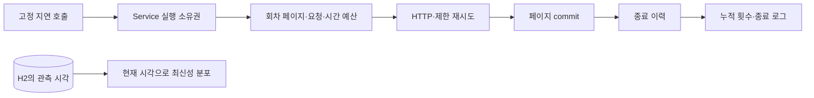

# 수집과 데이터 품질 확인

`GET /actuator/health`의 `UP`은 서버와 기본 구성의 상태다. 충전소 관측 시각의 최신성이나 전체 수집 성공을 뜻하지 않는다.
수집은 기본 비활성화다. 실제 계정 한도·검증 지역·페이지 수를 확인한 뒤 인증키와 `PLUGPASS_INGESTION_ENABLED=true`를 외부 환경에 설정한다. 키를 명령 인자·로그·저장소에 쓰지 않는다.



## 로컬 확인

전체 검증은 `bash scripts/verify.sh`다. 실제 JAR 확인용 서버는 아래처럼 실행한다. 이 설정은 해당 프로세스에서만 지표 HTTP를 노출한다. 기본 노출은 health이며 env는 계속404다.

```bash
java -jar build/libs/plugpass-0.0.1-SNAPSHOT.jar --server.address=127.0.0.1 --server.port=18080 --management.endpoints.web.exposure.include=health,metrics
curl -s http://127.0.0.1:18080/actuator/health
curl -s http://127.0.0.1:18080/actuator/metrics
curl -s 'http://127.0.0.1:18080/actuator/metrics/plugpass.ingestion.has.success'
curl -s 'http://127.0.0.1:18080/actuator/metrics/plugpass.ingestion.last.success.age'
curl -s 'http://127.0.0.1:18080/actuator/metrics/plugpass.ingestion.runs?tag=outcome:SUCCESS'
curl -s 'http://127.0.0.1:18080/actuator/metrics/plugpass.data.chargers?tag=freshness:STALE'
```

수집되지 않은 서버의 누적 카운터는 아직 없을 수 있다. has.success=0은 전체 성공 이력이 없다는 뜻이며 last.success.age는 NaN이다. 0초 경과와 미확인을 구분한다.

| 지표 | 단위·태그 | 의미 |
| --- | --- | --- |
| plugpass.ingestion.runs | 회차, outcome | SUCCESS / PARTIAL_FAILURE / FAILURE 종료 횟수 |
| plugpass.ingestion.records | 입력 건수 | commit된 페이지의 처리 건수 합. 같은 ID의 재수집도 포함하며 DB 고유 충전기 수가 아님 |
| plugpass.ingestion.requests | 요청 횟수 | 재시도를 포함한 실제 client 진입 횟수 |
| plugpass.ingestion.retries | 재요청 횟수 | 실제 시작한 추가 시도 횟수. 예산으로 막힌 대기는 포함하지 않음 |
| plugpass.ingestion.failures | 실패 회차, cause | AUTHENTICATION / RATE_LIMIT / SERVER / CONTRACT / TIMEOUT / TRANSPORT / BUDGET_EXHAUSTED / STORAGE / INTERNAL |
| plugpass.ingestion.has.success | 0 또는1 | 전체 성공 이력 존재 여부 |
| plugpass.ingestion.last.success.age | 초 | 마지막 전체 성공 이후 경과. 실패·부분 실패가 초기화하지 않음 |
| plugpass.data.chargers | 저장 충전기 수, freshness | 조회 가능한 전체 저장 관측의 RECENT / STALE / UNVERIFIED 분포 |

누적 카운터는 프로세스 시작 이후 값이며 재시작하면 초기화된다. 최신성 게이지는 조회 시 DB에서 건수를 계산한다.
RECENT는 관측 시각이 미래가 아니고 maxAge(기본10분) 이하, STALE은 초과, UNVERIFIED는 관측 누락/미래다. 경계10분은 RECENT다.
현재 공급자는 관측 시각을 제공하지 않아 기본적으로 UNVERIFIED다. 수집 성공만으로 RECENT가 되지 않는다.
여러 게이지는 각각 조회하므로 수집 commit과 동시에 읽으면 측정 시점 차이가 있을 수 있다.

## 실패와 복구 해석

- AUTHENTICATION: 키·활용 신청을 확인한다. CONTRACT: XML·필수 필드·페이지·중복·완료 건수를 확인한다. 둘 다 같은 요청을 재시도하지 않는다.
- TIMEOUT / RATE_LIMIT / SERVER / TRANSPORT: 최대 한 번 재시도한다. interrupt는 바로 종료하고 flag를 유지한다. Retry-After가 남은 예산 이상이면 재요청하지 않는다.
- BUDGET_EXHAUSTED: 회차의10페이지/20요청/120초 상한을 확인한다. 상한을 넘기기 위해 설정을 올리는 대신 검증 범위·페이지 크기·계정 한도를 다시 확인한다.
- PARTIAL_FAILURE: 앞서 commit한 페이지는 유지된다. 전체 성공 시각은 갱신하지 않는다. FAILURE도 기존 업무 데이터를 삭제하지 않는다.
- INTERNAL / STORAGE: runId로 종료 로그와 이력을 연결해 원인을 확인한다. 다음 실행 소유권은 해제되며 스케줄러는 다음 회차를 유지한다.

종료 로그에는 runId·outcome·processed·failedPage·failure·requests·retries만 기록한다. 공급자 응답 전체·URL·키·원본 I/O 예외를 출력하지 않는다. 지표 태그에는 충전소/충전기/실행 ID를 넣지 않는다.
중복 호출은 SKIPPED로 즉시 종료하며 새로운 실행 이력·요청·완료 카운터를 만들지 않는다.
H2 메모리 방식은 프로세스 재시작 후 업무 데이터·수집 이력의 복구를 보장하지 않는다.

실제 검증: [3주차 기록](week3-verification.md). fixture 서버의 장애·복구를 검증한 범위이며 실공공 API 인증과 cmux 화면 E2E는 별도 미확인이다.
