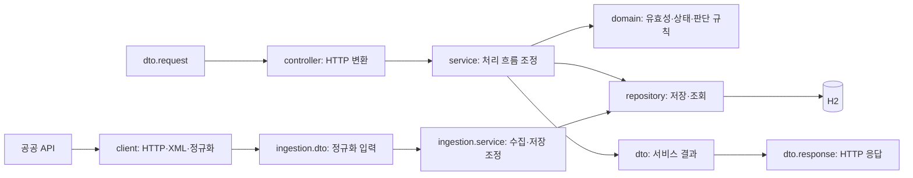

# 기능별 묶음 안의 역할 구분

2026-10-05. 기존 기능별 구성을 유지하고 DTO·도메인·저장소·서비스·HTTP 진입점을 구분했다.

## 어디에서 무엇을 찾는가

| 패키지 | 책임 | 대표 객체 |
| --- | --- | --- |
| `station.domain` | 식별·좌표·충전기 상태·커넥터 호환 규칙 | Station, Charger, ChargerId, GeoPoint, Connector |
| `station.repository` | 충전소·충전기 DB 접근 | StationRepository, ChargerRepository |
| `freshness.domain` | 관측 시각에 근거한 최신성 판정 | FreshnessPolicy, FreshnessAssessment |
| `freshness.config` | 최신성 정책 생성·설정 연결 | FreshnessConfiguration |
| `ingestion.client` | HTTP 호출·XML 해석·외부 상태 코드 변환 | PublicDataClient, DefaultPublicDataClient, PublicDataXmlParser, ProviderStatusMapper |
| `ingestion.config` | 외부 API·스케줄 설정과 Bean 조립 | PublicDataProperties, PublicDataConfiguration, SyncScheduleProperties, SyncSchedulingConfiguration |
| `ingestion.scheduler` | 고정 지연 수집 진입점 | SyncScheduler |
| `ingestion.domain` | 수집 실행의 상태와 완료 규칙 | SyncRun, SyncStatus |
| `ingestion.dto` | 정규화 입력·페이지·서비스 실행 결과 전달 | StationSnapshot, StationPage, SyncResult |
| `ingestion.dto.response` | 공급자가 반환한 원본 XML 데이터 | PublicDataItem, PublicDataResponse |
| `ingestion.repository` | 수집 실행 이력 DB 접근 | SyncRunRepository |
| `ingestion.service` | 수집 순서·페이지 commit·저장 조정 | StationSyncService, StationUpsertService, SyncProgress |
| `search.controller` | 검색·상세 HTTP 진입점 | StationController |
| `search.service` | 실제 저장 데이터와 최신성을 조합 | StationQueryService, DefaultStationQueryService |
| `search.domain` | 유효한 검색 조건 | StationSearchQuery |
| `search.dto` | 서비스 조회 결과 전달 | StationSearchResult, StationMatch, StationDetail, ChargerObservation |
| `search.dto.request`, `search.dto.response` | 검색 HTTP 입력·출력 | StationSearchRequest, StationSearchResponse, StationDetailResponse |
| `recommendation.controller`, `recommendation.service` | 추천 HTTP 변환·유스케이스 조정 | RecommendationController, RecommendationService |
| `recommendation.domain` | 후보·충전기 조건·분류 결과와 추천 정책 | StationCandidate, CandidateCharger, CandidateGroups, RankedCandidate, CandidatePolicy |
| `recommendation.dto.request`, `recommendation.dto.response` | 추천 HTTP 입력·출력 | RecommendationRequest, RecommendationResponse |
| `common.validation`, `common.dto.response` | 여러 HTTP 기능이 공유하는 입력 검증·오류 형태 | FiniteDouble, FiniteDoubleValidator, ApiError |
| `exception` | 공개 오류 분류와 HTTP 예외 변환 | StationNotFoundException, PublicDataException, ApiExceptionHandler |

없는 역할은 빈 폴더로 만들지 않는다. 스케줄 기능의 진입점은 `ingestion.scheduler`를 사용한다. 수집 실행 소유권은 기존 StationSyncService 구현이 유지한다.

## 객체들이 협력하는 흐름

이 그림은 주요 호출·데이터 흐름이다. 패키지 이름 자체가 의존성을 자동으로 금지하는 검사기는 아니다.

## 분류의 이유와 좁은 예외

- 기능을 수정할 때 관련 파일을 가까이 찾을 수 있도록 `station`, `search`, `ingestion` 등의 상위 묶음을 유지한다. 그 안에서 규칙·데이터 전달·흐름 조정·저장을 구분한다.
- `record`라고 모두 HTTP DTO인 것은 아니다. GeoPoint와 ChargerId는 자신의 유효성을 지키는 값 객체이고, 추천 후보·분류 결과와 FreshnessAssessment는 정책이 사용하는 도메인 모델이다. 검색 서비스의 조회 결과와 공급자 원본 응답은 `dto`로 모았다.
- Connector는 검색과 추천 모두 사용하는 충전기 업무 규칙이므로 `station.domain`이 소유한다. FiniteDouble은 두 HTTP 요청에 공통인 입력 검증이므로 `common.validation`이 소유한다.
- SyncProgress는 한 수집 호출 동안만 쓰이는 내부 진행 상태다. `ingestion.service`의 package-private 객체로 유지해 구현 세부를 공개하지 않는다. 영속 수집 상태는 SyncRun이 지킨다.
- 공급자 원본 DTO는 XML 파서와 패키지가 달라 public record·생성자·변환 메서드가 필요하다. 상태 코드 해석은 client에 유지하고 DTO는 이미 정규화된 ChargerStatus를 받아 Snapshot으로 변환한다. DTO가 구체적인 통신 구현에 의존하지 않도록 했다.
- SyncRun.result가 SyncResult를 만드는 기존 협력은 유지한다. 계층을 엄격히 분리하는 새 아키텍처·모듈 시스템을 도입하는 작업은 아니다.
- Controller는 Service 인터페이스를 호출한다. DTO 이동으로 URL·JSON 이름·validation 메시지·DB 컬럼·트랜잭션을 바꾸지 않는다. 요청 DTO 경로는 사용자 지시에 따라 Controller 패키지 밖의 `dto.request`로 통일했다.

## 스캔과 테스트

PlugPassApplication은 `com.plugpass` 루트에 남는다. Spring Boot 공식 문서는 루트 애플리케이션 패키지 아래에서 component·entity를 탐색하도록 권장한다. 하위 역할 패키지 이동이 현재 Boot 4.1.1에서 실제로 작동하는지는 전체 Spring·JPA·MVC 테스트와 실행 JAR HTTP로 확인한다.
출처: [Spring Boot 코드 구조](https://docs.spring.io/spring-boot/4.1/reference/using/structuring-your-code.html), 확인 2026-10-05.

테스트도 책임을 따라 domain·repository·service·controller에 두고, 공급자 HTTP부터 DB·업무 HTTP까지 연결하는 테스트는 각 기능의 integration에 둔다. 기존 클래스 이름과 assertion은 유지하므로 `./gradlew test --tests '*StationSearchTests'` 같은 실행 명령은 동일하다. 실행 근거는 [구조 정리 검증](package-structure-verification.md)을 참고한다.
