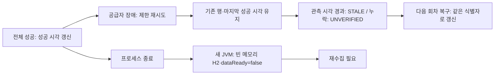

# T17 — 장애·복구와 메모리 데이터 재시작

## 보장과 한계

실패한 수집은 기존 업무 데이터를 삭제하지 않는다. 이미 commit한 페이지는 부분 실패에도 유지되고 전체 성공 시각은 갱신되지 않는다. 실패가 반복되어도 회차별 요청/재시도/시간 예산을 넘지 않는다. 회차가 끝나면 실행 소유권을 해제하여 다음 회차가 다시 시도할 수 있다. 현재 공급자의 관측 시각은 미제공이므로 성공 수집 뒤에도 UNVERIFIED다. 합성 관측 시각의 STALE 검증은 실제 공급자 최신성 보장이 아니다.

| 시나리오 | 실제 assertion 소유 테스트/실행 |
| --- | --- |
| 지속 장애·retry 상한·429/timeout/계약/인증 실패 | IngestionRecoveryTests.boundsRetries와 IngestionHttpBudgetTests |
| 여러 회차의503·기존 행/성공 시각 유지·복구 후 시각 갱신 | IngestionRecoveryTests.readsAgingDataAndRecovers (보강) |
| 중간 페이지 실패·이전 commit 보존·부분 실패 | StationSyncTests.recordsPartialFailure와 요청 예산 테스트 |
| 반복 응답·중복 식별자·역전/건수 변화 | StationSyncTests.repeatsWithoutDuplicateRows와 계약 실패 테스트 |
| 겹친 실행 즉시SKIPPED·예외 후 소유권 해제 | SyncSchedulerTests.skipsOverlappingExecution/releasesOwnershipAfterException |
| 실제 공급자HTTP→저장→검색/상세/추천·STALE·503·복구 | ChargingJourneyTests 3건 |
| 실제 JVM 종료/재시작·H2 소실·재수집 | `python3 scripts/verify-memory-restart.py` |

## 실행 방식

공용 명령은 기존 `bash scripts/verify.sh`다. 기존 전체 테스트·JAR HTTP 뒤 `performanceClasspath`의 test runtime classpath를 재사용해 테스트 전용 RestartProbeApplication을 실행한다. 기존 classpath 내보내기 task를 중복해서 만들지 않았다.

재시작 검증은 Python이 loopback XML 공급자와 JVM3개를 순서대로 소유한다. 첫 JVM은 실제 StationSyncService로 수집 후 검색의 준비완료/1충전소/1충전기/UNVERIFIED를 확인하고 종료한다. 둘째 JVM은 수집하지 않고 기본 H2의 빈 데이터·성공시각null·dataReady=false를 확인한다. 셋째 JVM은 다시 실제 수집 후 한 행과 준비완료를 확인한다. 프로덕션 수집 실행 endpoint·seedSQL·Service mock은 추가하지 않는다. 각 JVM은 실제 HTTP 서버이며 이전 프로세스/포트를 재사용하지 않는다.

운영 JAR에 reliability 패키지가 들어가면 verify-runtime.py가 거부한다. 차단 assertion의 Red는 `RuntimeError not raised`; Green은 실제 테스트 클래스를 가진 JAR 이름을 거부하고 운영 클래스 이름을 허용했다. 이 검사도 기존 Python suite에 통합했다.

T17의 제품 동작은 기존 구현을 검증한 것으로 새 기능 Red를 꾸며내지 않았다. 보강한 장애 assertion은 첫 실행부터 통과했으며 재현된 제품 결함은 없었다. Refactor는 기존 JAR 테스트 산출물 검사에 이름을 부여해 새로운 reliability 경계를 함께 검사하도록 한 것이며 수집 책임/공개 계약은 유지했다.

이름·책임 검토: RestartProbeApplication은 test classpath에서만 초기 수집을 조정하고 verify-memory-restart.py가 프로세스/포트/공급자 정리를 소유한다. production Service/Domain의 업무 판단을 대체하지 않는다. 새 네트워크/시계 mocking 체계나 Controller 엔드포인트는 없다. 프런트/TypeScript는 아직 적용 대상 없음이다.

## 증거

실행 로그와 응답은 `build/verification/memory-restart/{before,after,recollected}.{log,json}`·`result.json`, 전체 JUnit은 `build/test-results/test/`, 실제 종합 HTTP는 `build/verification/charging-journey/`에 남는다. 공용 verify는 이 재시작 assertion을 실패하면 종료0으로 숨기지 않는다. 로컬 소유 서버는 종료하고 사용자가 허용한 현재 Codex 세션에서 결과 파일을 표시한다. 실공공 API 인증은 키가 없어 미확인이고, 메모리 H2 재시작을 영속 복구 성공으로 표현하지 않는다.

관측 결과: 대상 recovery/sync/scheduler/journey35건·Python16건 통과. 별도JVM3회·before1행/readytrue·after0행/readyfalse·recollected1행/readytrue, 도구종료0·각 소유서버143. [실제 응답과 결과](evidence/t17-memory-restart/result.json). 최초 실행은 classpath 내보내기 완료 전 호출해 파일 없음으로 실패했고, 준비 종료를 확인한 뒤 재실행했다. 이 환경 실패를 제품 Red나 통과로 계산하지 않는다.

최종 공용 검증 `bash scripts/verify.sh` 종료0: Java360건·Python16건·실패/오류/skip0, 기존JAR HTTP와 별도JVM재시작검증 모두 통과했다. 생산 API/DTO/트랜잭션 변경은 없다.
