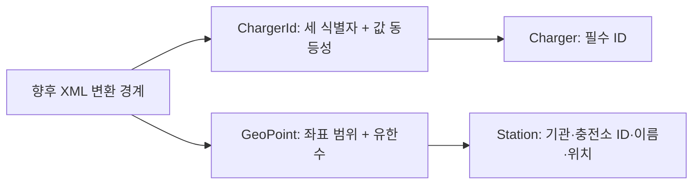

# T01/T02 실행 기록

작업: tasks.md T02까지. 사용자 지시대로 순서대로 실행했고 병렬 에이전트는 사용하지 않았다.
검증일: 2026-10-02(KST). 저장소: `/Users/seungmin/Desktop/repo/PlugPass`.

## T01 판정

공식 계약·fixture는 [PR #4](https://github.com/seungmin-park/PlugPass/pull/4)의
필수 CI 성공 후 main `9d93fae`에 반영했다. XML fixture 3개 구문·필수 식별자·건수·키/연락처 미포함 검사 통과.
키가 없어 실응답·시간대·실표본 대조는 미완료다. 사용자가 문서/fixture 진행을 선택했고 plan.md의
승인 지연 예외를 적용해 T02를 진행한다. 완료 여부는 tasks.md의 하위 체크로 구분한다.

## T02 Red → Green → Refactor

- 먼저 StationModelTests를 작성했다. 클래스 미존재로 발생한 compileTestJava 실패는 Red로 세지 않았다.
- 동작 없는 record 선언으로 컴파일 형태만 만든 뒤 `./gradlew test --tests '*StationModelTests' --console=plain` 실행.
  종료 1, 52건 중 39 assertion 실패·오류/skip 0. 기대 예외가 발생하지 않는 것이 실패 원인이었다.
  나머지 13건은 record 기본 값 동등성·정상 생성이 제공하는 기존 동작을 확인했다.
- Green: compact constructor에서 식별자/이름의 null·blank, 좌표 범위·유한수, 필수 위치/ID를 검사.
  검증이 완료된 뒤 final 필드가 설정돼 invalid 객체가 만들어지지 않는다.
- 대상 52건 통과 후 `./gradlew test --console=plain` 전체 통과.
- Refactor 검토: 책임이 작고 각 생성자에 규칙이 모여 있어 추가 추출이 필요하지 않았다.
  사용하지 않는 테스트 import만 제거했다. 코드 길이만 줄이는 공용 validator·추측성 인터페이스는 만들지 않았다.
- 최종 `bash scripts/verify.sh`: 종료 0. clean build, 총 56건, 실패·오류·skip 0.
  패키징 문서 일치, health 200/UP·상세정보 없음, env 404, docs 200·생성 HTML 일치.
  검증 도구가 시작한 서버만 종료했다(서버 종료 143은 SIGTERM, 검증 명령 실패가 아님).

## 책임·실패·경계 검토

- 같은 충전기 번호라도 기관/충전소가 다르면 별개이고, 모든 식별자가 같으면 Set 중복으로 판정한다.
  문자열을 숫자로 변환하지 않아 선행 0을 보존한다. 공급자의 원문 ID에 임의 길이·형식 규칙을 추가하지 않았다.
- 위도 ±90·경도 ±180은 허용, 바로 밖은 거부한다. NaN은 비교만으로 거부되지 않으므로 isFinite가 필요하다.
- 실패는 IllegalArgumentException의 타입·메시지를 검증했다. 불변 객체 생성이므로 실패 후 변경된 기존 상태가 없다.
- Station/Charger는 아직 JPA 엔티티가 아니다. T04 매핑에서 Lombok·생성/수정 시각·저장 제약을 적용한다.
  T02에서 수집 시각·상태·DB를 선구현하지 않았다. record의 모든 필드 기반 값 동등성은 현재 불변 모델용이고
  향후 JPA 엔티티 동등성은 별도 저장 계약으로 결정한다.
- 클래스명과 필드는 도메인 대상·역할을 드러낸다. 호출부는 현재 순수 단위 테스트뿐이다.
  기존 라우트·JSON·DB 컬럼 변경 없음. Service·HTTP API 추가 없음. Java 25 유지, 신규 의존성 없음.
- timeout·429·외부 인증/응답 실패·동시 수집·상태 변경은 T02의 외부 I/O 없는 모델에 해당하지 않는다.
  실제 저장·HTTP 업무 흐름은 후속 작업에서 검증한다. 프런트엔드·Vue·TypeScript 적용 대상 없음.

## 실행 환경과 한계

CMUX_WORKSPACE_ID·CMUX_SURFACE_ID 없음. `cmux identify --json`은 샌드박스 내부와 외부 모두
`No live cmux socket found`로 실패했다. 따라서 현재 cmux에서 보이는 E2E는 수행하지 못했다.
터미널의 공용 검증은 기반 HTTP·JAR 검증이며 충전소 업무 흐름이나 인증된 공공 API 성공을 증명하지 않는다.
Gradle의 기존 deprecated feature 경고가 있으며 빌드/테스트는 종료 0이다.

증거: `build/test-results/test/TEST-*.xml`, `build/reports/tests/test/index.html`,
`build/verification/runtime.json`, `build/verification/server.log`.
실행 로그: `/tmp/plugpass-t02-red-evidence.log`, `/tmp/plugpass-t02-green.log`,
`/tmp/plugpass-t02-suite.log`, `/tmp/plugpass-t02-verify.log`(로컬 임시 파일).
원격 CI·main 반영 여부는 해당 PR에서 별도로 확인하고 tasks.md에 반영한다.
