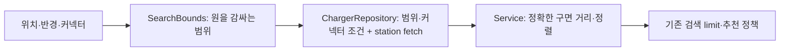

# T16 — 조회 범위 개선

## 문제와 책임

T15에서 N+1은 관측되지 않았다(SQL 2개). 병목은 검색·추천이 60,001엔티티를 먼저 읽고 반경·호환 커넥터를 Java에서 걸러내는 경로였다.

SearchBounds는 구면 반경의 위경도 범위만 계산한다. 원형 거리·정렬·추천 규칙은 기존 소유자에 유지했다. Connector의 불변 providerCodes를 조회 파라미터로 전달해 코드표를 SQL에 복제하지 않는다. 날짜 변경선에서는 경도를 두 구간으로 취급하고 극점을 포함하면 모든 경도를 허용한다. 부동소수점 경계 누락을 피하기 위해 사각형만 1e-9도 확장하며 최종 반경 판정은 기존 기준을 유지한다. 캐시·인덱스·DB 변경은 추가하지 않았다.

## Red → Green → Refactor

- Red: `./gradlew test --tests '*StationQueryEfficiencyTests' --console=plain`, 종료1. 검색 내용·SQL2개는 맞지만 엔티티 로딩이 기대2/실제5로 assertion 실패했다. 3건 중1건 실패; 극지방2건은 기존 동작 확인이었다.
- Green: DB where에서 위경도 범위와 호환 코드를 제한했다. 같은 테스트와 StationSearchTests·Recommendation 관련 테스트가 통과했다. 기존 날짜 변경선·반경 경계·거리/ID 순서·최신성/상태·그룹별limit 계약을 유지한다.
- Refactor: 범위 계산을 SearchBounds로 분리해 Service가 좌표 계산까지 소유하지 않게 했다. 단순 위임 객체나 새로운 Service 인터페이스는 만들지 않았다.
- 전체 공용 검증: `bash scripts/verify.sh`, 종료0. Java360건·Python14건, 실패/오류/skip0. 실제 JAR health200·env404·검색200·validation400·상세404·추천200·문서일치·테스트 산출물 미포함을 확인했다.

이름→실제 수행→배치: findSearchCandidates는 정확한 원 안의 최종 결과가 아닌 사각형 후보 조회임을 드러낸다. SearchBounds는 검색의 좌표 범위 계산, Repository는 저장 데이터 필터, Service는 기존 조회 유스케이스를 소유한다. Java DTO·HTTP·JSON 계약은 바뀌지 않았다. 프런트/TypeScript는 이 작업에 해당하지 않는다.

관련 실패/경계는 미호환·빈 결과·반경과 같음/바로 밖·날짜 변경선·양극·거리 동률을 실행했다. 외부 네트워크 재시도는 읽기 경로에서 외부 API를 호출하지 않아 해당 없음이다. 기존 수집·동시 실행 검증은 전체 suite에서 유지한다.

## 실행 환경과 화면

JDK25.0.4.1·Boot4.1.1·Hibernate7.4.5.Final·메모리H2를 유지했다. [Hibernate 7.4 HQL](https://docs.hibernate.org/orm/7.4/querylanguage/html_single/)의 join fetch·between/in·파라미터, [Spring Data @Query](https://docs.spring.io/spring-data/jpa/reference/jpa/query-methods.html)를 확인했다. rolling HQL은7.4.12 문서이므로 실제7.4.5의 compile·쿼리 실행을 근거로 사용한다. 사각형 후보 축소는 프로젝트 설계 판단이다.

cmux env가 없고 identify/ping/capabilities 모두 live socket 없음이었다. 사용자가 현재 Codex 세션을 대신 사용하도록 허용했다. Codex 파일/브라우저 패널을 열었으며 첫 자동화 브라우저의 loopback 주소는 ERR_BLOCKED_BY_CLIENT를 반환했다. 실제 HTTP 부하는 별도 loopback 서버에 실행했으며 브라우저의 화면 검증으로 바꾸어 보고하지 않는다.

## 성능 측정

동일 grid-v1·10,000충전소/50,000충전기·동시20명·준비30초/측정180초·512MiB/2GiB JVM 조건으로 재측정했다. 측정 소스는 서명 commit `4cf4949`의 조회 변경이며 측정 시작 시 dirty=false였다. 전후 전체 반환 원소·거리·그룹·상태/이유·DB건수 assertion을 유지했다. 결과와 원본은 [성능 기록](performance.md)에 연결한다.

실측 전체p95 75.04ms(기준선1425.41ms),176,051요청·오류0·전후및기준선응답동일. SQL2개 유지, 검색edge/추천541·검색center1956엔티티. 목표 달성, 도구종료0/소유서버143.
