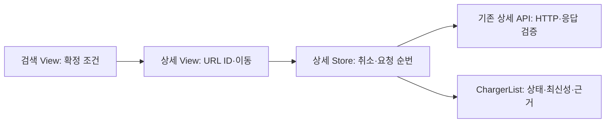

# T21 상세 화면 실행 기록

2026-10-05, 기준 main d6ac70a(T20/PR41), 작업 codex/t21-station-detail.

## 동작과 책임

검색 View가 확정 query와 ID를 카드 이동에 전달한다. 카드는 props와 openDetail event를 제공한다. 상세 View는 URL ID 변화와 이탈을 Store에 연결하고, Store는 결과/오류/조회 시각/요청 순번을 소유한다. ChargerList는 서버 상태·최신성을 그대로 표시한다. 원본 비고는 텍스트 보간이며 HTML로 해석하지 않는다.

동일 화면에서 ID만 바뀌어도 재조회한다. 취소를 무시하는 외부 응답까지 순번으로 방어한다. AVAILABLE+UNVERIFIED는 이용 가능 보고/최신성 확인 불가이며 현장 이용을 보장하지 않는다. 관측 시각을 수집 시각으로 채우지 않는다. 시각은 로컬 시간대 이름과 함께 표현하며 원본 상태 변경 문자열은 시간대 미확인으로 표시한다.

## Red → Green → Refactor

- Red: `npm --prefix frontend run test:unit -- src/features/station-detail/views`, 종료1, 10건 실패. 기존 없는 화면·상세 링크 부재 때문에 이름/근거/404/로딩 assertion이 실패했다. 로그 `/private/tmp/plugpass-t21-red.log`.
- Green: 상세 route/Store/ChargerList와 검색 이동을 구현했다. 8건 통과 후 테스트 준비 오류 두 건을 바로잡았다. jsdom 진입 경로는 `#/stations`이며 로딩 알림은 조건 안내와 구분해 선택해야 한다. 제품의 기대 결과는 유지했다.
- 추가 Red: 빈 useTime이 안내 없이 표시되는 assertion 실패를 확인했다. 빈 운영 정보도 확인 필요로 표시하고 Y는 제한 있음으로 표현했다. 로그 `/private/tmp/plugpass-t21-conditions-red.log`. 같은 실행의 freshness CSS 선택자 오류는 기능 Red에 포함하지 않는다.
- Refactor: 카드의 Router 상태 직접 읽기를 제거했다. 검색 View가 이동을 소유하고 카드는 props/event로 표현한다. 세 Store의 요청 상태는 아직 각 유스케이스가 직접 소유한다. 추측성 공통 Store는 만들지 않았다.
- 대상 상세/표시 55건, 전체 프런트229건/20파일 통과. Store6·View10·ChargerList3을 추가했다. Store의 추가 회귀 사례 중 처음부터 통과한 항목은 기존 구현의 확인이며 별도 기능 Red가 아니다.

## 검증

`bash scripts/verify.sh`, 현재 cmux workspace:5/surface:18에서 실행, 종료0. Java360·Python21·프런트229, 실패/오류/skip0. type-check·lint(경고0)·build·JAR 실제HTTP·REST Docs 일치·메모리H2 별도JVM3회 검증 통과. 로그 `/private/tmp/plugpass-t21-verify.log`, `build/verification/runtime.json`, `build/test-results/test/`.

실행 환경은 JDK25·Node26.7.0·기존 lockfile이다. /tmp worktree 기본Node25에 따른 npm engine 오류는 PATH에 설치된26.7.0을 명시해 해결했으며 기능 Red가 아니다. Vue3.5.43·Router4.6.4·Pinia4.0.3·Axios1.20.0을 유지했다. [Router 공식 동적 경로](https://router.vuejs.org/guide/essentials/dynamic-matching.html)의 객체 재사용과 [Vue watch](https://vuejs.org/guide/essentials/watchers.html)의 변경 감시를 설치 버전 및 실제 테스트와 대조했다.

## 현재 cmux 화면

호출 workspace:5/surface:6, 오른쪽 보조surface:18, 실제 브라우저surface:19를 확인했다. /private/tmp/plugpass-t21 소스로 합성 공급자 HTTP→실제 수집→H2→개발 웹앱을 실행했다. 이전T20의8080 프로세스는 수정하지 않고 이번 백엔드18081, Vite5173 proxy를 사용했다. 공급자와 실행 경계만 합성이고 Controller/Service/Repository는 실제다.

예시 위치 클릭→검색→가까운 충전소 상세 클릭→관측 시각 확인 불가/수집 시각/두 배지 확인→목록 링크 클릭을 진행했다. URL조건 유지·검색2곳·제외ID=1을 확인했다. 375×812에서 가로 넘침 false와 상세 화면을 확인했다. 없는ID999 직접 이동은 실제404/공개 메시지/재시도 버튼을 확인했다. 화면/서버 로그는 `build/verification/t21-screen/`이다.

HTTP오류·응답 역전·빈 충전기·unknown코드·빈 조건·텍스트 비고는 외부경계 제어 단위/컴포넌트 assertion이다. 화면의 실공공 API 인증·native위치 성공·대체 후보 UI·Playwright 전체흐름·JAR웹앱 제공은 이 작업의 검증이 아니다. T22/T23/T24에 이어진다.

## 책임·이름·계약 리뷰

loadStation은 상세조회, reset은 이탈/요청무효화, refresh는 동일ID 재조회다. Route/Store/API/표시 책임과 호출부를 함께 확인했다. Java/API/DB계약은 변경하지 않았다. 상세와 목록의 공개 hash 경로를 연결했다. 색만으로 상태를 전달하지 않고 원본코드·사유·텍스트를 제공한다. 외부 공급자 timeout/수집 실패는 변경하지 않아 기존Java검증을 유지한다. 프런트는 조회만 수행하므로 저장rollback/DB동시성 사례를 새로 만들지 않는다.

PR/원격 CI/실제 머지는 전달 후 tasks.md의 연결 근거를 따른다.
