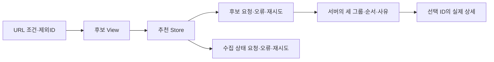

# T22 같은 조건의 대체 후보 실행 기록

2026-10-05, T21 PR42/main27c0f79 반영 후 codex/t22-alternatives에서 순차 구현했다.

## 상태 소유권과 계약

URL은 확정 검색 조건과 제외ID를 소유한다. View는 입력검증·이동을, recommendationStore는 후보와 수집메타의 독립 상태·요청 순번을, API는 HTTP/응답 검증을 소유한다. CandidateGroup은 서버 그룹·순서·거리·사유의 표현과 선택 event를 제공한다.

메타 조회만 실패해도 성공한 후보를 보존한다. 후보/메타의 재시도는 다른 요청을 다시 실행하지 않는다. 조건 변경·이탈은 두 요청을 무효화하고 취소를 무시한 성공/실패도 순번으로 거부한다. 검색메타의 시각을 후보 관측시각으로 표시하지 않는다. 후보를 다시 평가하거나 응답에 없는 좌표·충전기 수·전체 건수를 만들지 않는다. 상세 이동 때 이전 제외ID는 제거하고 검색 조건을 유지한다.

## Red → Green → Refactor

- View Red: `npm --prefix frontend run test:unit -- src/features/recommendation/views`, 10건 assertion 실패, 종료1. 기존 없는 화면·후보그룹/입력오류 안내 부재. `/private/tmp/plugpass-t22-red.log`.
- Green: route·독립 Store·그룹 표현·재시도를 구현했다. 처음 실행의 Vue URLSearchParams 경고와 타입오류는 기능 Red가 아니다. script 함수로 링크 변환을 옮겨 렌더링 원인을 고쳤다. `/private/tmp/plugpass-t22-green.log`의 마지막 실행은 사유번역1건만 실패/9건통과였다.
- 사유 Red: 실제 CandidateCharger/CandidatePolicy의 코드와 대조하여 표시 테스트를 먼저 추가했다. 11건 번역누락 assertion 실패 후 Map에 현재 코드 문구를 추가했다. unknown/constructor는 상세 확인이 필요한 사유를 유지한다. `/private/tmp/plugpass-t22-reasons-red.log`.
- 진단기 회귀 Red: 기존 handler를 자신에게 재대입하면 RangeError가 발생하는 두 assertion을 실행했다. `/private/tmp/plugpass-t22-diagnostics-red.log`. 같은 handler의 재대입만 무시한다. 진단 수집/최종 assertion은 유지하고 별도 vueAppDiagnostics가 handler 수명을 소유한다.
- Refactor: Green262건 뒤 검색/상세/후보의 동일 query 문자열 변환을 toSearchQuery로 모았다. 실제 URL·이동 계약 테스트를 그대로 유지했다. 추가 Store6·그룹2 테스트의 처음 통과는 구현 확인이며 별도 기능 Red로 보고하지 않는다.

대상 추천/진단기38건, 전체 프런트262건/24파일이 통과했다. View10·Store6·그룹2·사유13·진단기2를 추가했다. null/중복/잘못된 직접링크, 빈 세 그룹, 준비전, 한쪽 실패/독립 재시도, 응답역전/이탈, unknown/텍스트이름을 검증한다. 저장 동작은 없어 새 DB rollback/동시쓰기 테스트는 적용하지 않는다. 기존 Java 도메인/외부실패 검증은 유지한다.

## 공용 검증과 화면

첫 공용 검증은 진단기 테스트의 optional handler 대입 타입오류로 실패했다. handler 존재를 확인한 뒤 대입하게 고쳤으며 타입단언으로 우회하지 않았다. 이후 type-check·lint(경고0)·build·Java360·Python21·실제JAR HTTP·REST Docs·메모리H2 재시작3회가 통과했다. 최종 리팩터링 소스의 공용 검증은 `/private/tmp/plugpass-t22-verify-final.log`와 `build/verification/runtime.json`을 따른다.

호출 workspace:5/surface:6, 기존 검증surface:18/브라우저surface:19를 재사용했다. /private/tmp/plugpass-t22 소스의 합성 공급자→실제 수집→H2를18081포트, 개발웹앱을5173포트로 실행했다. 검색→ID1상세→제외ID1대체후보→ID2상세를 실제 클릭했다. 세 그룹/서버 반환1개/NOT_AVAILABLE사유/새 상세의ID2·t20_second/검색조건 유지와 제외ID 제거를 확인했다. 375×812 가로넘침false. 기존T20 합성데이터의 둘째 충전기가 사용중이므로 실제화면은 제외이유 그룹이며, 확인필요/우선후보의 UI는 외부경계 제어 테스트로 구분한다. 기록은 `build/verification/t22-screen/` 및 `/private/tmp/plugpass-t22-screen-evidence/`다.

## 책임·이름·실행 한계

loadAlternatives는 두 읽기 요청을 조정하고 retryCandidates/retryMetadata는 각 요청만 재실행한다. 독립 오류·순번·조회시각을 소유하므로 Store의 상태 수를 억지로 줄이는 위임 객체는 추가하지 않았다. toSearchQuery는 확정조건을 URL문자열로 변환하며 서버 추천·최신성 규칙을 계산하지 않는다. 호출부/route/JSON/API계약을 함께 리뷰했다. 제품의 Java/API/DB계약과 의존성 버전은 유지했다.

Vue 공식 [errorHandler](https://vuejs.org/api/application.html#app-config-errorhandler)·[warnHandler](https://vuejs.org/api/application.html#app-config-warnhandler)를 Vue3.5.43과 대조했다. 경고는 개발모드에서 검증하고 production 결과로 대체하지 않는다. 실공공API 인증·native위치 성공·Playwright 전체흐름·JAR웹앱은 T23/T24의 별도 범위다. 직접 시작한 두 서버만 종료하고 cmux pane은 유지했다. PR/CI/main완료는 tasks.md에 전달 뒤 연결한다.
