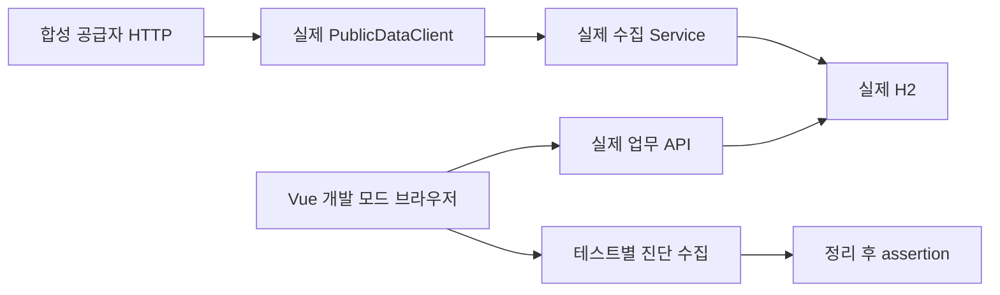

# T23 실제 백엔드 연결 브라우저 검증

T22 병합 main7ca266a에서 순서대로 구현했다. 브라우저는 실제 검색·상세·제외 후보 API를 호출하고 서버는 합성 공급자를 HTTP로 읽어 H2에 저장한다. 공급자 응답과 시간을 제어하며 업무 Service·Repository·Controller는 실제 객체다.

## Red → Green · 책임 검토

- Java Red: `./gradlew test --tests '*ChargingDemoApplicationTests' --console=plain`, 검색 결과 기대2/실제0 assertion 실패·종료1. 비어 있던 DemoConfiguration에 공급자·시계·실제 수집 진입점을 연결해 Green1건. 컴파일·sandbox·JSON import 준비 오류는 기능 Red로 세지 않았다.
- JAR 검사 Red: `python3 -m unittest discover -s scripts -p test_verify_runtime.py -v`, e2e 클래스가 포함됐어도 거부하지 않아 assertion 실패. 기존 검사기의 금지 prefix에 e2e를 추가해 Green. 별도 검사 체계를 만들지 않았다.
- 브라우저 첫 실행은 기존 연결 동작 확인이다. 진단 수집이 `/favicon.ico`404를 거부했고 아이콘 link를 추가해 정상 흐름의 console오류를 없앴다. 전역 허용 목록으로 숨기지 않았다. 최종10건 통과.
- Refactor: 새 업무 규칙은 없고 기존 Store/API 책임을 유지했다. DemoProvider는 HTTP 자원 수명을, DemoConfiguration은 공급자·시계 연결을, runner는 자신의 프로세스 수명을 소유한다. BrowserDiagnostics는 테스트별 진단과 좁은 HTTP예상값을 소유한다. 작은 변동 경계 외 추측성 인터페이스를 추가하지 않았다.
- 공개 URL·JSON·서버 정책은 그대로다. Vite proxy 대상만 검증용 포트로 지정할 수 있다. 테스트 classpath는 운영JAR과 분리된다.

## 정상 · 실패 · 경계

실제 journey는 예시 위치→2곳 검색→첫 상세→첫ID 제외→확인필요 그룹의 다른 상세→조건유지 목록 복귀를 검증한다. sourceObservedAt=null/UNVERIFIED를 수집시각으로 대체하지 않는다. UI 실패9건은 위치 권한거부 콜백, 빈 결과,400/429/503와 재시도,실제 상세404,실제Axios10초 timeout,늦은 이전 응답,메타 오류/독립재시도를 확인한다. HTTP 진단은 종류error·해당 API pathname·상태메시지·정확한1회만 허용한다. Vue경고/pageerror는 허용하지 않는다.

응답 역전 브라우저 검사는 실제 취소 가능한 Axios를 사용한다. 취소를 무시한 성공/실패응답의 순번 거부는 기존 Store 단위테스트로 유지한다. DB 변경·중복·외부 재시도 규칙은 이번 작업에서 변경하지 않았고 기존Java 검증을 유지한다. 실공공 API 인증과 native 위치 성공은 이번 합성 검증 범위에 없다.

## 개발 모드 진단의 실제 거부

공용 page fixture가 최초goto 전에 console/pageerror listener를 등록하고 페이지close까지 감시한 뒤 assertion한다. 테스트마다 새 수집기를 만든다. 임시App 컴포넌트의 필수prop 누락 초기mount,클릭→Promise 후 prop누락 mount,클릭→setTimeout의 처리되지 않은 예외를 각각 실제 발생시켰다. 세 실행 모두 Playwright1건 실패·종료1,원본복원 실행10건 통과. handlerthrow만으로 판정하지 않는다. [진단 로그](evidence/t23/diagnostics.log.gz), [결과](evidence/t23/result.json). 임시probe 소스는 `/private/tmp/plugpass-t23-diagnostic-probes.py`, HTML/trace는 `/private/tmp/plugpass-t23-diagnostics/`에 보존했다.

## 현재 cmux 실행

호출workspace:5/surface:6을 identify로 확인하고 기존검증surface:18/브라우저surface:19를 재사용했다. `/private/tmp/plugpass-t23`의 백엔드18180·개발웹앱5183과 headedChromium 러너의 명령·로그를 같은 검증pane에 표시했다. Playwright의 응답제어 UI와 cmux WKWebView의 실제 API화면은 별개다.

같은workspace cmux브라우저에서 예시위치·검색·ID1상세·제외ID1후보·ID2상세를 실제클릭했다. `browser_second`·관측시각 없음·확인필요 그룹·첫ID부재·검색조건유지·기존제외ID제거·가로넘침false를 확인했다. 화면은 `/private/tmp/plugpass-t23-screen.png`. 직접 시작한 서버만 종료했고 검증pane은 유지했다.

## 실제 결과

`bash scripts/verify.sh` 종료0: Java361·Python22·프런트262건,실패/오류/skip0,타입/lint/build·기존JAR HTTP·별도JVM3회 재시작 통과. 운영JAR에 e2e class없음. `bash scripts/frontend-e2e.sh`와 진단복원 후 `npm --prefix frontend run test:e2e` 종료0:10건/2파일. [공용로그](evidence/t23/verify.log.gz)·[브라우저로그](evidence/t23/e2e.log.gz)·[실제HTTP결과](evidence/t23/runtime.json). HTML은 frontend/playwright-report/index.html, trace/JSON은 frontend/test-results/, 서버로그는 build/verification/frontend-e2e/다.

T23 공용verify/CI는 기존필수 검사와 새Java·JAR격리를 검증한다. 개발모드E2E를 공용verify/필수CI에 연결하고 웹앱 자체를 JAR에서 제공하는 것은 T24다.
