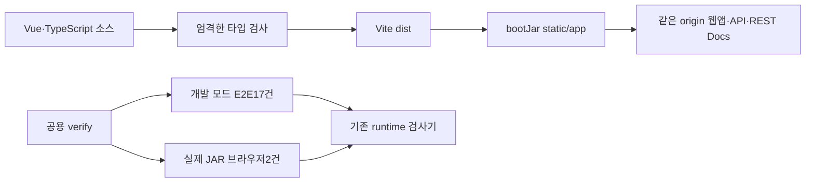

# T24 웹앱 JAR·키보드·필수 품질 검사

T23 PR44 병합 main5c31b58에서 이어 진행했다. Spring JAR 하나가 `/app/index.html`, `/api/v1/...`, 기존 `/docs/index.html`을 같은 origin에서 제공한다. 개발 모드 Vue 진단과 배포 산출물 검사는 별도 실행하며 둘 다 공용verify·필수 PlugPass verify가 실행한다.

## Red → Green

| 관찰할 동작 | 실제 Red | 최소 Green |
| --- | --- | --- |
| 모바일·키보드·오류 포커스 | `bash scripts/frontend-e2e.sh webapp-quality.spec.ts`: 7건 중 오류 포커스4건 실패·종료1. 모바일/데스크톱/키보드3건은 기존 동작 확인 | 400을 반경/커넥터 라디오의 aria-invalid·설명·포커스와 연결. 나머지 오류는 tabindex=-1 요약으로 focus. 7건 통과 |
| 운영JAR 웹앱 | 기존 `./gradlew bootJar` 뒤 실제 ZIP의 static/app/index.html 존재 assertion 실패·종료1 | Gradle frontendInstall/build→bootJar를 연결. 타입 성공 후 Vite build·static/app 포함 |
| 금지 의존 | 임시 Vue→Axios/API→Store/spec→rawPlaywright 세 파일을 lint가 종료0으로 허용하여 거부 assertion 실패 | 기존 ESLint의 no-restricted-imports를 확장. 각각 종료1·해당 규칙 error 확인·원본복원 |
| 브라우저 증거 거부 | 기존 runtime 검사기에 브라우저 callable 경계만 준비한 뒤 Python 테스트8건이 누락/0개/skip/실패/오류 등을 거부하지 못해 assertion 실패 | 실제 Playwright JSON의 필수 파일·실행결과·예상상태·재시도를 검사. Python32건 통과 |

화면 Red/Green 로그는 `/private/tmp/plugpass-t24-quality-{red,green}.log`, JAR Red는 `/private/tmp/plugpass-t24-jar-red.log`, 의존 위반은 `/private/tmp/plugpass-t24-*-lint.log`다. 테스트 준비·환경 오류를 기능 Red로 세지 않았다.

## 책임·이름·호출부 검토

View는 화면 조립·이동, Store는 요청 상태·응답 순번, API는 HTTP/JSON 검증, SearchForm은 라벨과 필드 오류 연결을 소유한다. useErrorFocus는 DOM 갱신 후 오류 요약 포커스라는 실제 공유 동작만 모았다. DTO/서버 정책을 계산하지 않는다. 라디오 자체에 aria-describedby를 주어 해당 입력의 접근 가능한 설명을 검증한다. Refactor는 기존 상태 흐름을 유지하며 반복 포커스 동작만 공용 composable로 모은 것이다.

Gradle은 설치·웹앱 산출물과 JAR 포함을 소유한다. 기존 runtime검사기는 Java/unit/E2E 실행 증거와 JAR/실제HTTP를 판정한다. verify-browser.py는 같은 함수의 CLI 진입점이며 별도 정책을 복제하지 않는다. 기존 REST Docs 비교와 테스트 fixture 격리를 유지한다. 서비스·JSON·DB·라우트 공개 계약을 변경하지 않았다.

Vue의 Axios/httpClient 직접 import, API의 Store/View/Component import, E2E spec의 공용fixture 우회를 정적으로 거부한다. 이 검사만으로 모든 업무 책임이나 동적 의존을 증명하지 않으며 객체 의미·공개 계약은 리뷰한다. Java/단위 테스트의 누락/0개/skip/실패/오류 거부를 그대로 유지한다.

## 성공·실패·경계 검증

- 375×812·1440×900에서 실제 검색·상세·후보의 가로 넘침이 없다. native radio·Tab/Enter/방향키·본문 건너뛰기·상태 알림을 실제 브라우저로 검증한다.
- 400 반경 메시지는 해당 라디오의 접근 가능한 설명과 포커스로 이어진다. 503·상세404·후보메타503 요약도 focus하며 Tab→재시도를 수행한다.
- 개발모드17건은 실제 수집/H2 연결과 UI 실패를 포함한다. 운영JAR2건은 실제 JS/CSS 실행·같은origin API의 준비전 상태·상세 hash 직접링크·새로고침·목록 복귀를 검사한다. JAR에는 합성 데이터나 테스트class가 들어가지 않는다.
- HTTP 진단 허용은 테스트별 종류/경로/상태메시지/정확한횟수이며 Vue경고·pageerror를 전역 허용하지 않는다. 단위 진단기의 테스트별 격리와 개발 모드 검사를 유지한다.
- 공급자 재시도·DB 상태전이·중복 규칙은 이번 작업의 변경 대상이 아니며 기존Java361건을 유지한다. 실공공API 인증·운영배포·native 위치성공·메모리H2 재시작보존은 이 결과의 범위가 아니다.

## 공용 검증의 실제 거부와 복원

타입을 통과하는 실제 Vue 필수prop 누락 mount,window 비동기 예외,필수spec 이동,전체spec 이동,test.skip을 각각 임시로 넣고 `bash scripts/verify.sh` 자체를 실행했다. 다섯 실행 모두 종료1이다. Vue경고/pageerror는 공용fixture assertion에서, 누락/skip은 기존runtime 검사에서,0개는 Playwright의 No tests found에서 거부했다. 로그와 HTML/trace를 `/private/tmp/plugpass-t24-gate-probes/`에 보존하고 모든 원본을 finally에서 복원한다. 첫skip 실행은 정상거부했으나 probe확인 스크립트의 기대메시지가 달랐으므로 그 확인을 바로잡아 재실행해 종료1/예상메시지를 확인했다. 복원 후 전체verify 종료0이다. [실제 실패5종·복원 결과](evidence/t24/result.json), 해당 폴더의 압축 로그를 따른다.

## 실행 결과·화면·전달

최초 정상 공용verify 종료0: Java361·프런트262/24파일·Python32·개발E2E17/3필수spec·JAR브라우저2건. 실패/오류/skip0,엄격한타입/lint/build·JAR HTML/JS/CSS/SVG 실제HTTP일치·RESTDocs일치·테스트class부재·별도JVM3회 재시작을 확인했다. 임시 변경 복원 후 같은 전체 결과·종료0을 다시 확인했다. [실제HTTP/건수](evidence/t24/runtime.json)·[전체로그](evidence/t24/verify.log.gz)·[화면Red](evidence/t24/quality-red.log.gz)·[화면Green](evidence/t24/quality-green.log.gz)을 따른다.

로컬은 호출workspace:5/surface:6,전용surface:18에서 명령·서버·headedChromium 로그를 표시했다. 자동 테스트의 응답제어와 cmux WKWebView의 실제 화면을 구분한다. CI는 같은 공용verify를 headless로 실행하고 lockfile의 Chromium 및 Linux 의존성을 설치한다. 보고서 위치는 frontend/test-results/{unit,e2e,packaged}.json·trace, frontend/playwright-report/와 그 packaged하위, build/verification의 서버/HTTP 결과다.

현재cmux surface:19에서 실제JAR18181을375×812/1440×900으로 열었다. 준비전 안내·0개·가로넘침없음,상세999999의실제404/alert포커스,hash새로고침,목록복귀의반경1000/DC_COMBO 조건유지를 assertion했다. [모바일](evidence/t24/jar-mobile.png)·[데스크톱](evidence/t24/jar-desktop.png). 직접 시작한 JAR만 종료했고 pane을 유지했다. cmux Tab명령뒤 activeElement=BODY가 관찰돼 키보드통과로세지 않았다. 현재포커스를 빼앗아 보정하지 않았고, 키보드 전체assertion은 실제headedChromium 결과로 구분한다.

## 최종 검토 후 링크 회귀 수정

[T21~T24 최종 검토 기록](t21-t24-final-review.md)에 상세 링크의 modifier 클릭 결함과 판단을 남겼다. 두 컴포넌트의 기본 이동 취소 assertion 10건이 실제 실패한 뒤 `exact → left → prevent`로 수정했다. 대상 15건과 전체 프런트273건이 통과했다. 초기262건은 앞의 실행 시점 기록이며, 최종 검증은273건을 따른다. 검색 조건과 props/event·라우트·API 계약을 유지한다.

수정 후 공용 검증 종료0: Java361·프런트273/24파일·Python32·개발E2E17·JAR브라우저2건, 실패/오류/skip0. 타입/lint/build·실제HTTP·별도JVM3회도 통과했다. [최종 실행 로그](evidence/t24/review-verify.log.gz)·[최종 runtime](evidence/t24/review-runtime.json).
