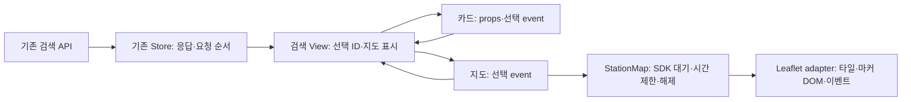

# T25 지도와 목록 연결 — 실행 기록

2026-10-05 착수, 2026-10-06 구현·로컬 검증. 사용자는 무료 SDK 비교 후 **Leaflet + OpenStreetMap**과 검색 결과의 마커↔카드 선택·조건 초기화·지도 실패 시 목록 유지 범위를 선택했다. PR·필수 CI·main 반영은 아래 전달 상태와 [체크리스트](../tasks.md#t25--지도와-목록-선택-연결)를 따른다.

## 실제 동작과 책임

검색 후 ‘지도 보기’를 눌러 SDK를 불러온다. 선택한 마커·카드는 같은 충전소 ID로 강조되고 텍스트로 선택 이름을 알린다. 조건 변경·같은 조건의 검색/새로고침·지도 접기 때 이전 선택을 지운다. 단일/빈/동일 좌표 결과와 Enter/Space 선택도 지원한다.



선택 ID의 쓰기 책임은 검색 View 한 곳에 있다. 마커와 카드가 서로를 직접 조작하지 않으며, 검색 Store가 가진 응답 순서 방어를 그대로 사용한다. 지도 실패는 검색 응답을 지우거나 API 오류로 바꾸지 않는다. SDK 다운로드 실패/10초 무응답에는 ‘화면 새로고침’으로 확정 URL을 유지해 복구하고, 타일 실패에는 ‘지도 다시 시도’로 지도만 다시 생성한다. 이탈·조건 변경·새 SDK 대기 뒤 이전 완료와 이벤트는 세대 번호로 무시하고 타이머·지도 이벤트를 해제한다.

추천 응답에는 좌표가 없어 추천 지도는 포함하지 않았다. 주소 검색·경로 안내·유료 실행·공개 배포도 범위 밖이다. 업무 API·JSON·hash 경로·확정 query·서버 상태/최신성 판단은 바꾸지 않았다. 백엔드 HTTP/REST Docs 변경이 없어 새 문서 계약 테스트를 추가하지 않았고 기존 계약은 공용 verify로 확인했다.

## SDK 공식 조건·실제 버전

- 공식 안정판과 API reference, npm registry·package/lockfile·설치 소스를 대조했다: Leaflet1.9.4/BSD-2-Clause, @types/leaflet1.9.22, Vue3.5.43, TypeScript6.0.3, Vite8.3.2, Playwright1.63.0. Node26.7.0·JDK25.0.4.1을 실제 실행했다.
- Leaflet 라이브러리와 OSM 공용 타일은 키·허용 도메인 등록 없이 사용한다. 정확한 HTTPS 타일 URL, 지도 위 출처, Referer, 브라우저 기본 캐시를 유지한다. keepBuffer0·updateWhenIdle을 사용하고 벌크/오프라인 다운로드는 제공하지 않는다. 공용 타일은 best effort이며 SLA가 없다.
- 공식 Leaflet 사이트는 Chrome·Firefox·Safari·Edge와 모바일 브라우저를 안내한다. 레거시 목록을 Vue 앱 전체의 지원 보장으로 바꾸지 않는다. 이번 실제 브라우저 검증은 Chromium과 cmux WKWebView 범위다.
- 비교한 카카오는 JavaScript 키·도메인 등록, 개발자 계정에서 첫 지도 활성화 앱만 Web SDK 일간300,000건 무료라는 2026-07-21 변경 조건을 확인했다. 네이버는 대표 계정의 API별 무료 이용량 안내를 확인했지만 상세 요금표·구체적 SDK 조건까지 채택 검증하지 않았다. 두 SDK는 설치하지 않았다.

출처: [Leaflet 안정판](https://leafletjs.com/download.html), [Leaflet1.9.4 API](https://leafletjs.com/reference.html), [Leaflet 브라우저 안내](https://leafletjs.com/#browser-support), [OSM 타일 정책](https://operations.osmfoundation.org/policies/tiles/), [카카오 가이드](https://apis.map.kakao.com/web/guide/), [카카오 사용·무료 조건](https://developers.kakao.com/docs/ko/kakaomap/common), [카카오 쿼터](https://developers.kakao.com/docs/ko/getting-started/quota), [네이버 무료 정책](https://www.ncloud.com/support/faq/all/2828).

## Red → Green → Refactor

기존 `tasks.md` T25 순서를 실행 기록으로 추적했다. agent-engineering·executing-plans·TDD를 적용하고 기존 검증 스킬/필수 suite/공용 verify를 재사용했다. 별도 구현·리뷰 에이전트는 실행하지 않았다.

| 단계 | 실제 실패·최소 변경 | 근거 |
| --- | --- | --- |
| 기준선 | 제품 변경 전 프런트24파일·273건 통과 | `/private/tmp/plugpass-t25-baseline-unit.log` |
| 카드 선택 Red | 지도 보기/선택이 없어5건 실패, 버튼 존재 assertion false와 선택 대상 부재 | [selection-red.log](evidence/t25/selection-red.log) |
| 카드 선택 Green | View의 단일 선택 ID·Card props/event·로딩 시 초기화, 전체278건 통과 | `/private/tmp/plugpass-t25-selection-green.log` |
| 실제 마커 Red | 기대 마커2개에 실제0개, 새2건 실패 | [marker-red.log](evidence/t25/marker-red.log) |
| 키보드 보완 | 클릭은 연결됐으나 Enter가 선택 callback을 실행하지 않았다. 설치 SDK의 popup/keyboard 경계를 조사하고 Enter/Space2건 Red 후 명시적 keydown 연결, 전체281건 통과 | [keyboard-red.log](evidence/t25/keyboard-red.log) |
| 장애 Red | SDK 거부·10초 대기·타일 실패의 안내가 없어3건 실패, SDK 거부는 unhandled rejection도1건 발생 | [availability-red.log](evidence/t25/availability-red.log) |
| 장애 Green | 지도 경계의 catch·세대 번호·10초 제한·안내/복구·타일 이벤트 연결, 전체284건 통과 | `/private/tmp/plugpass-t25-availability-green.log` |
| 수명·경계 확인 | 단일/빈/동일좌표·해제 후 재생성·이탈·늦은 이전 로딩·HTML 이름6건 추가, 첫 실행 통과. 별도 기능 Red로 보고하지 않음 | 전체290건, `/private/tmp/plugpass-t25-lifecycle.log` |
| Refactor | Green 상태에서 adapter를 배경 타일·마커 생성·화면 범위 맞추기로 나눔. SDK 상태/해제 책임은 같은 모듈에 유지, 전체290건 통과 | `/private/tmp/plugpass-t25-refactor.log` |
| 실제 SDK 복구 결함 | headed4건 중2실패·2통과. radio input은 fieldset에 가려 클릭할 수 없어 실제 보이는3km 라벨 클릭과 checked assertion으로 바로잡았다. SDK503 후 같은 import는 새 요청을 보내지 않아 복구 실패 | [첫 E2E 로그](evidence/t25/map-e2e-first.log), 실패 trace `/private/tmp/plugpass-t25-failed-e2e/` |
| 복구 Red/Green | SDK 오류의 화면 새로고침 버튼 존재 assertion1건 Red. SDK는 명시적 reload, 타일은 지도만 재생성으로 분리 후 전체290건·headed4건 통과 | [sdk-reload-red.log](evidence/t25/sdk-reload-red.log), [headed Green](evidence/t25/map-e2e-green.log) |

단위 반복 명령은 `npm --prefix frontend run test:unit -- src/features/search/views/StationMapSelection.spec.ts` 또는 `StationMapAvailability.spec.ts`다. Green/Refactor마다 `npm --prefix frontend run test:unit`을 실행했다. 최종 대상은 아래3파일17건이다.

```bash
npm --prefix frontend run test:unit -- \
  src/features/search/views/StationMapSelection.spec.ts \
  src/features/search/views/StationMapAvailability.spec.ts \
  src/features/search/components/StationMap.spec.ts
```

실제 Chromium trace에는 SDK 모듈 요청503이1회만 남고 재시도 클릭의 새 요청은 없었다. [Vite load error 안내](https://vite.dev/guide/build.html#load-error-handling)의 새로고침 방법을 참고했다. 자동 reload·전역 오류 무시·타입 설정 완화는 추가하지 않았다. 단위 테스트의 성공한 재호출만으로 브라우저 복구를 보장할 수 없었던 사례다.

첫 타입 검사는 새 테스트의 Axios adapter 복원에서 undefined 가능성을 거부해 기존 패턴의 명시적 확인으로 수정했다. 첫 공용 verify는 E2E의 replaceAll이 ES2020 lib에 없어 종료2로 중단했다. 기대 URL을 명시적 정규식으로 바꾸고 동일 공용 명령을 재실행했다. 이는 기능 Red가 아니라 타입 오류다. 로그: `/private/tmp/plugpass-t25-type.log`, `/private/tmp/plugpass-t25-verify-first.log`.

## 실제 검증과 cmux 표시

`CMUX_WORKSPACE_ID=F5885C10-2F15-4A59-9B6B-5C12B3821DBB`, `CMUX_SURFACE_ID` 환경값은 없었다. `cmux identify --json`의 caller는 workspace:4·pane:4·surface:4였다. 같은 workspace에 보조 pane이 없어 호출 터미널 오른쪽에 focus false로 surface:7을 만들었다. 브라우저는 같은 workspace의 surface:9·pane:8을 focus false로 만들었다. 사용자 터미널에 명령을 보내거나 다른 workspace를 변경하지 않았다.

저장소 `/Users/seungmin/Desktop/repo/PlugPass`의 `bash scripts/frontend-e2e.sh --serve`를 surface:7에서 실행했다. 서버 로그의 CHARGING_DEMO_READY·실제 수집/H2의2곳과 Vue 개발 모드를 확인했다. cmux 브라우저에서 예시 위치→검색→지도 보기→마커 클릭→카드 클릭→3km 변경→검색을 직접 조작했다. DOM assertion은 마커→카드/카드→마커 일치, 조건 변경 후 선택0개,375/1440px 가로 넘침 없음을 자동 판정했다. 실제 외부 OSM 타일6개가 naturalWidth>0으로 로딩되고 출처가 표시됐으며 errors0·Vue warn/console error0을 확인했다. [데스크톱](evidence/t25/desktop.png)·[모바일](evidence/t25/mobile.png) 화면을 남겼다.

headed 러너도 같은 surface:7에서 실행했다. 서버·명령·로그·종료 코드를 표시하고 직접 시작한 서버만 정리했다. 검증 pane과 브라우저는 남겼다. Playwright는 Chromium, cmux는 WKWebView이며 같은 브라우저라고 보고하지 않는다. 자동 테스트는 실제 합성 공급자 HTTP→수집→H2→업무 API와 실제 Leaflet을 사용하지만 외부 타일 응답은 SVG fixture로 제어한다. cmux의 실제 외부 타일 결과를 이 자동 테스트의 지리정보 assertion으로 바꾸어 표현하지 않는다.

| 최종 검사 | 실제 결과 |
| --- | --- |
| `bash scripts/verify.sh` | surface:7, `T25_VERIFY_EXIT=0` |
| Java JUnit XML | 361건, 실패·오류·skip0 |
| 프런트 단위 JSON | 27파일·290건, 실패·skip0 |
| Python 검사기 회귀 | 32건 통과 |
| type-check·lint 경고0·build | 모두 종료0 |
| 개발모드 Playwright | 4필수spec·21건 통과, 실패·skip·재시도0 |
| 운영JAR Playwright | 3건 통과. 실제 같은 origin API·빈 검색·지연로딩 지도JS/CSS·출처·직접 링크/404 |
| 운영JAR HTTP | 웹앱/asset200·API/validation·RESTDocs 일치, 테스트용 클래스 미포함 |
| 별도 JVM 재시작 | JVM3회·메모리 데이터 소실/준비 상태 초기화/재수집 복구 |

최종 [로컬 요약](evidence/t25/local-summary.json)에 실제 runtime.json·XML/JSON 건수와 검증한 코드/테스트/필수 목록의 SHA256을 기록했다. 기준 HEAD는9ede7dd이며 T25 변경은 검증 당시 dirty 상태였다. 원격 CI가 아래 최종 commit을 다시 검증한다. 공용 로그 `/private/tmp/plugpass-t25-verify.log`, HTTP/서버 `build/verification/`, 단위 `frontend/test-results/unit.json`, 브라우저 JSON/trace `frontend/test-results/`, HTML `frontend/playwright-report/`를 확인했다. 기존 Gradle deprecation·npm의 optional fsevents install-script 안내는 남아 있고, Vue/브라우저 경고를 숨기는 설정은 추가하지 않았다.

## 이름·책임·공개 계약 검토

선언→수행 내용→호출부를 직접 검토했다. StationMapSession은 생성한 지도 자원의 선택/해제 계약이며 모든 객체에 추측성 인터페이스를 추가하지 않았다. loadStationMap은 SDK 코드를 불러오고, createLeafletStationMap은 지도를 생성하며, selectStation은 선택 ID를 변경/반영한다. SDK 객체는 Store·HTTP/API 모듈에 노출하지 않는다. 프런트 TypeScript 모듈의 의존성과 단일 책임을 검토하고 Vue는 props/event·렌더링·상태 경계로 판단했다. 파일 길이만 맞추는 위임 클래스는 추가하지 않았다.

성공·관련 실패·경계는17개 새 단위 테스트와4개 지도 E2E로 검증했다. 기존 API 요청 역전·HTTP/validation·링크 modifier 계약은 기존 suite를 유지했다. 새 도메인 저장·DB transaction·재시도 API는 추가하지 않아 해당 새 테스트는 적용 대상이 아니다. 실공공 API 인증·공용 타일의 향후 가용성·미실행 브라우저·실제 사용자 위치 성공·배포·메모리 H2의 영속성은 이번 검증으로 보장하지 않는다.

## 전달 상태

GitHub API로 main 보호의 필수 PlugPass verify(GitHub Actions app15368)·strict 최신 main·관리자 적용·승인0명·강제 push/삭제 금지와 native auto-merge·squash 허용을 확인했다. PR·현재 head의 필수 CI·실제 merge 결과는 진행 중이며 관측 뒤 기록한다. 로컬 성공을 원격 CI 또는 main 반영으로 바꾸어 보고하지 않는다.
