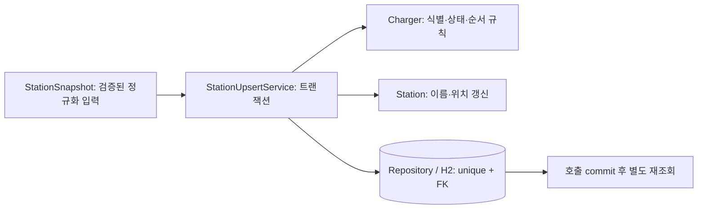
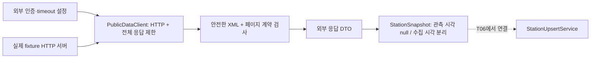

# 1주차 실행 기록 — T03~T05

계획: [tasks.md](../tasks.md), 계약: [data-contract.md](data-contract.md). 순차 실행, 병렬 에이전트 없음.
T01 실응답은 사용자 선택(키 없음, 문서/fixture 진행)에 따라 미확인으로 유지한다.

## T03 — 상태 코드 정규화

- RED: `./gradlew test --tests '*ProviderStatusMapperTests' --console=plain`, 종료 1, 19건 중 6 assertion 실패·오류/skip 0.
  항상 UNKNOWN을 반환하는 최소 형태에서 1/2/3/4/5 매핑과 null 상태 거부가 실패했다.
- GREEN: 공식 코드표 2=AVAILABLE, 3=OCCUPIED, 1/4/5=UNAVAILABLE, 0/미지원/null=UNKNOWN.
  Charger에 normalized status와 nullable rawStatus를 별도로 보존한다. 원본의 공백·선행 0을 정규화해서 유효 코드로 추측하지 않는다.
- REFACTOR: 원본 보존 테스트에서 같은 mapper 호출로 기대값을 계산하던 불필요 assertion을 제거했다.
  매핑 결과는 독립 리터럴 기대값으로 별도 테스트한다. 책임이 작아 클래스 추출은 불필요했다.
- 기존 Charger(id) 생성은 UNKNOWN/null로 유지한다. 도메인은 ingestion 구현을 참조하지 않는다.
- 실패/경계: 정상 코드 전부, unknown·null·빈 값·공백·02·앞 공백, 원본 보존, null 업무 상태 거부.
  외부 timeout·DB·상태 변경 시각은 이 순수 매핑 단계에 적용 대상 없음.
- 이름/책임: ProviderStatusMapper는 외부 코드 해석, Charger는 상태/원본 소유. Service·HTTP·DB 계약 변경 없음.

## 실행 환경

`CMUX_WORKSPACE_ID`, `CMUX_SURFACE_ID` 없음. `cmux identify --json`은 샌드박스 안팎 모두 No live cmux socket found.
보이는 E2E를 수행한 것으로 보고하지 않는다. 공용 검증은 기반 HTTP와 JAR 확인이며 업무 흐름은 후속 범위다.
실행 로그는 `/tmp/plugpass-t03-{red,green,verify}.log`, 현재 XML은 `build/test-results/test/`에 있다.

T03 검증 결과: 대상 19건 통과, 최종 `bash scripts/verify.sh` 종료 0·전체 75건·실패/오류/skip 0,
health 200/UP, env 404, docs 200 및 패키징 문서 일치. 기존 Gradle deprecation 경고는 남아 있다.

## T04 — 중복 없는 저장과 갱신

- T03 PR #7의 필수 CI 성공 후 main `027143a`에 반영하고 T04를 시작했다.
- RED: `./gradlew test --tests '*StationPersistenceTests' --tests '*StationUpsertTests' --tests '*StationMutationTests' --console=plain`.
  14건 중 12 assertion 실패·오류/skip 0, 종료 1. 저장/갱신 없는 형태, 숫자 enum, 잘못된 관계 허용을 확인했다.
  최초 실행의 없는 결과 접근은 isPresent assertion으로 보완한 뒤 Red를 다시 확인했다.
- GREEN: unique key, 문자열 enum, private 생성자 Builder, 생성자 검증, 의도한 update, 실제 @Transactional upsert 구현.
  대상 14건과 기존 전체 89건 통과. 추가 정규화 입력 검증은 StationSnapshotTests 8건 모두 assertion Red 후 최소 생성자 검증으로 Green.
- StationModelTests/ProviderStatusMapperTests는 JPA private 생성자·Builder/getter 형태로 호출부를 갱신했다. 기존 assertions는 유지했다.
- 생성 시 createdAt=updatedAt=collectedAt, 성공 갱신은 createdAt 유지·updatedAt 변경. invalid 갱신은 검증 후 변경하여 기존 필드/시각 유지.
- sourceObservedAt이 양쪽에 있으면 이전 관측은 Station/Charger 변경 전에 거부한다. 동일 시각은 재수집 허용.
  현재 공급자에는 관측 시각이 없어 상태 변경 문자열은 비교하지 않는다. sourceObservedAt=null인 데이터의 순서는 보장하지 않으며 T06 직렬 수집으로 제한한다.
- 성공·실패·경계: 재수집 중복 방지, 같은 부모의 여러 충전기, 기관/충전소 식별 분리, 역순/동일 관측,
  원본 변경 시각이 오래된 미확인 데이터, 잘못된 관계, invalid 갱신, DB 제약 실패 시 부모 생성 롤백, 입력 필수값 누락.
- Service 테스트는 SpringBootTest와 실제 DB이며 mock/test Transactional 없음. 호출 종료 후 별도 Repository 재조회, AfterEach 자식→부모 bulk 정리.
  공유 DB 테스트는 기본 직렬 실행이다. Repository 매핑 복원 1건만 그 목적을 명시한 flush/clear를 사용한다.
- SQL 즉시 실행이 필요한 duplicate constraint 검증은 IDENTITY insert가 save 시 실행하는 실제 동작으로 검사한다.
  rawStatus VARCHAR 제약 위반은 DB 실패를 주입하여 production 트랜잭션 롤백을 검증하는 입력이며 정상 코드로 간주하지 않는다.
- REFACTOR 판단: 원본 운영/시각 정보는 함께 바뀌는 ChargerDetails로 묶었다. ID/좌표는 기존 값 객체 유지.
  Service는 유스케이스 조정, Domain은 유효성/순서 판단, Repository는 저장/조회만 담당한다. 추측성 위임 클래스는 추가하지 않았다.
- @Version은 ORM 낙관 버전 컬럼이다. 동시 insert 성공·분산 수집 보장은 이 작업에서 검증하거나 주장하지 않는다.
  T04는 네트워크 없는 저장 단위이며 외부 timeout/인증 실패는 T05 이후에서 검증한다. 업무 HTTP 라우트·JSON은 아직 없음.

T04 Refactor: 업무 복합 ID 조회는 findByIdentity로 이름을 바꿔 JpaRepository의 DB 내부 번호 findById(Long)와 구분했다.
모든 호출부를 갱신했으며 공개 HTTP·JSON·DB 컬럼 계약은 바뀌지 않았다.

T04 최종 Refactor 후 `bash scripts/verify.sh` 종료 0, 전체 97건·실패/오류/skip 0.
패키징 문서 일치·실제 health 200/UP·env 404·docs 200 통과. Lombok annotationProcessor 실제 해석 1.18.46 확인.

## T05 — 외부 HTTP 클라이언트

- T04 PR #8의 필수 CI 성공 후 main `35786b4`에 반영하고 완료 체크 뒤 시작했다.
- RED: `./gradlew test --tests '*PublicDataClientTests' --console=plain`, 48건 중 47 assertion 실패·오류/skip 0, 종료 1.
  통신/변환 없는 최소 형태에서 정상 데이터·페이지·오류·설정 방어·timeout 실패를 확인했다. 빈 페이지 1건은 기존 빈 반환과 동일해 처음부터 통과했다.
- GREEN: 실제 loopback HTTP 서버에 요청하여 XML 응답을 외부 DTO→StationSnapshot으로 변환.
  상태·원본 코드·원본 시각 문자열·운영/삭제 정보를 보존, sourceObservedAt=null, Clock 경계에서 collectedAt 생성. 48건 통과.
- 추가 검토/RED: endpoint·지역 입력 방어와 공급자 오류 04 분류의 22건 중 14 assertion 실패를 확인했다.
  04는 요청 오류/처리 오류가 혼재해 일시 장애로 단정할 수 없으므로 CONTRACT로 분류했다.
- 설정/경계: 키 외부 주입, 페이지 1 이상·크기 10~9999·지역 두 자리, endpoint에 userInfo/query/fragment 금지,
  연결/응답 timeout 양수, 설정 문자열 표현의 키 redaction.
- 정상/경계: 정상·빈·다음/마지막 페이지·UNKNOWN/누락 상태·페이지 실제 내용/totalCount/hasNext·불변 목록.
- 실패: 401/403·429·5xx·404, 공급자 오류 코드, 깨진 XML/DOCTYPE, 필수 식별자 누락,
  NaN/범위 밖/문자열 좌표, 응답 페이지 역전·건수/크기 오류·남은 데이터가 있는 빈 목록,
  헤더 지연/본문 지연 timeout·연결 거부·키 누락, 예외 cause/로그/설정 표현의 키 비노출.
- HTTP 헤더 뒤 본문이 정지해도 완료 future에 전체 응답 deadline을 적용하고 cancel한다. 단순 헤더 timeout만으로 끝내지 않았다.
  기본 3초 연결/10초 응답이며, 테스트는 latch로 지연을 제어한다. timeout 요청이 1회인 것도 assertion했다.
  unreachable 네트워크의 실제 connect timeout 만료는 환경 의존성이 커 재현하지 않았고, 연결 거부/실제 응답 timeout과 설정 검증을 구분한다.
- XML parser는 외부 DTD/entity/Schema/XInclude를 차단하고 parser 원문 오류 출력을 억제한다.
  I/O·파싱 cause의 URI/본문이 키를 노출하지 않도록 PublicDataException은 타입/범주/안전한 메시지만 반환한다.
- Refactor: sendRequest는 실제 외부 호출 효과를 이름에 드러내고 responseFuture와 완성 응답을 구분했다.
  XML parser의 requireProviderSuccess는 HTTP 상태 검사와 구분한다. transport·XML 해석·외부 DTO 변환의 변경 책임을 분리했다.
- 현재 입력에 필요한 원본 삭제 플래그/사유를 ChargerDetails에 추가하고 실제 DB 매핑 복원 fixture에도 포함했다.
  기존 9인자 생성은 새 필드 null로 유지한다. DB 컬럼 2개 추가, 업무 HTTP/JSON 라우트는 추가하지 않았다.
- 요청마다 지역/결과/future를 로컬에 두고 공유 singleton에 사용자 요청 상태를 저장하지 않는다.
  테스트별 서버·executor·client를 새로 만들고 소유 리소스만 정리한다. DB 저장은 클라이언트 책임이 아니다.
- T05는 인증된 공공 API 성공·수집→DB 전체 사용자 흐름·재시도/스케줄을 증명하지 않는다.
  T01의 키 없는 실응답 확인, T06 이후 수집, T12 재시도, T14 연결 흐름과 구분한다.

T05 실행 로그: `/tmp/plugpass-t05-{red,edge-red,green,suite,verify}.log`.
프런트엔드/Vue/TypeScript 적용 대상 없음. 공개 수집 실행 API·스케줄·실공급자 인증 성공을 추가하거나 주장하지 않았다.

T05 최종 검토: 외부 entity fixture를 정상 문서 구조에 삽입하고 loopback resource 요청이 0회인지 검사해
단순 헤더 누락으로 우연히 실패하는 보안 테스트를 보완했다. 프로덕션 보안 규칙은 유지했다.
유효한 UTF-8 BOM/UTF-16 선언 XML 2건은 실제 assertion Red 후, HTTP 원본 bytes를
DocumentBuilder에 전달해 해결했다. 문자열을 UTF-8로 먼저 해석하지 않아 선언/BOM을 파서가 처리한다.
최종 대상은 64건이며 연결/인코딩/보안 확인은 실제 fixture HTTP 범위다.
리뷰는 작성자 자체 검토이며 독립 에이전트 리뷰로 보고하지 않는다(병렬 에이전트 권한 없음).

T05 최종 `bash scripts/verify.sh` 종료 0: 전체 161건, 실패·오류·skip 0.
실행 JAR health UP, env 404, API 문서 일치, 테스트 fixture 미포함을 확인했다.
