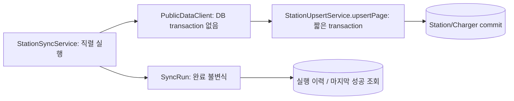

# 2주차 실행 기록 — T06~T09

계획: [tasks.md](../tasks.md). 순차 실행, 병렬 에이전트 없음. 기존 전달 절차의 PR·보호된 자동 머지 권한을 따른다.
T01 실공공 API 인증은 키 없어 미확인이다. CMUX_WORKSPACE_ID/SURFACE_ID 없음,
`cmux identify --json`은 No live cmux socket found로 실패했다. 터미널 검증을 화면 E2E로 보고하지 않는다.

## 사전 계약 검토

- T06 입력은 T05 StationPage/StationSnapshot, 저장은 T04 StationUpsertService다.
- Ruling: 잘못된 레코드가 섞이면 T05가 페이지 전체를 CONTRACT로 거부한다. 부분 레코드 구제 대신 페이지 단위 실패/rollback과 이전 페이지 보존을 선택한다. 비용은 그 페이지의 유효 레코드도 다음 성공 실행까지 미반영이다.
- Ruling: lastSuccessfulRunAt은 SUCCESS 이력의 최신 completedAt으로 조회한다. 별도 가변 singleton 시계를 두지 않아 부분 실패가 마지막 성공을 바꾸지 못한다.
- 신뢰할 관측 시각 없는 공급자는 T07에서도 UNVERIFIED다. 수집 시각·원본 상태 변경 시각으로 최신성을 만들지 않는다.
- T08 검색은 저장 데이터만 사용하며 준비 여부는 SUCCESS 이력을 조회한다. T09 내부 충전소 ID는 Station의 databaseId다.
- 독립 리뷰 병렬화는 승인되지 않아 작성자 자체 검토를 별도 수행한다. 독립 리뷰로 주장하지 않는다.

## T06 — 페이지 순차 수집과 실행 이력

RED: `./gradlew test --tests '*StationSyncTests' --console=plain`, 8건 모두 assertion 실패(반환 null), 오류/skip 0, 종료 1.
GREEN: 서비스는 외부 요청→페이지 저장 서비스 commit→다음 요청을 순서대로 실행한다. SyncRun은 RUNNING에서
SUCCESS/PARTIAL_FAILURE/FAILURE로 한 번만 완료된다. 페이지 실패 코드/번호, 처리 레코드 수, 시작/완료 시각을 저장한다.
추가 RED: `--tests '*SyncRunTests' --tests '*StationSyncTests'`, 18건 중 도메인 방어 9 assertion 실패.
페이지 전체 건수 변화 테스트는 기존 계약 방어로 처음부터 통과했고 Red로 계산하지 않았다.
전체 GREEN/Refactor 검증: `bash scripts/verify.sh` 종료 0, 179건 실패/오류/skip 0, 실제 health UP·env 404·JAR 문서 일치.

확인한 경계: 여러 페이지/반복 실행/빈 성공/첫 인증 실패/중간 timeout/계약 실패/역전 페이지/total 변화,
DB VARCHAR 위반 페이지 전체 rollback, 기존 데이터 유지, 성공 이력 유지, 종료 입력 실패 시 상태 유지.
fetchPage 시 실제 DB transaction이 없음을 검사했다. Service 테스트는 실제 Repository·commit 후 별도 재조회,
AfterEach 자식→부모 정리이며 외부 client와 Clock만 제어했다.
처리 수는 commit한 페이지의 입력 레코드 수다. 실제 새 행/변경 행 수와 같다고 주장하지 않는다.
프로세스 crash/DB 자체 불통은 정상 완료 기록을 보장하지 못하고 RUNNING 이력이 남을 수 있다.
동시 synchronize는 한 빈의 synchronized로 직렬화하며 분산 보장은 없다. busy 재호출 처리·예산/재시도는 T11/T12 범위다.

이름·배치 검토: 수집 흐름은 DefaultStationSyncService, 페이지 저장 경계는 기존 upsert 서비스,
상태 전이는 SyncRun이 소유한다. self-call upsert는 upsertPage의 외부 proxy transaction 안에서만 수행하므로
새 transaction을 기대하지 않는다. 원본 예외 메시지를 이력에 저장하지 않는다. 업무 HTTP/JSON 변경 없음.
로그: `/tmp/plugpass-t06-{red,edge-red,green,verify}.log`, XML: `build/test-results/test/`.
