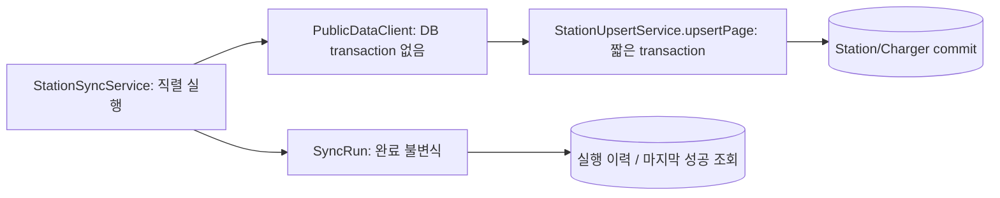
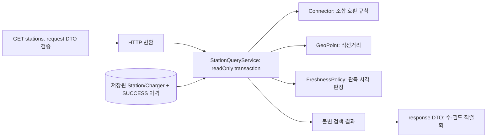
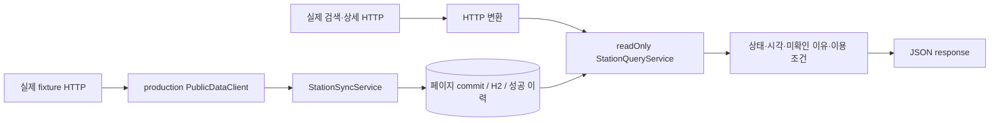

# 2주차 실행 기록 — T06~T09

계획: [tasks.md](../tasks.md). 순차 실행, 병렬 에이전트 없음. 기존 전달 절차의 PR·보호된 자동 머지 권한을 따른다.
T01 실공공 API 인증은 키 없어 미확인이다. CMUX_WORKSPACE_ID/SURFACE_ID 없음,
`cmux identify --json`은 No live cmux socket found로 실패했다. 터미널 검증을 화면 E2E로 보고하지 않는다.

## 사전 계약 검토

- T06 입력은 T05 StationPage/StationSnapshot, 저장은 T04 StationUpsertService다.
- Ruling: 잘못된 레코드가 섞이면 T05가 페이지 전체를 CONTRACT로 거부한다. 부분 레코드 구제 대신 페이지 단위 실패/rollback과 이전 페이지 보존을 선택한다. 비용은 그 페이지의 유효 레코드도 다음 성공 실행까지 미반영이다.
- Ruling: lastSuccessfulRunAt은 SUCCESS 이력의 최신 completedAt으로 조회한다. 별도 가변 singleton 시계를 두지 않아 부분 실패가 마지막 성공을 바꾸지 못한다.
- 신뢰할 관측 시각 없는 공급자는 T07에서도 UNVERIFIED다. 수집 시각·원본 상태 변경 시각으로 최신성을 만들지 않는다.
- T08 검색은 저장 데이터만 사용하며 준비 여부는 SUCCESS 이력을 조회한다. T09 내부 충전소 ID는 Station의 databaseId다.
- 독립 리뷰 병렬화는 승인되지 않아 작성자 자체 검토를 별도 수행한다. 독립 리뷰로 주장하지 않는다.

## T06 — 페이지 순차 수집과 실행 이력

RED: `./gradlew test --tests '*StationSyncTests' --console=plain`, 8건 모두 assertion 실패(반환 null), 오류/skip 0, 종료 1.
GREEN: 서비스는 외부 요청→페이지 저장 서비스 commit→다음 요청을 순서대로 실행한다. SyncRun은 RUNNING에서
SUCCESS/PARTIAL_FAILURE/FAILURE로 한 번만 완료된다. 페이지 실패 코드/번호, 처리 레코드 수, 시작/완료 시각을 저장한다.
추가 RED: `--tests '*SyncRunTests' --tests '*StationSyncTests'`, 18건 중 도메인 방어 9 assertion 실패.
페이지 전체 건수 변화 테스트는 기존 계약 방어로 처음부터 통과했고 Red로 계산하지 않았다.
전체 GREEN/Refactor 검증: `bash scripts/verify.sh` 종료 0, 179건 실패/오류/skip 0, 실제 health UP·env 404·JAR 문서 일치.

확인한 경계: 여러 페이지/반복 실행/빈 성공/첫 인증 실패/중간 timeout/계약 실패/역전 페이지/total 변화,
DB VARCHAR 위반 페이지 전체 rollback, 기존 데이터 유지, 성공 이력 유지, 종료 입력 실패 시 상태 유지.
fetchPage 시 실제 DB transaction이 없음을 검사했다. Service 테스트는 실제 Repository·commit 후 별도 재조회,
AfterEach 자식→부모 정리이며 외부 client와 Clock만 제어했다.
처리 수는 commit한 페이지의 입력 레코드 수다. 실제 새 행/변경 행 수와 같다고 주장하지 않는다.
프로세스 crash/DB 자체 불통은 정상 완료 기록을 보장하지 못하고 RUNNING 이력이 남을 수 있다.
동시 synchronize는 한 빈의 synchronized로 직렬화하며 분산 보장은 없다. busy 재호출 처리·예산/재시도는 T11/T12 범위다.

이름·배치 검토: 수집 흐름은 DefaultStationSyncService, 페이지 저장 경계는 기존 upsert 서비스,
상태 전이는 SyncRun이 소유한다. self-call upsert는 upsertPage의 외부 proxy transaction 안에서만 수행하므로
새 transaction을 기대하지 않는다. 원본 예외 메시지를 이력에 저장하지 않는다. 업무 HTTP/JSON 변경 없음.
로그: `/tmp/plugpass-t06-{red,edge-red,green,verify}.log`, XML: `build/test-results/test/`.

## T07 — 관측 시각 기반 최신성

T06 PR #11 필수 CI 성공·main `e062034` 확인 후 시작/체크했다.
RED: `./gradlew test --tests '*FreshnessPolicyTests' --console=plain`, 14건 중12 실패, 오류/skip0, 종료1.
일관된 UNVERIFIED stub에서 경계 판정·이유·양수 설정·기준 시각 방어가 실패했다. 누락 관측 관련2건은 처음부터 통과했다.
GREEN: Duration으로 나노초 단위 경과를 비교하며 maxAge 이하 RECENT, 초과 STALE,
누락/미래 UNVERIFIED와 각각 이유를 반환한다. 입력은 observedAt/now뿐으로 collectedAt/원본 문자열을 대입하는 API가 없다.
고정 Clock, 경계 ±1ns, Instant.MIN/MAX, 재수집한 오래된 응답, 현재 수집+상태변경 시각에도 관측 누락,
null/0/음수 maxAge, null 기준 시각을 검증했다. 정책은 순수 Java이며 DB/네트워크 실패는 적용 대상 없다.
이름/책임 검토: FreshnessPolicy가 판정, FreshnessAssessment는 상태+이유의 불변 값이다.
작은 정책은 추가 추출 없이 유지했다. evaluate는 assess의 동일 판단을 사용해 이유와 상태가 갈라지지 않는다.
설정은 ISO Duration PLUGPASS_FRESHNESS_MAX_AGE, 기본 PT10M이다. 10분은 잠정 제품 판단이며 공급자 지연 보장이 아니다.
파싱 실패 원본 시각은 변환 어댑터에서 관측 미확인으로 처리하며 이 정책은 Instant만 받는다. 현재 공급자는 관측 시각 null이다.
T07 대상14건·전체193건 실패/오류/skip0, `bash scripts/verify.sh` 종료0.
실행 JAR health UP·env404·문서 일치 통과. 로그 `/tmp/plugpass-t07-{red,green,verify}.log`.

## T08 — 저장 데이터 주변 검색

T07 PR #12 필수 CI 성공·main `16083e3` 확인 후 완료 체크/시작했다.
RED: 검색·거리·커넥터 23건 중20 assertion 실패. 동일 위치0과 미지원 코드2건은 baseline 통과.
HTTP RED: `--tests '*StationSearchHttpTests'`, 20건 모두 assertion 실패(라우트 없어404).
추가 query RED: HTTP 우회 입력6건 모두 assertion 실패 후 불변식 구현.
GREEN: 호환 충전기를 묶고 Haversine 직선거리≤반경, 거리/내부ID순, limit으로 검색한다.
조회는 실제 Repository만 사용하며 외부 PublicDataClient 의존성이 없다. SUCCESS 이력으로 준비 여부/마지막 성공 시각을 반환한다.
ChargerObservation은 개별 상태·원본·관측/수집 시각·최신성/이유·이용 제한을 보존한다.
HTTP response DTO에서 AVAILABLE 보고 수와 호환 충전기 수를 합산한다. 보고 수를 최신·실제 이용 가능 수로 표현하지 않는다.

검증: 반경 포함/바로 밖, 동률/limit, 거리를 우선하는 순서, 날짜 변경선·대척점,
공급자 조합 코드01~10/미지원/null, 준비 전후 빈 결과, 여러 상태/최신성/이용 제한.
MVC slice는 실제 Spring 바인딩/validation/JSON과 Service 반환 mock을 사용했다. 필수값·유한수·좌표/반경/limit 범위·형식·미지원 커넥터의
400과 정확한 한국어 필드 메시지, 기본 limit20/경계1·50 전달을 확인했다. 실제 DB는 Service 테스트가 소유한다.
REST Docs: id 설명을 임시 제거한 documentsSearch가 SnippetException으로 실패했고 즉시 복원했다.
단순 문서 생성 성공만 보고하지 않는다. 충전기 하위 필드는 검색 문서의 subsection과 명시 필드표로 설명한다.

Refactor: 공통 ApiError를 common/response로 배치해 예외 처리기의 JSON DTO 책임을 분리했다.
이름·계약 검토: 공개 id는 내부 databaseId이고 providerStationId와 구분한다. reportedAvailableCount는 보고 수라는 의미를 이름에 드러냈다.
readOnly transaction 안의 join fetch로 필요한 Station을 한 번에 로딩하고 entity를 HTTP에 반환하지 않는다.
현재는 전체 저장 행을 읽어 메모리에서 거리를 필터링한다. 전국 규모 성능 보장 없이 T15 측정에서 개선 위치를 결정한다.
HTTP 키 노출·재시도는 조회 책임에 없으며 원격 API 장애가 즉시 조회 호출로 전파되는 경로를 만들지 않았다.
T08 최종 대상49건·전체242건 실패/오류/skip0, `bash scripts/verify.sh` 종료0.
실제 JAR 검색 HTTP200(초기 준비 전 빈 목록), validation400, health UP·env404·문서 일치 통과.
로그 `/tmp/plugpass-t08-{red,http-red,query-red,green,doc-contract,verify}.log`.

## 완료 판정 회귀 수정 — T06

T08 PR #13 성공·main `828377a` 확인 뒤 전체 흐름 자체 리뷰에서 발견했다.
원인: hasNext=false만으로 전체 성공 처리하여 totalCount2/내용1도 SUCCESS였다.
RED: `--tests '*StationSyncTests.rejectsIncompleteRecordCount'`, expected PARTIAL_FAILURE vs SUCCESS assertion 실패,1건,종료1.
GREEN: 마지막 페이지 commit 후 processedCount와 최초/일관된 totalCount를 비교하며 다르면 CONTRACT로 완료한다.
앞서 commit한 유효 데이터는 보존하고 마지막 성공 이력은 생성하지 않는다.
정상 여러 페이지 fixture는 최소 pageSize10에 맞는 실제 10+1건으로 바로잡고 전체 원소/건수를 검증했다.
Ruling: advertised total을 모두 처리하지 못하면 전체 성공이 아니다. 비용은 공급자가 부정확한 total을 주는 경우도 실패로 분류하는 보수적 정책이다.
공용 verify 전체243건 실패/오류/skip0,종료0. 로그 `/tmp/plugpass-sync-count-{red,verify}.log`.
작성자 자체 검토이며 T06 독립 수정 PR로 전달한다. 새 스케줄·재시도는 추가하지 않았다.

## T09 — 상세 조회와 실제 HTTP 연결

T06 완료 건수 회귀 PR #14 필수 CI 성공·main `7392d03` 후 시작했다.
RED: StationDetailTests5 assertion 실패(null/예외 없음), StationDetailHttpTests7 assertion 실패(404/공개 오류 없음),
StationReadFlowTests2 assertion 실패(실제 상세 HTTP404). 연결 Red에서 수집·H2·검색은 이미 통과했으며 상세 부재에서 실패했다.
GREEN: readOnly 서비스가 내부 ID로 Station과 그 Charger만 조회하고 없으면 StationNotFoundException을 던진다.
Controller/response DTO는 HTTP 필드 변환만 하고 공통 예외 처리기가404/400을 변환한다.

검증: 여러 상태·RECENT 경계/STALE/UNVERIFIED와 이유·원본 코드·관측/수집/원본 시각,
다른 공급자의 동일 source ID·충전기 없는 충전소·없는/null ID·미제공 운영 정보.
MVC slice는 Service 반환 mock, JSON 값·UTC offset·정확한404 메시지/코드·Long 범위/형식400·REST Docs 모든 하위 필드를 검사한다.
reasonCode 문서 설명을 임시 제거해 SnippetException 실패를 확인한 뒤 복원했다.
실제 연결 테스트는 production HTTP client → loopback fixture HTTP → 수집 서비스 → H2 commit → 실제 Tomcat 검색/상세 HTTP를 실행했다.
반복 수집 중복 없음과 공급자503 이후 기존 데이터/마지막 성공 시각 유지, 조회가 공급자 요청 수를 늘리지 않는 것도 assertion했다.
외부 client mock으로 실제 연결 성공을 대신하지 않았다. Clock/fixture 서버 응답만 제어했다.

전체257건 실패/오류/skip0, `bash scripts/verify.sh` 종료0.
실행 JAR 검색200·입력400·없는 상세404·health UP·env404·패키징 문서 일치 통과.
실제 연결 응답은 `build/verification/station-read-flow/*.json`, runtime 결과는 `build/verification/runtime.json`,
JUnit XML은 `build/test-results/test/`, 로그는 `/tmp/plugpass-t09-{red,http-red,flow-red,green,doc-contract,verify}.log`다.

Refactor/이름/책임: 기존 ChargerResponse 변환을 검색/상세가 재사용해 원본과 최신성 필드가 갈라지지 않는다.
새 위임 계층은 불필요해 추가하지 않았다. detail은 조회 계약, StationNotFoundException은 공개 도메인 실패,
StationDetail은 entity와 분리한 불변 유스케이스 결과다. 모든 Repository/호출부는 새 Service 계약으로 compile/전체 테스트를 통과했다.
T06~T09 전체 자체 리뷰에서 수정한 완료 건수 결함은 별도 PR #14로 기록했다. 독립 에이전트 리뷰는 아니다.
실공공 API 인증·시간대 확인은 여전히 미검증이며 cmux 소켓 없이 보이는 E2E로 보고하지 않는다.
T10 추천·T11 스케줄·T12 예산/재시도·T14 추천 포함 종합 데모·T15 성능 측정은 시작하지 않았다.
