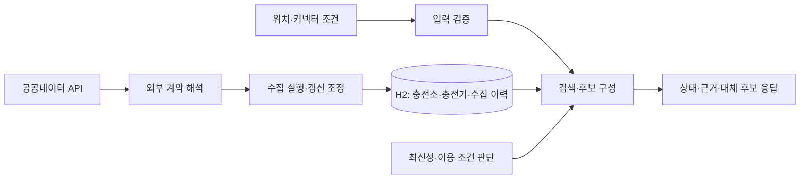

# PlugPass 프로젝트 계획

**목표:** 충전소의 상태·정보 최신성·이용 조건을 함께 보여 주고 대체 후보를 제공하여 전기차 충전소 헛걸음을 줄이는 백엔드를 만든다.

**구조:** 하나의 Spring Boot 애플리케이션에서 외부 데이터 수집과 사용자 조회를 분리한다. 수집한 데이터를 H2에 저장하고 조회 요청은 저장된 데이터를 사용한다. 외부 API 장애가 사용자 요청의 즉시 실패로 이어지지 않도록 한다.

**기술:** Java 25 LTS, Spring Boot 4.1.1, JPA·H2, Spring REST Docs.

**기간·용도:** 4~6주, 백엔드 개발 포트폴리오. 4주차에 핵심 흐름과 성능 기준선을 확보하고 5~6주차에 장애 복구·개선 효과·재현 자료를 완성한다.

**실행 목록:** [tasks.md](tasks.md). 구현 시 `superpowers:executing-plans`로 작업 하나씩 진행하며, 병렬 에이전트 실행은 별도 사용자 지시 없이 시작하지 않는다. 이 문서는 계획이며 미완료 기능의 구현을 뜻하지 않는다.

## CI 보강 — 동작과 구조의 검증 책임 분리 (2026-10-05)

- 목적: 도메인 규칙의 결과는 기존 동작 테스트가 확인하고, 책임·의존성 위치는 구조 검사와 리뷰가 확인한다. HTTP와 업무 동작은 변경하지 않는다.
- 구조: ArchUnit core를 기존 JUnit 실행에 연결한다. REST Controller→Service 계약, 도메인→HTTP/저장 호출 금지, 엔티티 공개 setter 금지, Service 이름/계약과 Service·MVC 테스트 경계를 검사한다. 검사 대상과 리뷰의 한계는 [검증 기준](docs/architecture-guardrails.md)에 기록한다.
- 누락: [필수 테스트 목록](docs/required-test-suites.json)을 실제 JUnit XML과 비교한다. 고정 총건수나 coverage 비율을 강제하지 않는다. 새로운 선택 테스트는 허용하고 기존 필수 suite 삭제·이름 변경은 기능 지도와 함께 검토한다.
- 실행: 검사기의 허용/금지 예제로 Red→Green을 확인하고, 실제 Controller의 임시 위반과 필수 XML 누락을 공용 경로에서 거부하는지 확인한다. 복원 후 `bash scripts/verify.sh`와 원격 CI를 확인한다.
- 제외: 사용자 선택에 따라 JaCoCo를 도입하지 않는다. 동시성·성능·실공급자 검증은 기존 후속 기능 작업의 범위로 유지한다.

## 1. 확정 사항과 현재 상태

| 구분 | 내용 |
| --- | --- |
| 사용자와 확정 | 이름은 PlugPass·플러그패스, 목적은 백엔드 포트폴리오, 개발 기간은 4~6주 |
| 현재 선택 | 서비스 언어는 Java, DB는 H2로 간단히 시작, API 문서는 Spring REST Docs |
| 구현·검증 완료 | 애플리케이션 기동, health HTTP, JPA 저장·재조회 테스트, 문서 생성·JAR 제공, T02 식별/위치, T03 상태 정규화, T04 업무 저장, T05 외부 HTTP 클라이언트(fixture 검증), T06 페이지 수집/실행 이력, T07 관측 최신성, T08 주변 검색, T09 상세 조회/실제 fixture 연결 검증, T10 근거 있는 추천, T11 중복 방지 스케줄, T12 실행 예산/제한 재시도/다음 회차 복구, T13 수집·품질 지표 |
| 협업 기반 완료 | 작은 PR, 필수 CI, 보호된 main, 자동 squash merge. [PR #1](https://github.com/seungmin-park/PlugPass/pull/1)에서 실제 동작 확인 |
| 후속 작업 | T14 종합 HTTP 데모, T15 성능 기준선, T16 측정 기반 개선 판단, T17 장애 종합 검증, T18 최종 재현·포트폴리오 |
| T01 실연동 미확인 | 키 없는 상태. 인증된 실제 응답으로 검증 지역·필드/시각 의미·공식 가이드 대조·계정 한도를 확인해야 함 |

T02~T13을 구현·검증하고 main에 반영했다. 3주차 완료 근거는 [체크리스트](tasks.md)와 [실행 기록](docs/week3-verification.md)에 연결했다. 최종 공용 검증은 Java353건·Python8건 실패/오류/skip0과 실제 JAR HTTP·REST Docs 일치를 확인했다. 공공 API 인증은 키 없어 미확인이며 실제 HTTP 연결 검증은 합성 fixture 범위다. cmux 접근 제한으로 화면 E2E는 확인하지 못했다. 현재 H2는 메모리 모드이므로 서버 재시작 후 데이터를 보존하지 않는다. 서버가 살아 있다는 health 응답은 충전소 데이터가 최신이라는 뜻이 아니다.

아래 API·객체·작업 분할은 이 목표를 구현하기 위한 설계안이다. 외부 API의 제공 사실과 구분하며, T01에서 확인한 계약과 충돌하면 관련 항목을 함께 수정한다.

## 2. 누구의 어떤 판단을 돕는가

대상은 현재 위치 근처에서 차량에 맞는 충전소를 찾는 운전자다.

1. 위치·검색 반경·커넥터 종류를 입력한다.
2. 주변 충전소의 충전기 상태, 거리, 이용 제한, 데이터 시각을 확인한다.
3. 상태가 오래됐거나 확인되지 않은 경우 그 이유를 확인한다.
4. 첫 후보를 이용하기 어렵다면 같은 조건의 다른 충전소를 확인한다.

제공하는 가치는 **상태와 근거를 함께 설명하는 것**이다. 도착 시점의 빈자리나 충전 성공을 보장하지 않는다. 경로·교통 기반 소요 시간, 예약, 실시간 현장 점유 판단은 범위에 넣지 않는다.

## 3. 첫 완성본의 범위

| 포함 | 완료 모습 |
| --- | --- |
| 공공데이터 공급자 1곳·검증 지역 1곳 | 실제 응답과 익명화한 테스트 fixture로 수집 경로 재현 |
| 충전소·충전기 수집과 갱신 | 같은 데이터를 다시 수집해도 중복되지 않고 최신 유효 상태 유지 |
| 상태 정규화 | 이용 가능·사용 중·이용 불가·알 수 없음으로 변환하고 원본 코드 보존 |
| 데이터 최신성 | 제공자가 관측한 시각과 우리 서버가 수집한 시각을 구분해 표시 |
| 주변 조회·상세 조회 | 위치·반경·커넥터 조건으로 검색하고 충전기별 근거 확인 |
| 대체 후보 | 확인 가능한 최신 이용 가능 후보를 우선 제공하고 제외·불확실 이유 설명 |
| 반복 수집·장애 복구 | 중복 실행 방지, 시간 제한, 제한된 재시도, 실패 후 다음 수집에서 회복 |
| 검증·문서 | REST Docs, 실제 HTTP 검증, 장애 시나리오, 성능 기준선과 재현 절차 |

첫 완성본에서 제외한다: 로그인·회원·결제·예약, 커뮤니티 제보, 알림 발송, 지도 프런트엔드 전체 구현, 머신러닝 대기 시간 예측, 전국 대규모 수집, 다중 인스턴스 운영, MCP 서버 제공. 추가 저장소·메시지 브로커·캐시는 측정된 필요가 생기기 전에는 도입하지 않는다.

## 4. 데이터 계약과 최신성 원칙

T01에서 공식 활용 가이드와 실제 응답을 확인해 `docs/data-contract.md`에 공급자·API명·공식 URL·확인일·인증 방식·페이지 규칙·요청 한도·이용 조건을 기록한다. 비밀 키를 저장소·fixture·로그에 넣지 않는다. 실데이터 접근이 막히면 fixture 개발과 실연동 미검증 상태를 구분한다.

| 데이터 | 책임과 규칙 |
| --- | --- |
| 식별자 | 공급자·충전소 ID·충전기 ID의 조합으로 충돌과 중복 방지 |
| 위치·커넥터·운영 정보 | 누락·잘못된 좌표·미지원 코드는 추측으로 채우지 않고 오류 또는 미확인 처리 |
| `sourceObservedAt` | 공급자가 상태를 관측한 시각임이 계약에서 확인된 경우에만 사용 |
| `sourceStatusChangedAt` | 마지막 상태 변경 시각이면 별도로 보존. 오래 유지된 상태라는 이유만으로 데이터가 오래됐다고 판단하지 않음 |
| `collectedAt` | 우리 서버가 응답을 받은 시각. 방금 재수집했다는 이유만으로 원본이 최신이라고 판단하지 않음 |
| `lastSuccessfulRunAt` | 수집 범위의 모든 페이지 처리가 성공한 실행에만 갱신 |

최신성은 `RECENT`, `STALE`, `UNVERIFIED`로 표현한다. 신뢰할 수 있는 관측 시각이 없으면 `UNVERIFIED`다. 미래 시각·파싱 불가 시각도 확인 실패 이유를 남긴다. `RECENT`는 관측 시각이 현재보다 미래가 아니고 경과 시간이 설정한 `maxAge` 이하일 때다. `maxAge`는 T01에서 확인한 공급자 갱신 특성과 허용할 지연을 근거로 정한다. 공식 근거 없이 “실시간” 또는 “5분 이내”를 제품 약속으로 고정하지 않는다.

수집 실패가 기존 데이터를 삭제하거나 최신성 시계를 새로 시작하게 해서는 안 된다. 페이지 일부만 성공하면 실행 결과는 부분 실패로 기록한다. 성공한 개별 데이터는 사용할 수 있지만 전체 동기화 성공으로 표시하지 않는다. 응답에서 빠진 충전기를 삭제 처리하는 정책은 첫 완성본에서 적용하지 않는다.

## 5. 객체 책임과 데이터 흐름



| 책임 | 맡는 일 | 맡지 않는 일 |
| --- | --- | --- |
| `Station`, `Charger`, `ChargerId` | 충전소·충전기의 식별·상태·데이터 유효성 | HTTP 호출·응답 JSON 구성 |
| `FreshnessPolicy` | 주입받은 현재 시각과 관측 시각으로 최신성 판단 | 시스템 시각 직접 조회·DB 접근 |
| `PublicDataClient` | 인증·페이지·외부 응답 해석과 정규화 입력 생성 | 추천 순서 결정·DB 트랜잭션 |
| `StationSyncService` | 실행 결과·페이지 처리·중복 없는 저장·순서 역전 방지 | 긴 외부 호출을 DB 트랜잭션 안에서 수행 |
| `StationQueryService` | 저장된 데이터 검색·도메인 판단을 응답으로 조합 | 사용자 요청마다 외부 API 호출 |
| `CandidatePolicy` | 호환성·최신성·거리와 제외 이유에 따라 후보 구성 | 근거 없는 확률 점수·예측 |
| `IngestionBudget`, `RetryingPageFetcher` | 회차의 페이지·요청·시간 상한과 일시 오류 재시도 | 인증/계약 오류 무한 반복·DB 저장 강제 중단 |
| `IngestionMetrics` | 종료 결과 기록과 현재 성공 경과·최신성 관측 | DB 상태 변경·충전 가능 보장 |

기능별 묶음 안에서 역할을 구분한다.

```text
src/main/java/com/plugpass/
  station/        domain/ · repository/
  freshness/      domain/ · config/
  ingestion/      client/ · config/ · domain/ · dto/ · repository/ · service/ · scheduler/ · metrics/
  search/         controller/ · domain/ · dto/ · service/
  recommendation/ controller/ · domain/ · dto/ · service/
  common/         dto/response/ · validation/
  exception/      사용자 정의 예외 · 공통 HTTP 예외 처리
src/test/java/com/plugpass/  같은 기능·역할별 경로, 전체 연결 검증은 integration/
src/test/resources/publicdata/  비밀 정보 없는 외부 응답 fixture
src/docs/asciidoc/index.adoc     테스트에서 생성한 업무 API 문서
```

HTTP DTO는 각 기능의 `dto/request`, `dto/response`에 모은다. T11 스케줄 진입점은 `ingestion/scheduler`, T13 관측은 `ingestion/metrics`에 둔다. 외부 API 계약·저장 매핑·공개 HTTP 계약은 패키지 이동으로 변경하지 않는다.

Service 이름은 유스케이스 인터페이스를 뜻하며 구현은 `Default{ServiceName}`으로 둔다. 테스트 경계·Java 명시적 타입·엔티티 생성·이름과 책임 검토는 [AGENTS.md](AGENTS.md)를 따른다.

객체지향 생활 체조는 [프로젝트 기준](docs/object-calisthenics.md)을 따른다. ID·좌표 등 실제 불변조건이 있는 값에 책임을 부여한다. 규칙을 맞추기 위한 빈 래퍼·불필요한 인터페이스를 늘리지 않는다. 저장 기술 교체가 실제로 필요해질 때 해당 경계를 확장한다.

## 6. API 설계안

| 경로 | 입력 | 응답과 실패 조건 |
| --- | --- | --- |
| `GET /api/v1/stations` | 위도·경도·반경·커넥터·limit | 거리순 주변 충전소, 상태 요약·최신성·이용 제한. 결과 없음은 200과 빈 목록 |
| `GET /api/v1/stations/{stationId}` | 내부 충전소 ID | 충전기별 상태·관측/수집 시각·미확인 이유. 없는 ID는 404 |
| `GET /api/v1/recommendations` | 같은 검색 조건, 선택적 제외 충전소 ID | 우선 후보와 확인이 필요한 후보를 분리하고 reasonCodes 제공 |

초기 입력 제한은 위도 -90~90, 경도 -180~180, 반경 100~10,000m, limit 1~50(기본 20)으로 제안한다. 유효하지 않은 입력은 400과 일관된 오류 응답이다. 위도·경도·반경·커넥터는 필수다. 시간은 UTC offset을 포함한 ISO 8601로 응답한다. 제공자 원본 시각은 계약의 시간대를 확인해 변환한다.

우선 후보는 호환되는 충전기가 `AVAILABLE`이고 `RECENT`이며 명시적인 이용 불가 조건이 없는 충전소다. 운영 시간·접근 조건을 알 수 없으면 그 불확실성을 응답에 표시한다. `UNVERIFIED` 상태의 이용 가능 보고는 별도 확인 필요 후보로 분리하고 `STALE`·알 수 없는 상태를 확정 이용 가능으로 승격하지 않는다. 같은 그룹은 직선거리, 동률이면 충전소 ID로 정렬한다. 직선거리를 주행거리로 표현하지 않는다.

## 7. 검증과 완료 기준

| 검증 층 | 입증할 내용 |
| --- | --- |
| 도메인 테스트 | 미지원 상태·중복 ID·최신성 경계·미래/누락 시각·후보 제외 이유 |
| Repository 테스트 | 실제 매핑·쿼리, 기본 save 후 조회. 매핑 복원이 목적일 때만 이유를 명시해 flush/clear |
| Service 테스트 | 실제 production commit 후 별도 조회로 중복 upsert·이전 상태 덮어쓰기 차단 검증, 테스트 트랜잭션 없이 AfterEach 정리 |
| 외부 계약 테스트 | 정상·빈 페이지·파싱 오류·인증 실패·429·5xx·timeout |
| API·문서 테스트 | MVC slice와 Service mock으로 정상·빈 결과·400·404·직렬화·REST Docs 계약; 장애 중 실제 데이터 읽기는 별도 통합 테스트 |
| 실제 HTTP 흐름 | fixture 공급자 → 수집 → H2 → 주변/상세/후보 API. 실제 공공 API 연동은 별도 확인 |
| 장애·성능 검증 | 수집 중 장애·재시도 종료·복구 후 재수집, 조회 지연·오류율·쿼리 수 |

리뷰에서 반드시 확인할 다섯 가지는 재수집으로 오래된 데이터를 최신으로 오인하는 문제(T07), 중복·역순 응답의 덮어쓰기(T04/T06), 부분 실패의 거짓 성공(T06/T12), 미지원 코드·이용 제한을 이용 가능으로 오인하는 문제(T03/T10), 반경 경계·동률·조회 비용 문제(T08/T15)다.

성능 실험의 초기 목표는 생성 데이터 충전소 10,000개·충전기 50,000개, 조회 요청 동시 사용자 20명, 준비 30초 후 측정 3분에서 p95 300ms 이하·예상하지 않은 HTTP 오류율 1% 미만이다. **미측정 목표**이며 H2·단일 로컬 프로세스의 결과를 운영 환경 성능으로 일반화하지 않는다. 머신·JDK·커밋·데이터·부하 명령·쿼리 수를 함께 기록한다. 실제 데이터 규모와 맞지 않으면 측정 전에 기준 변경 이유를 남긴다.

4주차 완료 기준은 계약 근거, 중복 없는 수집, 최신성 근거가 있는 조회·후보 API, 장애 중 기존 정보 조회, 자동 API 문서, 재현 가능한 데모와 성능 기준선이다. 최종 완료에는 장애 복구 결과·필요한 성능 개선 전후 비교·한계 설명까지 포함한다.

## 8. 일정과 범위 조절

| 주차 | 작업 | 확인할 결과 |
| --- | --- | --- |
| 1주 | T01~T05 | 실제 데이터 계약, 업무 모델, 저장과 외부 응답 해석 |
| 2주 | T06~T09 | 수집부터 저장·최신성·주변/상세 조회까지 연결 |
| 3주 | T10~T13 | 대체 후보, 반복 수집, 실패 제어, 운영 지표 |
| 4주 | T14~T15 | 핵심 흐름 데모와 성능 기준선; 4주 범위의 1차 완성 |
| 5주 | T16~T17 | 측정에 따른 개선과 장애·복구 종합 검증 |
| 6주 | T18 | 포트폴리오 설명·재현 자료·최종 검증 |

외부 API 승인 지연 시 fixture 기반 개발은 진행하되 실연동 완료로 표시하지 않는다. 일정이 부족하면 검색 지역과 부가 필터를 줄이고, 최신성의 정직한 표현·중복 방지·실패 검증은 유지한다. H2 재시작 시 데이터가 사라지는 한계는 명시한다. 영속 DB 전환과 운영 배포는 후속 범위로 별도 결정한다.

## 9. 작은 PR로 진행하는 규칙

작업 하나는 목적 하나·실행 가능한 검증·독립적인 되돌리기를 갖는다. 테스트·REST Docs·설정은 해당 기능 PR에 함께 넣는다. 파일 하나마다 의미 없는 PR을 만들지 않는다.

`작업 선택 → 실패 조건 정의 → 구현·검증 → PR → 필수 CI → 자동 squash merge → 완료 체크` 순서로 진행한다. [전달 절차](docs/delivery-workflow.md)와 [검증 스킬](.agents/skills/verify-plugpass/SKILL.md)을 따른다. 로컬 E2E는 현재 cmux에 보이게 실행하고, 불가능하면 그 한계와 대체 범위를 기록한다. 체크리스트는 실제 검증·머지 근거가 있는 항목만 완료로 표시한다.
